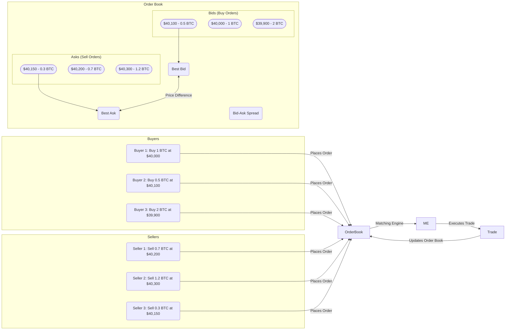
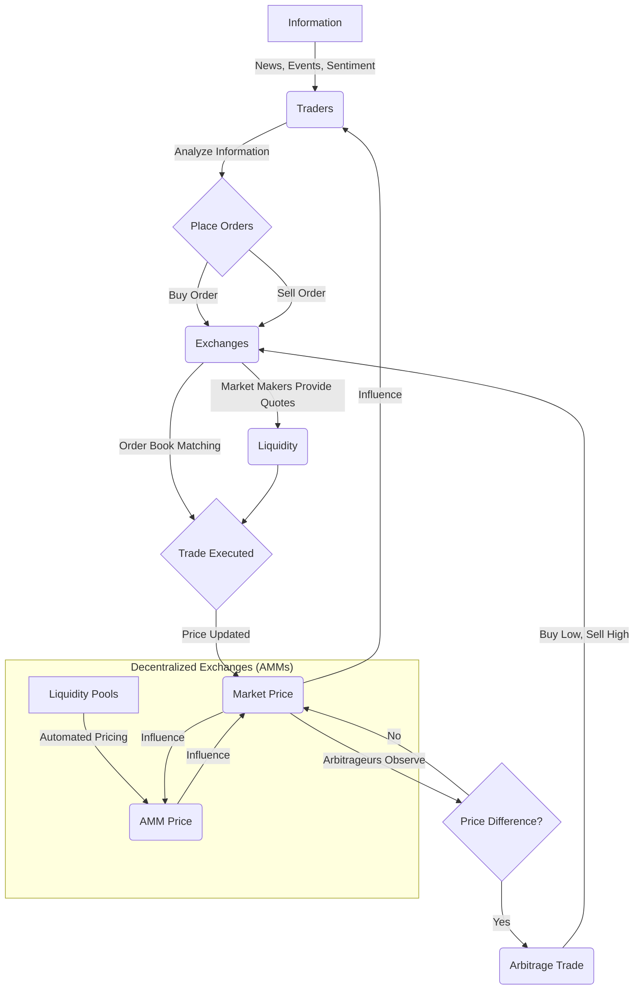

Okay, let's dive deep into Module 1.1: Market Fundamentals and generate high-quality content based on the provided prompts.

**1.1 Market Fundamentals**

**Prompt 1: Explain the mechanics of cryptocurrency markets, including the roles of exchanges, market makers, and other participants. Describe how order books work and illustrate with a mermaid diagram showing the interaction between buyers and sellers, and the formation of the order book. Also, find and include relevant YouTube videos that explain the basics of crypto market mechanics.**

**Response:**

**Cryptocurrency Market Mechanics**

Cryptocurrency markets are digital marketplaces where people can buy, sell, and trade cryptocurrencies like Bitcoin, Ethereum, and many others. They operate 24/7, globally, and are characterized by high volatility and decentralization (in many cases). Here's a breakdown of the key components:

*   **Exchanges:** These are platforms that facilitate the buying and selling of cryptocurrencies. They can be:
    *   **Centralized Exchanges (CEXs):**  These are like traditional exchanges, managed by a central company (e.g., Binance, Coinbase). They typically have high liquidity and user-friendly interfaces but require users to trust the exchange with their funds.
    *   **Decentralized Exchanges (DEXs):** These operate on blockchain technology, allowing users to trade directly with each other without an intermediary (e.g., Uniswap, SushiSwap). They offer greater control over funds but can have lower liquidity and be more complex to use.

*   **Market Makers:** These are entities (often trading firms or individuals) that provide liquidity to the market by continuously quoting buy and sell prices for cryptocurrencies. They profit from the bid-ask spread (the difference between the buy and sell price). Their role is crucial for ensuring that traders can easily enter and exit positions without causing significant price fluctuations.

*   **Other Participants:**
    *   **Retail Traders:** Individual investors who buy and sell cryptocurrencies for their own accounts.
    *   **Institutional Investors:** Large organizations like hedge funds, investment banks, and asset managers that are increasingly participating in the crypto market.
    *   **Miners:**  In Proof-of-Work blockchains like Bitcoin, miners validate transactions and add them to the blockchain, earning rewards in cryptocurrency. They can influence the market by selling their mined coins.
    *   **Arbitrageurs:** These traders take advantage of price differences for the same cryptocurrency on different exchanges, buying low on one and selling high on another, contributing to price consistency across markets.

**How Order Books Work**

An order book is a list of buy and sell orders for a specific cryptocurrency on an exchange. It's a fundamental mechanism for price discovery and trade execution.

*   **Buy Orders (Bids):** These are orders to buy a certain quantity of cryptocurrency at a specified price or lower.
*   **Sell Orders (Asks/Offers):** These are orders to sell a certain quantity of cryptocurrency at a specified price or higher.

The order book is constantly updated as new orders are placed, canceled, or executed.

**Mermaid Diagram of Order Book Formation**

**Explanation of the Diagram:**

1. Buyers and sellers place their orders, specifying the quantity and price.
2. The exchange's matching engine sorts these orders into the order book.
3. Buy orders are sorted in descending order of price (highest bid first).
4. Sell orders are sorted in ascending order of price (lowest ask first).
5. The highest buy order is the "best bid," and the lowest sell order is the "best ask."
6. The difference between the best bid and the best ask is the "bid-ask spread."
7. When a new buy order matches an existing sell order (or vice versa), a trade is executed.
8. The order book is updated to reflect the executed trade.

**Relevant YouTube Videos:**

*   **What is a Limit Order, Stop Limit, Market Order (Binance Order Types) | Crypto Trading for Beginners:** [https://www.youtube.com/watch?v=zu-H4w4V6gw](https://www.youtube.com/watch?v=zu-H4w4V6gw)
*   **How to Read Crypto Charts (Full Beginners Guide):** [https://www.youtube.com/watch?v=8R7AXupC94Y](https://www.youtube.com/watch?v=8R7AXupC94Y)
*   **Order Book Trading EXPLAINED:** [https://www.youtube.com/watch?v=wYoUzkgv0Cs](https://www.youtube.com/watch?v=wYoUzkgv0Cs)

These videos provide a good visual and auditory explanation of the concepts discussed above.

---

**Prompt 2: Discuss the different order types (market, limit, stop-loss, etc.) in cryptocurrency trading, providing scenarios where each order type would be most appropriate. Include example mock order book data and show how different order types would be executed against it.**

**Response:**

**Common Order Types in Cryptocurrency Trading**

Understanding different order types is crucial for executing trades effectively and managing risk. Here are some of the most common order types:

*   **Market Order:**
    *   **Description:** An order to buy or sell a cryptocurrency immediately at the best available price in the market.
    *   **Scenario:** Use when you want to ensure immediate execution and are not concerned about the exact price. For example, you need to buy or sell quickly to enter or exit a position during rapid market movements.
    *   **Risk:** You might get a worse price than expected, especially in volatile markets or when trading assets with low liquidity (this is called slippage).

*   **Limit Order:**
    *   **Description:** An order to buy or sell a cryptocurrency at a specific price or better.
    *   **Scenario:** Use when you want to control the price at which you buy or sell. For example, you want to buy ETH only if it drops to $3,000 or sell it only if it rises to $3,500.
    *   **Risk:** Your order might not be filled if the market price does not reach your specified limit price.

*   **Stop-Loss Order:**
    *   **Description:** An order that automatically becomes a market order when the market price reaches a specified "stop price." It's primarily used to limit potential losses on a position.
    *   **Scenario:** You own BTC at $40,000 and want to limit your potential loss. You could place a stop-loss order at $38,000. If the price falls to $38,000, your stop-loss order will trigger a market order to sell your BTC, helping you exit the position before further losses.
    *   **Risk:** In a fast-moving market, your stop-loss order might be executed at a price significantly worse than the stop price due to slippage.

*   **Stop-Limit Order:**
    *   **Description:** Similar to a stop-loss order, but instead of becoming a market order, it becomes a limit order when the stop price is reached. It combines a stop price and a limit price.
    *   **Scenario:** You want to limit your loss but also want to avoid selling at a price too far below your stop price. For instance, you set a stop price at $38,000 and a limit price at $37,900. If the market drops to $38,000, your order will trigger, but it will only be filled at $37,900 or better.
    *   **Risk:** Your order might not be filled if the market moves too quickly and the price falls below your limit price before your order can be executed.

*   **Take-Profit Order:**
    *   **Description:** An order that automatically becomes a market order when the market price reaches a specified "take-profit price." It's used to lock in profits on a position.
    *   **Scenario:** You bought ETH at $3,000 and you want to sell it and make a profit when it reaches $3,500.
    *   **Risk:** In a fast-moving market, your take-profit order might be executed at a price worse than the take-profit price due to slippage.

*   **Trailing Stop Order:**
    *   **Description:** A type of stop-loss order where the stop price automatically adjusts as the market price moves in your favor.
    *   **Scenario:** You bought BTC at $40,000 and set a trailing stop order with a trailing distance of $1,000. If the price goes up to $42,000, the stop price will adjust to $41,000. If the price then drops, the stop price will remain at $41,000, protecting your profit.
    *   **Risk:**  Similar to stop-loss orders, in volatile markets, the actual execution price might differ from the stop price.

**Example Mock Order Book Data and Order Execution**

Let's consider the following simplified order book for ETH/USD:

| **Asks (Sell Orders)** | **Bids (Buy Orders)** |
| :-------------------- | :------------------ |
| 0.5 ETH @ $3,010      | 0.7 ETH @ $2,995    |
| 1.0 ETH @ $3,008      | 0.9 ETH @ $2,992    |
| 1.2 ETH @ $3,005      | 1.5 ETH @ $2,990    |

**Scenario 1: Market Order to Buy 1 ETH**

*   Your order will be filled immediately by taking the best available ask prices.
*   You will buy 0.5 ETH at $3,010 and then 0.5 ETH at $3,008.
*   Average execution price: $3,009

**Scenario 2: Limit Order to Buy 1 ETH at $2,995**

*   Your order will be placed on the order book in the Bids section.
*   It will only be filled if the market price of ETH drops to $2,995 or lower.

**Scenario 3: Stop-Loss Order to Sell 1 ETH with a Stop Price of $2,992**

*   Your order is not yet on the order book.
*   If the best bid price drops to $2,992, your stop-loss order will trigger and become a market order to sell 1 ETH.
*   The execution price will depend on the bids available at that moment, potentially lower than $2,992.

**Scenario 4: Stop-Limit Order to Sell 1 ETH with a Stop Price of $2,992 and a Limit Price of $2,990**

*   Your order is not yet on the order book.
*   If the best bid price drops to $2,992, your order will trigger and become a limit order to sell 1 ETH at $2,990.
*   It will only be filled if there are buyers willing to buy at $2,990 or higher.

---

**Prompt 3: Analyze market microstructure in the context of cryptocurrencies, focusing on concepts like bid-ask spread, slippage, and market impact. Explain how these factors affect trading strategies and profitability. Supplement this with links to academic papers or industry whitepapers that delve deeper into market microstructure.**

**Response:**

**Market Microstructure in Cryptocurrencies**

Market microstructure examines how specific trading mechanisms and market structures affect price formation, trading behavior, and liquidity. In cryptocurrencies, understanding microstructure is vital due to the market's unique characteristics, including its 24/7 nature, fragmentation across many exchanges, and varying levels of regulation.

**Key Concepts:**

*   **Bid-Ask Spread:**
    *   **Definition:** The difference between the best bid price (highest price a buyer is willing to pay) and the best ask price (lowest price a seller is willing to accept).
    *   **Impact:** A wider spread indicates lower liquidity and higher transaction costs. Traders generally prefer tighter spreads as it means they can enter and exit positions with less cost.
    *   **In Crypto:** Spreads can vary significantly between exchanges and between different cryptocurrencies. High-volume trading pairs on major exchanges tend to have tighter spreads.

*   **Slippage:**
    *   **Definition:** The difference between the expected price of a trade and the actual executed price.
    *   **Impact:** Slippage can negatively impact profitability, especially for large orders or in volatile markets. It's more pronounced in low-liquidity situations.
    *   **In Crypto:** Slippage is a major concern due to price volatility and the potential for significant price swings within short periods.

*   **Market Impact:**
    *   **Definition:** The effect that a large order has on the market price. A large buy order can push the price up, while a large sell order can push it down.
    *   **Impact:** Traders with large orders need to be mindful of market impact, as their orders can move the price against them, reducing profitability.
    *   **In Crypto:** Market impact can be significant, especially for less liquid cryptocurrencies or on smaller exchanges. Traders often use algorithms to break down large orders into smaller ones to minimize market impact (this is related to order execution algorithms, as mentioned in previous sections).

**How These Factors Affect Trading Strategies and Profitability**

*   **High-Frequency Trading (HFT) and Scalping:** These strategies rely on executing a large number of trades with small profit margins per trade. Tight spreads and low slippage are crucial for their profitability.
*   **Arbitrage:** Arbitrageurs exploit price differences between exchanges. The bid-ask spread and potential slippage on each exchange directly impact the profitability of arbitrage opportunities.
*   **Market Making:** Market makers provide liquidity and profit from the bid-ask spread. Their profitability is directly tied to the spread and their ability to manage inventory risk in the face of market impact.
*   **Large Order Execution:** Traders executing large orders need to consider market impact and slippage. They might use algorithms to optimize order execution and minimize these effects.

**Academic Papers and Industry Whitepapers:**

*   **"Trade size, order imbalance and the volatility-volume relation" by  Joel Hasbrouck and  Duane J. Seppi :**  [https://www.sciencedirect.com/science/article/abs/pii/S0304405X0000088X](https://www.sciencedirect.com/science/article/abs/pii/S0304405X0000088X)
*   **"Market Microstructure Invariants: Theory and Practical Applications" by  Marco Avellaneda and Sasha Stoikov:** [https://www.researchgate.net/publication/24072534_Market_Microstructure_Invariants_Theory_and_Practical_Applications](https://www.researchgate.net/publication/24072534_Market_Microstructure_Invariants_Theory_and_Practical_Applications)
*   **"An Introduction to High-Frequency Data and Order Book Dynamics" by Irene Aldridge:** [https://papers.ssrn.com/sol3/papers.cfm?abstract_id=2128647](https://papers.ssrn.com/sol3/papers.cfm?abstract_id=2128647)
*   **"Market Microstructure: A Survey of Microfoundations, Empirical Evidence, and Policy Implications"  by Maureen O'Hara:** [https://www.jstor.org/stable/2352789](https://www.jstor.org/stable/2352789)

These resources provide a more in-depth understanding of market microstructure concepts and their implications for trading.

---

**Prompt 4: Explore the psychology of trading, covering topics like emotional biases, risk aversion, and herd behavior. Discuss how these psychological factors can influence market movements and individual trading decisions. Recommend books or articles that provide further insights into trading psychology.**

**Response:**

**The Psychology of Trading**

Trading is not just about numbers and algorithms; it's deeply intertwined with human psychology. Emotions, biases, and cognitive limitations play a significant role in how traders make decisions, which, in turn, can influence market movements.

**Key Psychological Factors:**

*   **Emotional Biases:**
    *   **Fear and Greed:** These are the two most dominant emotions in trading. Fear can lead to panic selling during market downturns, while greed can lead to excessive risk-taking during bull markets.
    *   **Loss Aversion:** The tendency to feel the pain of a loss more strongly than the pleasure of an equivalent gain. This can lead traders to hold onto losing positions for too long, hoping they will recover, or to sell winning positions too early to lock in profits.
    *   **Overconfidence:** Overestimating one's own abilities and the accuracy of one's predictions. This can lead to taking on too much risk or making poorly researched trades.
    *   **Confirmation Bias:** The tendency to seek out information that confirms existing beliefs and to ignore information that contradicts them. This can lead traders to make biased decisions and to ignore warning signs.
    *   **Recency Bias:**  Giving more weight to recent events than to events further in the past. This can lead traders to extrapolate recent market trends, assuming they will continue indefinitely.
    *   **Anchoring Bias:**  The tendency to rely too heavily on the first piece of information received (the "anchor"). In trading, this could be the initial purchase price of an asset, leading to irrational decisions about when to buy or sell.

*   **Risk Aversion:**
    *   **Definition:** The degree to which an individual is willing to take on risk. Risk-averse traders prefer lower but more certain returns, while risk-seeking traders are willing to accept higher risk for the potential of higher returns.
    *   **Impact:** Risk aversion can significantly influence investment choices and portfolio construction. In volatile markets like cryptocurrencies, understanding one's own risk tolerance is essential.

*   **Herd Behavior:**
    *   **Definition:** The tendency for individuals to mimic the actions of a larger group, even if those actions are irrational.
    *   **Impact:** In trading, herd behavior can lead to market bubbles and crashes. When many traders buy an asset because everyone else is buying it (fear of missing out, or FOMO), it can drive the price up to unsustainable levels. Conversely, when everyone starts selling, it can lead to a rapid price decline.

**Influence on Market Movements and Trading Decisions:**

*   **Market Bubbles and Crashes:** Emotional biases, particularly fear and greed, combined with herd behavior, are often cited as major contributors to market bubbles and crashes.
*   **Volatility:**  Emotional trading can exacerbate market volatility, as rapid price swings trigger more emotional reactions, creating a feedback loop.
*   **Trading Errors:** Biases can lead to poor decision-making, such as entering trades at the wrong time, holding onto losing positions, or failing to adequately diversify.
*   **Inefficient Markets:** While the efficient market hypothesis suggests that market prices reflect all available information, psychological factors can create inefficiencies that astute traders can potentially exploit.

**Recommended Books and Articles:**

*   **"Thinking, Fast and Slow" by Daniel Kahneman:** A foundational book on behavioral economics and cognitive biases.
*   **"The Psychology of Trading" by Brett N. Steenbarger:** A practical guide to understanding and managing emotions in trading.
*   **"Trading in the Zone" by Mark Douglas:** Focuses on developing the mental discipline needed for consistent trading success.
*   **"Market Mind Games" by Denise Shull:** Explores the role of emotions and intuition in financial markets.
*   **"Reminiscences of a Stock Operator" by Edwin Lefèvre:** While a fictionalized account, it offers valuable insights into the psychology of speculation and market manipulation.
*   **"Influence: The Psychology of Persuasion" by Robert Cialdini:** While not directly about trading, it explores psychological principles that can be relevant to understanding market sentiment and manipulation.

By understanding the psychological aspects of trading, traders can become more self-aware, manage their emotions more effectively, and make more rational decisions.

---

**Prompt 5: Explain the concept of liquidity in cryptocurrency markets and how it impacts trading. Describe the factors that contribute to liquidity and how to assess liquidity for different cryptocurrencies. Provide links to resources that offer real-time liquidity data or analysis.**

**Response:**

**Liquidity in Cryptocurrency Markets**

**Definition:**

Liquidity, in the context of financial markets, refers to the ease with which an asset can be bought or sold without causing a significant change in its price. A liquid market is one with many buyers and sellers, allowing for quick and efficient transactions at prices close to the fair market value.

**Impact on Trading:**

*   **Ease of Entry and Exit:** High liquidity allows traders to enter and exit positions quickly and easily without significantly affecting the price.
*   **Tighter Spreads:** Liquid markets typically have tighter bid-ask spreads, reducing transaction costs.
*   **Reduced Slippage:**  Trades in liquid markets are less likely to experience slippage, meaning the execution price is closer to the expected price.
*   **Price Stability:** Liquid markets tend to be more stable and less prone to sudden, drastic price swings caused by individual large orders.
*   **Better Price Discovery:**  High liquidity contributes to efficient price discovery, as the market price reflects the collective actions of many buyers and sellers.

**Factors Contributing to Liquidity:**

*   **Trading Volume:** Higher trading volume generally indicates higher liquidity.
*   **Number of Market Participants:** A large number of buyers and sellers creates a more active and liquid market.
*   **Number of Exchanges Listing an Asset:**  A cryptocurrency listed on multiple exchanges tends to have higher overall liquidity.
*   **Market Depth:**  This refers to the volume of buy and sell orders at different price levels in the order book. Deep order books with substantial volume on both the bid and ask sides indicate high liquidity.
*   **Market Makers:** Active market makers providing continuous buy and sell quotes contribute significantly to liquidity.
*   **Investor Sentiment:** Positive sentiment and growing interest in a cryptocurrency can attract more traders and increase liquidity.
*   **Regulatory Clarity:** Clear and favorable regulations can encourage greater participation and liquidity in the market.

**Assessing Liquidity for Different Cryptocurrencies:**

*   **Trading Volume:** Check 24-hour trading volume on reputable data aggregators like CoinMarketCap or CoinGecko. Higher volume generally suggests higher liquidity.
*   **Bid-Ask Spread:** Examine the bid-ask spread on major exchanges. Tighter spreads indicate better liquidity.
*   **Order Book Depth:** Analyze the order book on exchanges. Look for substantial volume on both the bid and ask sides at various price levels near the current market price.
*   **Slippage:** Simulate trades of different sizes on exchanges to see how much the price moves. Lower slippage indicates higher liquidity.
*   **Liquidity Metrics:** Some platforms provide specific liquidity metrics or scores based on factors like order book depth, trading volume, and price stability.

**Resources for Real-Time Liquidity Data and Analysis:**

*   **CoinMarketCap:** [https://coinmarketcap.com/](https://coinmarketcap.com/) Provides data on trading volume, market capitalization, and exchange listings. Also, have a liquidity score for each crypto listed.
*   **CoinGecko:** [https://www.coingecko.com/](https://www.coingecko.com/) Similar to CoinMarketCap, offering comprehensive market data, including trading volume and exchange information.
*   **Messari:** [https://messari.io/](https://messari.io/) Provides in-depth research and analysis on cryptocurrencies, including liquidity assessments.
*   **Skew:** [https://www.skew.com/](https://www.skew.com/) (Note: Now part of Coinbase) Focuses on cryptocurrency derivatives but also provides valuable data on spot market liquidity.
*   **Exchange Order Books:** Directly examining the order books on major exchanges like Binance, Coinbase, Kraken, etc., gives you the most granular view of liquidity for a specific trading pair.

**Conclusion:**

Liquidity is a crucial factor to consider when trading cryptocurrencies. It affects transaction costs, execution quality, and overall trading strategy. By understanding the factors that contribute to liquidity and using the resources mentioned above, traders can make more informed decisions and navigate the crypto markets more effectively.

---

**Prompt 6: Discuss the mechanisms of price discovery in cryptocurrency markets. How do different exchanges and trading venues contribute to the overall price discovery process? Include a flowchart diagram illustrating the flow of information and orders in price discovery.**

**Response:**

**Price Discovery in Cryptocurrency Markets**

**Definition:**

Price discovery is the process by which the market determines the "fair" or equilibrium price of an asset through the interactions of buyers and sellers. It's a continuous process driven by the flow of information, orders, and trades.

**Mechanisms of Price Discovery in Cryptocurrencies:**

Cryptocurrency markets are unique because they are fragmented across numerous exchanges (both centralized and decentralized) operating 24/7. Price discovery is influenced by:

*   **Order Books:** The primary mechanism on most exchanges. Buy and sell orders are matched, and trades are executed, constantly updating the last traded price and contributing to price discovery.
*   **Trading Activity:** The volume and frequency of trades provide signals about market sentiment and contribute to price adjustments.
*   **Information Flow:** News, events, social media sentiment, regulatory changes, and technological developments all impact trader expectations and, consequently, order placement and price discovery.
*   **Arbitrage:** Price differences between exchanges create arbitrage opportunities. Arbitrageurs buy on exchanges with lower prices and sell on exchanges with higher prices, helping to bring prices into alignment across different trading venues.
*   **Market Makers:** By continuously quoting buy and sell prices, market makers facilitate trading and contribute to price discovery, especially in less liquid markets.
*   **Automated Market Makers (AMMs) on DEXs:** AMMs use algorithms and liquidity pools to determine prices based on the ratio of assets in the pool, providing an alternative price discovery mechanism on decentralized exchanges.

**Contribution of Different Exchanges and Trading Venues:**

*   **Centralized Exchanges (CEXs):**  Major CEXs like Binance, Coinbase, and Kraken play a significant role due to their high trading volumes and liquidity. They often act as price leaders, with price movements on these exchanges influencing prices on other platforms.
*   **Decentralized Exchanges (DEXs):** DEXs like Uniswap and SushiSwap contribute to price discovery through their AMM mechanisms. While they may have lower liquidity than CEXs for some assets, they provide alternative pricing for many tokens, especially newer or less established ones.
*   **Regional Exchanges:** Exchanges catering to specific geographic regions can have a localized impact on price discovery, especially for cryptocurrencies that are more popular in those regions.
*   **OTC (Over-the-Counter) Markets:**  OTC desks facilitate large trades directly between parties, often for institutional investors. While these trades are not always public, they can still influence the overall market price, especially for large-cap cryptocurrencies.

**Flowchart Diagram of Price Discovery:**

**Explanation of the Flowchart:**

1. **Information:** New information enters the market, influencing trader sentiment and expectations.
2. **Traders:** Traders analyze the information and decide whether to buy or sell.
3. **Place Orders:** Traders place buy or sell orders on exchanges.
4. **Exchanges:** Exchanges, through their order books or AMM mechanisms, match buy and sell orders.
5. **Trade Executed:** When orders are matched, trades are executed.
6. **Price Updated:** The market price is updated based on the last traded price.
7. **Arbitrageurs Observe:** Arbitrageurs monitor prices across different exchanges.
8. **Price Difference?:** If price differences exist, arbitrageurs execute trades to profit from them.
9. **Arbitrage Trade:** Arbitrage trades help to align prices across exchanges.
10. **Market Makers Provide Quotes:** Market makers continuously provide buy and sell quotes, adding to liquidity.
11. **Liquidity:**  Liquidity, facilitated by market makers and trading volume, influences the ease of trade execution and price stability.
12. **AMMs (on DEXs):** Decentralized exchanges use AMMs and liquidity pools for automated price discovery.
13. **Influence:** The market price influences both traders (in their analysis) and AMM pricing.

**Conclusion:**

Price discovery in cryptocurrency markets is a complex and dynamic process. It's driven by the interplay of order books, trading activity, information flow, arbitrage, and market makers across a fragmented landscape of exchanges. Understanding this process is crucial for traders to interpret market movements and make informed trading decisions.

---

**Prompt 7: Identify and analyze common market inefficiencies in cryptocurrency markets. What are the opportunities and risks associated with these inefficiencies? Provide examples of how traders might attempt to exploit these inefficiencies, and link to relevant research papers or case studies.**

**Response:**

**Market Inefficiencies in Cryptocurrency Markets**

**Definition:**

Market inefficiencies are situations where the market price of an asset does not reflect its true or "fair" value based on all available information. These inefficiencies can arise due to various factors, including information asymmetry, emotional trading, transaction costs, and the unique characteristics of the cryptocurrency market.

**Common Market Inefficiencies in Cryptocurrencies:**

*   **Price Discrepancies Between Exchanges (Arbitrage Opportunities):** Due to the fragmented nature of the crypto market, the same cryptocurrency can trade at slightly different prices on different exchanges.
*   **Information Asymmetry:**  Not all market participants have access to the same information at the same time. News or developments might be reflected in the price on one exchange or in one region before others.
*   **Emotional Trading and Herd Behavior:** Fear, greed, and other emotional biases can lead to overreactions to news or events, causing temporary price deviations from fundamental value.
*   **Market Manipulation:**  "Pump and dump" schemes, spoofing (placing fake orders to influence the price), and wash trading (trading with oneself to create a false impression of activity) can create artificial price movements.
*   **Low Liquidity for Some Assets:**  Many cryptocurrencies have relatively low liquidity, making them susceptible to significant price swings even with moderately sized orders.
*   **Flash Crashes:** Sudden, rapid price drops, often followed by a quick recovery, can occur due to large sell orders, algorithmic trading errors, or cascading liquidations.

**Opportunities and Risks Associated with Inefficiencies:**

**Opportunities:**

*   **Arbitrage:** Traders can profit from price discrepancies between exchanges by buying low on one exchange and selling high on another.
*   **Statistical Arbitrage:** More sophisticated strategies can identify and exploit statistically significant deviations from expected price relationships between different cryptocurrencies or between cryptocurrencies and other assets.
*   **News-Based Trading:**  Traders who can quickly analyze and react to news events before they are fully reflected in the market price can potentially profit.
*   **Exploiting Emotional Overreactions:**  Contrarian strategies might involve buying when others are panic selling or selling when others are overly enthusiastic, aiming to profit from the eventual correction.

**Risks:**

*   **Execution Risk:**  Prices can change rapidly in the crypto market, and arbitrage opportunities might disappear before a trader can complete both legs of the trade.
*   **Liquidity Risk:**  Low liquidity can make it difficult to execute trades at the desired price, especially when trying to exploit inefficiencies in less liquid assets.
*   **Counterparty Risk:**  With centralized exchanges, there's a risk that the exchange could become insolvent or experience a security breach.
*   **Regulatory Risk:**  Regulations are constantly evolving in the crypto space, and changes in regulations can impact the ability to exploit certain inefficiencies or even the legality of certain trading strategies.
*   **Market Manipulation Risk:**  Traders attempting to exploit inefficiencies might themselves become victims of market manipulation.

**Examples of How Traders Might Exploit Inefficiencies:**

*   **Simple Arbitrage:** A trader notices that BTC is trading at $40,000 on Exchange A and $40,100 on Exchange B. They could buy BTC on Exchange A and simultaneously sell it on Exchange B, capturing the $100 price difference (minus fees).
*   **Triangular Arbitrage:** This involves exploiting price discrepancies between three different cryptocurrencies. For example, a trader might convert USD to BTC, BTC to ETH, and then ETH back to USD, ending up with more USD than they started with if the exchange rates are favorable.
*   **News-Based Trading:** A trader might use sentiment analysis tools to monitor social media and news sources for early signals of positive or negative developments related to a specific cryptocurrency. They could then buy or sell the asset before the market fully reacts to the news.
*   **Statistical Arbitrage:** A trader might develop a model that identifies a statistically significant correlation between two cryptocurrencies. If the correlation breaks down temporarily, they might buy the underperforming asset and sell the outperforming one, betting that the correlation will eventually be restored.

**Relevant Research Papers and Case Studies:**

*   **"Cryptocurrency Pump-and-Dump Schemes" by  Tao Li, Donghwa Shin, Baolian Cheng:** [https://papers.ssrn.com/sol3/papers.cfm?abstract_id=3303365](https://papers.ssrn.com/sol3/papers.cfm?abstract_id=3303365)
*   **"Price Discovery on Bitcoin Exchanges" by  Alexander Brauneis and  Jürgen Huber:** [https://www.researchgate.net/publication/326209746_Price_Discovery_on_Bitcoin_Exchanges](https://www.researchgate.net/publication/326209746_Price_Discovery_on_Bitcoin_Exchanges)
*   **"Flash Boys 2.0: Frontrunning, Transaction Reordering, and Consensus Instability in Decentralized Exchanges" by Philip Daian, Steven Goldfeder, Tyler Kell, Yunqi Li, Xueyuan Zhao, I