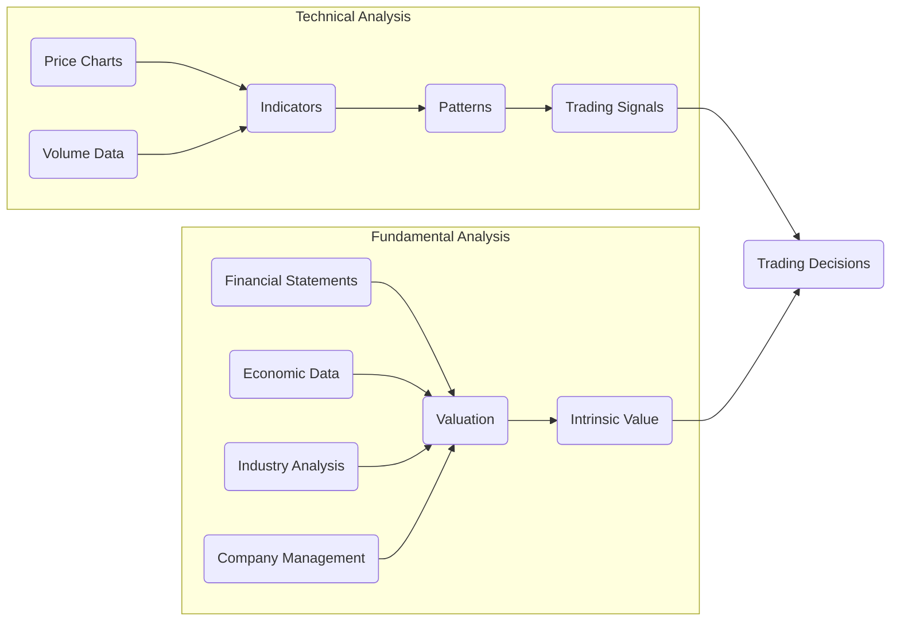
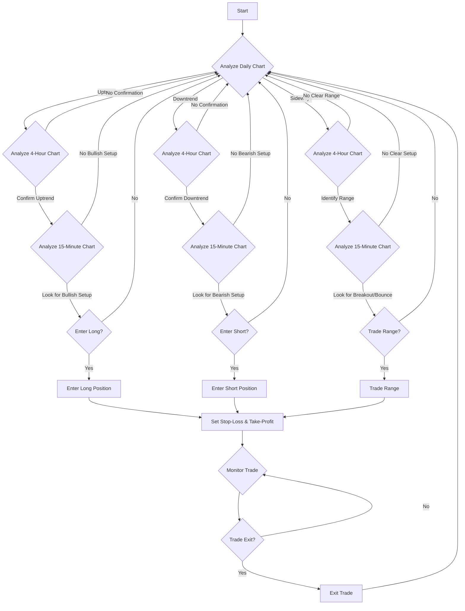
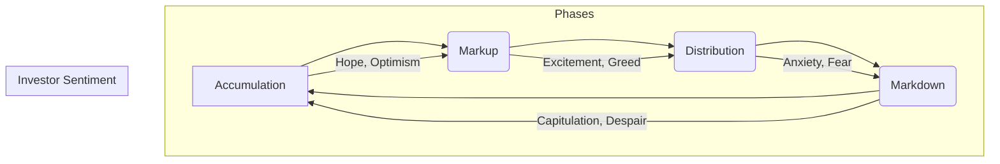

Okay, let's delve into Module 1.2: Technical Analysis Foundations, providing comprehensive responses to each prompt.

**1.2 Technical Analysis Foundations**

**Prompt 1: Provide a comprehensive introduction to technical analysis in cryptocurrency trading. Explain how it differs from fundamental analysis and discuss its underlying assumptions. Include a visual comparison of technical vs. fundamental analysis using a table or diagram. Also, provide links to popular charting platforms and tools used for technical analysis in crypto.**

**Response:**

**Introduction to Technical Analysis in Cryptocurrency Trading**

Technical analysis is a method of evaluating and forecasting the future price movements of an asset by analyzing historical market data, primarily price and volume. Unlike fundamental analysis, which focuses on an asset's intrinsic value, technical analysis assumes that all known information is already reflected in the asset's price and that price moves in trends.

**Key Differences from Fundamental Analysis:**

| Feature              | Technical Analysis                                      | Fundamental Analysis                                        |
| :------------------- | :------------------------------------------------------ | :---------------------------------------------------------- |
| **Focus**            | Price and volume patterns, market trends            | Intrinsic value, financial health, economic factors       |
| **Data Used**        | Historical price charts, trading volume                 | Financial statements, news, industry reports, economic data |
| **Time Horizon**     | Short-term to medium-term                              | Long-term                                                 |
| **Goal**             | Predict future price movements, identify trading opportunities | Determine if an asset is overvalued or undervalued          |
| **Underlying Belief** | Market prices reflect all available information; history tends to repeat itself | Markets can be inefficient, and prices may deviate from intrinsic value |

**Visual Comparison:**



**Underlying Assumptions of Technical Analysis:**

1. **The Market Discounts Everything:** All known information, including fundamental factors, is already reflected in the asset's price.
2. **Price Moves in Trends:** Prices tend to move in identifiable trends (uptrends, downtrends, sideways) that persist for some time.
3. **History Tends to Repeat Itself:**  Market psychology leads to recurring patterns in price movements that can be identified and potentially exploited.

**Popular Charting Platforms and Tools for Crypto:**

*   **TradingView:** [https://www.tradingview.com/](https://www.tradingview.com/) A comprehensive charting platform with a vast library of indicators, drawing tools, and community features. Widely used for cryptocurrency technical analysis.
*   **Coinigy:** [https://www.coinigy.com/](https://www.coinigy.com/) A multi-exchange trading platform with advanced charting capabilities, including various order types and automation features.
*   **GoCharting:** [https://gocharting.com/](https://gocharting.com/) A web-based charting platform that supports numerous cryptocurrencies and offers extensive customization.
*   **TensorCharts:** [https://www.tensorcharts.com/](https://www.tensorcharts.com/) Specializes in visualizing order book data and market depth, providing insights into liquidity and order flow.

**Conclusion:**

Technical analysis is a valuable tool for cryptocurrency traders, offering a framework for understanding market behavior and identifying potential trading opportunities. However, it's essential to remember that it's not a foolproof system, and it's often used in conjunction with other forms of analysis, such as fundamental analysis and risk management techniques.

---

**Prompt 2: Explain how to identify and interpret common chart patterns (e.g., head and shoulders, double top/bottom, triangles) in cryptocurrency price charts. Provide real chart examples from different cryptocurrencies and timeframes. Include links to resources that offer a comprehensive catalog of chart patterns.**

**Response:**

**Identifying and Interpreting Common Chart Patterns**

Chart patterns are recurring formations in price charts that are believed to signal potential future price movements. They are based on the idea that history tends to repeat itself in financial markets.

**Common Chart Patterns:**

*   **Head and Shoulders:**
    *   **Description:** A bearish reversal pattern that resembles a head with two shoulders on either side. The left shoulder and head form higher highs, while the right shoulder forms a lower high. A "neckline" connects the lows of the two shoulders.
    *   **Interpretation:** Signals a potential trend reversal from bullish to bearish. A break below the neckline confirms the pattern.
    *   **Example:** (Unfortunately, I can't directly embed real-time charts here. I'll describe where you can find examples.) On TradingView, search for "BTCUSD" or "ETHUSD" and look for historical examples on daily or 4-hour charts where this pattern occurred.
*   **Inverse Head and Shoulders:**
    *   **Description:** The opposite of the head and shoulders pattern, a bullish reversal pattern. It has a head that forms a lower low and two shoulders at higher lows.
    *   **Interpretation:** Signals a potential trend reversal from bearish to bullish. A break above the neckline confirms the pattern.
*   **Double Top:**
    *   **Description:** A bearish reversal pattern where the price reaches a similar high twice, with a moderate decline in between.
    *   **Interpretation:** Indicates that the buying pressure is weakening and a potential reversal to a downtrend is likely. A break below the low between the two tops confirms the pattern.
*   **Double Bottom:**
    *   **Description:** The opposite of the double top, a bullish reversal pattern where the price reaches a similar low twice, with a moderate rally in between.
    *   **Interpretation:**  Indicates that the selling pressure is weakening and a potential reversal to an uptrend is likely. A break above the high between the two bottoms confirms the pattern.
*   **Triangles (Ascending, Descending, Symmetrical):**
    *   **Description:** Continuation patterns that form as the price range contracts, creating converging trend lines.
        *   **Ascending Triangle:**  Flat upper trend line (resistance) and rising lower trend line (support).
        *   **Descending Triangle:** Flat lower trend line (support) and falling upper trend line (resistance).
        *   **Symmetrical Triangle:**  Falling upper trend line and rising lower trend line.
    *   **Interpretation:**
        *   **Ascending:** Usually bullish, indicating a potential breakout to the upside.
        *   **Descending:** Usually bearish, indicating a potential breakout to the downside.
        *   **Symmetrical:** Neutral, suggesting a potential breakout in either direction.
    *   **Confirmation:** A breakout occurs when the price moves decisively above or below the trend lines, often accompanied by increased volume.

**Example Chart Pattern Identification on TradingView:**

1. Go to [https://www.tradingview.com/](https://www.tradingview.com/)
2. In the search bar, type the symbol of a cryptocurrency (e.g., BTCUSD, ETHUSD, SOLUSD).
3. Choose a timeframe (e.g., 1D for daily, 4H for 4-hour).
4. Use the drawing tools (trend lines, horizontal lines) to identify potential chart patterns.
5. Look for historical examples where these patterns formed and observe how the price behaved afterward.

**Resources for a Comprehensive Catalog of Chart Patterns:**

*   **Thepatternsite:** [http://www.thepatternsite.com/](http://www.thepatternsite.com/) A vast resource on chart patterns, including detailed descriptions, identification guidelines, and trading strategies.
*   **StockCharts ChartSchool:** [https://school.stockcharts.com/doku.php?id=chart\_analysis:chart\_patterns](https://school.stockcharts.com/doku.php?id=chart_analysis:chart_patterns) A comprehensive guide to technical analysis, including a section on chart patterns.
*   **Investopedia:** [https://www.investopedia.com/](https://www.investopedia.com/) Search for specific chart patterns (e.g., "head and shoulders pattern") to find detailed articles.

**Important Considerations:**

*   **Confirmation:** It's crucial to wait for confirmation of a pattern before entering a trade. This usually involves a decisive break above or below key levels (e.g., neckline, trend lines) with increased volume.
*   **Context:** Consider the overall market trend and other technical indicators when analyzing chart patterns.
*   **False Signals:** No pattern is perfect, and false signals can occur. Use stop-loss orders to manage risk.

---

**Prompt 3: Describe how to use key technical indicators like Moving Averages, RSI, MACD, and Bollinger Bands in cryptocurrency trading. Provide example calculations and Python code snippets demonstrating how to calculate these indicators using libraries like TA-Lib. Suggest resources for learning more about advanced usage of these indicators.**

**Response:**

**Key Technical Indicators in Cryptocurrency Trading**

Technical indicators are mathematical calculations based on an asset's price, volume, or open interest. They are used to identify trends, momentum, volatility, and potential overbought/oversold conditions.

**1. Moving Averages (MAs):**

*   **Description:**  Smooth out price data by creating a constantly updated average price.
*   **Types:**
    *   **Simple Moving Average (SMA):**  Calculates the average price over a specific number of periods.
    *   **Exponential Moving Average (EMA):**  Gives more weight to recent prices, making it more responsive to price changes than the SMA.
*   **Uses:**
    *   **Trend Identification:**  Prices above the MA suggest an uptrend; prices below suggest a downtrend.
    *   **Support and Resistance:**  MAs can act as dynamic support or resistance levels.
    *   **Crossovers:**  When a shorter-term MA crosses above a longer-term MA, it can signal a bullish trend; a cross below can signal a bearish trend.

**Example Calculation (SMA):**

SMA (20-day) = (Sum of closing prices for the last 20 days) / 20

**Python Code (TA-Lib):**

```python
import talib
import numpy as np

# Sample closing prices (replace with your actual data)
close = np.array([50, 52, 51, 53, 55, 54, 56, 58, 57, 59, 61, 60, 62, 63, 65, 64, 66, 68, 67, 69])

# Calculate 20-day SMA
sma = talib.SMA(close, timeperiod=20)

print(sma)  # Output will be an array with the SMA values
```

**2. Relative Strength Index (RSI):**

*   **Description:**  A momentum oscillator that measures the speed and change of price movements. It oscillates between 0 and 100.
*   **Uses:**
    *   **Overbought/Oversold:** RSI above 70 is generally considered overbought (potential sell signal), while RSI below 30 is considered oversold (potential buy signal).
    *   **Divergence:** When the price makes a new high but the RSI makes a lower high (bearish divergence), it can signal a weakening trend. Conversely, a bullish divergence occurs when the price makes a new low, but the RSI makes a higher low.

**Example Calculation:**

1. Calculate the average gain and average loss over a specific period (usually 14 days).
2. Calculate the Relative Strength (RS) = Average Gain / Average Loss.
3. RSI = 100 - (100 / (1 + RS)).

**Python Code (TA-Lib):**

```python
import talib
import numpy as np

# Sample closing prices
close = np.array([50, 52, 51, 53, 55, 54, 56, 58, 57, 59, 61, 60, 62, 63, 65, 64, 66, 68, 67, 69])

# Calculate 14-day RSI
rsi = talib.RSI(close, timeperiod=14)

print(rsi)
```

**3. Moving Average Convergence Divergence (MACD):**

*   **Description:** A trend-following momentum indicator that shows the relationship between two EMAs of an asset's price.
*   **Components:**
    *   **MACD Line:** The difference between a 12-period EMA and a 26-period EMA.
    *   **Signal Line:** A 9-period EMA of the MACD line.
    *   **Histogram:** The difference between the MACD line and the signal line.
*   **Uses:**
    *   **Crossovers:** When the MACD line crosses above the signal line, it's a bullish signal. When it crosses below, it's bearish.
    *   **Divergence:** Similar to RSI, divergences between the MACD and price can signal potential trend reversals.
    *   **Histogram:** The histogram helps visualize the momentum and the strength of the MACD line's movement.

**Example Calculation:**

1. Calculate the 12-period EMA.
2. Calculate the 26-period EMA.
3. MACD Line = 12-period EMA - 26-period EMA.
4. Signal Line = 9-period EMA of the MACD Line.
5. Histogram = MACD Line - Signal Line.

**Python Code (TA-Lib):**

```python
import talib
import numpy as np

# Sample closing prices
close = np.array([50, 52, 51, 53, 55, 54, 56, 58, 57, 59, 61, 60, 62, 63, 65, 64, 66, 68, 67, 69])

# Calculate MACD
macd, signal, hist = talib.MACD(close, fastperiod=12, slowperiod=26, signalperiod=9)

print(macd)
print(signal)
print(hist)
```

**4. Bollinger Bands:**

*   **Description:**  A volatility indicator consisting of a middle band (usually a 20-day SMA) and two outer bands that are typically two standard deviations above and below the middle band.
*   **Uses:**
    *   **Volatility:** The bands widen when volatility increases and contract when volatility decreases.
    *   **Overbought/Oversold:** Prices near the upper band might suggest overbought conditions, while prices near the lower band might suggest oversold conditions.
    *   **Squeezes:** When the bands contract significantly (a "squeeze"), it can signal a potential breakout in either direction.

**Example Calculation:**

1. Calculate the 20-day SMA (middle band).
2. Calculate the standard deviation of closing prices over the last 20 days.
3. Upper Band = 20-day SMA + (2 \* Standard Deviation).
4. Lower Band = 20-day SMA - (2 \* Standard Deviation).

**Python Code (TA-Lib):**

```python
import talib
import numpy as np

# Sample closing prices
close = np.array([50, 52, 51, 53, 55, 54, 56, 58, 57, 59, 61, 60, 62, 63, 65, 64, 66, 68, 67, 69])

# Calculate Bollinger Bands
upper, middle, lower = talib.BBANDS(close, timeperiod=20, nbdevup=2, nbdevdn=2)

print(upper)
print(middle)
print(lower)
```

**Resources for Advanced Indicator Usage:**

*   **"Technical Analysis of the Financial Markets" by John J. Murphy:** A comprehensive guide to technical analysis, including in-depth coverage of various indicators.
*   **"Evidence-Based Technical Analysis" by David Aronson:**  Explores the statistical validity of technical indicators and trading strategies.
*   **TA-Lib Documentation:** [https://mrjbq7.github.io/ta-lib/](https://mrjbq7.github.io/ta-lib/) Provides detailed information about the functions and parameters of the TA-Lib library.
*   **Investopedia:** [https://www.investopedia.com/](https://www.investopedia.com/)  A great resource for learning about different technical indicators and their applications.

---

**Prompt 4: Explain the concepts of support and resistance in technical analysis. How can traders identify these levels on a chart? Provide examples of how to trade based on support and resistance breakouts or bounces. Include links to YouTube videos demonstrating how to draw support and resistance lines.**

**Response:**

**Support and Resistance in Technical Analysis**

**Definitions:**

*   **Support:** A price level where buying pressure is strong enough to prevent the price from declining further. It's like a "floor" for the price.
*   **Resistance:** A price level where selling pressure is strong enough to prevent the price from rising further. It's like a "ceiling" for the price.

**Identifying Support and Resistance Levels:**

1. **Swing Highs and Lows:**
    *   **Support:** Look for previous swing lows (valleys) where the price bounced back up.
    *   **Resistance:** Look for previous swing highs (peaks) where the price turned back down.

2. **Trend Lines:** In an uptrend, the rising trend line acts as support. In a downtrend, the falling trend line acts as resistance.

3. **Moving Averages:**  Longer-term moving averages (e.g., 50-day, 100-day, 200-day) can act as dynamic support or resistance levels.

4. **Fibonacci Retracement Levels:** These levels (e.g., 38.2%, 50%, 61.8%) can also act as support or resistance.

5. **Psychological Levels:** Round numbers (e.g., $10,000, $50,000 for Bitcoin) often act as support or resistance due to psychological factors.

6. **Volume Profile:** Areas with high trading volume can indicate significant support or resistance.

**How to Identify on a Chart (Using TradingView as an Example):**

1. Go to TradingView and open a chart for a cryptocurrency.
2. **Horizontal Lines:** Use the horizontal line tool to mark significant swing highs (resistance) and swing lows (support).
3. **Trend Lines:** Use the trend line tool to draw lines connecting consecutive higher lows (uptrend support) or lower highs (downtrend resistance).
4. **Moving Averages:** Add moving averages to the chart (e.g., 50-day, 200-day) and observe how the price interacts with them.

**Trading Based on Support and Resistance:**

*   **Bounces:**
    *   **Buy Near Support:**  If the price is approaching a support level, traders might look for buying opportunities, anticipating a bounce back up.
    *   **Sell Near Resistance:** If the price is approaching a resistance level, traders might look for selling opportunities, anticipating a pullback.

*   **Breakouts:**
    *   **Buy Above Resistance:** If the price breaks decisively above a resistance level (often with increased volume), it can signal a bullish breakout and a potential buying opportunity.
    *   **Sell Below Support:** If the price breaks decisively below a support level (often with increased volume), it can signal a bearish breakdown and a potential selling opportunity.

**Example Scenarios:**

*   **Scenario 1 (Bounce):** ETH is approaching a support level at $2,800. A trader might place a buy order slightly above $2,800, with a stop-loss order below the support level, anticipating a bounce.
*   **Scenario 2 (Breakout):** BTC has been facing resistance at $50,000. If the price breaks above $50,000 with strong volume, a trader might enter a long position, with a stop-loss order below $50,000, anticipating further upward movement.

**YouTube Videos on Drawing Support and Resistance:**

*   **How to Draw Support and Resistance Zones:** [https://www.youtube.com/watch?v=rZqe5bJffjM](https://www.youtube.com/watch?v=rZqe5bJffjM)
*   **How to Draw Support and Resistance Like a PRO:** [https://www.youtube.com/watch?v=a4xIicjLYbU](https://www.youtube.com/watch?v=a4xIicjLYbU)
*   **The Right Way to Draw Support and Resistance:** [https://m.youtube.com/watch?v=y-o-u-K_k9s](https://m.youtube.com/watch?v=y-o-u-K_k9s)

**Important Considerations:**

*   **Strength of Levels:** Not all support and resistance levels are equally strong. Levels that have been tested multiple times are generally considered stronger.
*   **Confirmation:** Look for confirmation of a bounce or breakout (e.g., increased volume, candlestick patterns) before entering a trade.
*   **False Breakouts:**  Sometimes the price might briefly break above or below a level but then quickly reverse. Use stop-loss orders to manage risk.
*   **Dynamic Nature:** Support and resistance levels are not static; they can change over time as the market evolves.

---

**Prompt 5: Discuss trend analysis in cryptocurrency markets. How can traders identify uptrends, downtrends, and sideways trends? Explain how to use trend lines and moving averages to confirm trends. Recommend books or articles that delve deeper into trend trading strategies.**

**Response:**

**Trend Analysis in Cryptocurrency Markets**

**Definition:**

Trend analysis is a core aspect of technical analysis that involves identifying the direction in which an asset's price is moving. Recognizing trends is fundamental for many trading strategies.

**Types of Trends:**

*   **Uptrend (Bullish):** A series of higher highs and higher lows. The overall price movement is upward.
*   **Downtrend (Bearish):** A series of lower highs and lower lows. The overall price movement is downward.
*   **Sideways Trend (Consolidation, Ranging):** The price moves within a relatively narrow range, without making significant higher highs or lower lows.

**Identifying Trends:**

1. **Visual Inspection:** The simplest way is to look at the price chart and observe the overall direction of price movement.
2. **Swing Highs and Lows:**
    *   **Uptrend:**  Higher highs and higher lows.
    *   **Downtrend:** Lower highs and lower lows.
    *   **Sideways:** No consistent pattern of higher highs/lows or lower highs/lows.

**Using Trend Lines to Confirm Trends:**

*   **Trend Line:** A straight line drawn connecting two or more swing lows (in an uptrend) or two or more swing highs (in a downtrend).
*   **Uptrend:**  An upward sloping trend line connecting higher lows acts as support.
*   **Downtrend:** A downward sloping trend line connecting lower highs acts as resistance.
*   **Confirmation:**
    *   The more times the price touches and respects a trend line, the stronger the trend is considered.
    *   A break above a downtrend line can signal a potential trend reversal to bullish.
    *   A break below an uptrend line can signal a potential trend reversal to bearish.

**Using Moving Averages to Confirm Trends:**

*   **Moving Average (MA):**  A smoothed average of past prices (e.g., 50-day MA, 200-day MA).
*   **Uptrend:** The price tends to stay above the MA, and the MA slopes upward.
*   **Downtrend:** The price tends to stay below the MA, and the MA slopes downward.
*   **Sideways:** The price might fluctuate around the MA, and the MA might be relatively flat.
*   **Confirmation:**
    *   The longer the time period of the MA, the more significant the trend it represents.
    *   Crossovers of different MAs can also signal trend changes (e.g., a 50-day MA crossing above a 200-day MA is a bullish "golden cross").

**Example (Using TradingView):**

1. Open a cryptocurrency chart on TradingView.
2. **Trend Lines:** Use the trend line tool to draw lines connecting swing highs or lows.
3. **Moving Averages:** Add MAs (e.g., 50-day, 200-day) to the chart and observe their slope and relationship to the price.

**Recommended Books and Articles on Trend Trading:**

*   **"How to Make Money in Stocks" by William J. O'Neil:**  While focused on stocks, the principles of trend following and CAN SLIM system are applicable to crypto.
*   **"Trend Following" by Michael Covel:**  A comprehensive guide to trend following strategies across various asset classes.
*   **"Following the Trend: Diversified Managed Futures Trading" by Andreas F. Clenow:**  Explores trend following in the context of managed futures, but the core concepts are relevant to other markets.
*   **Investopedia - Trend Analysis:** [https://www.investopedia.com/terms/t/trendanalysis.asp](https://www.investopedia.com/terms/t/trendanalysis.asp)

**Important Considerations:**

*   **Multiple Timeframes:** Analyze trends on different timeframes (e.g., daily, weekly, monthly) to get a broader perspective.
*   **Trend Strength:**  Not all trends are equally strong. Use indicators like ADX (Average Directional Index) to assess trend strength.
*   **Trend Reversals:**  Be aware of potential trend reversals and look for confirming signals (e.g., chart patterns, indicator divergences).

---

**Prompt 6: Explain the importance of volume analysis in technical analysis. How can volume confirm price movements or signal potential reversals? Describe different volume indicators (e.g., OBV, Chaikin Money Flow) and provide examples of their application. Include a section on where to find reliable volume data for cryptocurrencies.**

**Response:**

**The Importance of Volume Analysis in Technical Analysis**

**Definition:**

Volume analysis involves examining the number of shares, contracts, or, in the case of cryptocurrencies, the amount of the asset traded during a specific period. It provides insights into the strength and conviction behind price movements.

**Why Volume is Important:**

*   **Confirmation of Price Movements:**
    *   **High Volume:**  High volume accompanying a price move suggests strong participation and conviction, confirming the move's validity.
    *   **Low Volume:**  Low volume accompanying a price move suggests a lack of conviction and raises the possibility that the move might be weak or unsustainable.
*   **Signal Potential Reversals:**
    *   **Divergence:**  If the price is making new highs but volume is declining, it could signal a weakening trend and a potential reversal.
    *   **Exhaustion Moves:**  A sharp price move on extremely high volume can sometimes signal exhaustion, indicating that the trend might be nearing its end.
*   **Identifying Accumulation/Distribution:**
    *   **Accumulation:**  Increasing volume on up days and decreasing volume on down days can suggest that institutional investors or "smart money" are accumulating the asset.
    *   **Distribution:** Increasing volume on down days and decreasing volume on up days can suggest that institutional investors are selling (distributing) the asset.

**Volume Indicators:**

*   **On-Balance Volume (OBV):**
    *   **Description:** A cumulative indicator that adds volume on up days and subtracts volume on down days.
    *   **Uses:**
        *   **Trend Confirmation:**  A rising OBV confirms an uptrend, while a falling OBV confirms a downtrend.
        *   **Divergence:** If the price is making new highs but the OBV is not, it could signal a bearish divergence and a potential trend reversal.
    * **Example Calculation (Simplified):**
        * If today's close is higher than yesterday's close, today's volume is added to the OBV.
        * If today's close is lower than yesterday's close, today's volume is subtracted from the OBV.

*   **Chaikin Money Flow (CMF):**
    *   **Description:** Measures the buying and selling pressure over a specific period (usually 20 or 21 days) by considering both price and volume.
    *   **Uses:**
        *   **Accumulation/Distribution:** CMF above zero suggests buying pressure (accumulation), while CMF below zero suggests selling pressure (distribution).
        *   **Trend Confirmation:** Positive CMF can confirm an uptrend, while negative CMF can confirm a downtrend.
        *   **Divergence:** Divergences between CMF and price can signal potential trend reversals.
    * **Example Calculation (Simplified):**
    1. Calculate the Money Flow Multiplier: [(Close - Low) - (High - Close)] / (High - Low)
    2. Calculate Money Flow Volume: Money Flow Multiplier * Volume for the period
    3. CMF = (20-period sum of Money Flow Volume) / (20-period sum of Volume)

*   **Volume by Price (not available on TA-lib):**
    *   **Description:**  Shows the amount of volume traded at different price levels over a specific period.
    *   **Uses:**
        *   **Identify Support/Resistance:** Price levels with high volume can act as strong support or resistance.
        *   **Confirm Breakouts:** A breakout from a price range accompanied by high volume at the breakout level adds confirmation.
    * **Example:** You can see this indicator on most of the trading platforms (e.g. TradingView, GoCharting, etc.). By default it is shown as horizontal histogram on the left or right side of the screen, which shows how much volume was traded on each price level.

**Python Code (TA-Lib) for OBV and CMF:**

```python
import talib
import numpy as np

# Sample closing prices and volume
close = np.array([50, 52, 51, 53, 55, 54, 56, 58, 57, 59, 61, 60, 62, 63, 65, 64, 66, 68, 67, 69])
volume = np.array([1000, 1200, 900, 1100, 1300, 800, 1400, 1600, 1000, 1200, 1500, 900, 1300, 1400, 1700, 1100, 1500, 1800, 1200, 1600])

# Calculate OBV
obv = talib.OBV(close, volume)

# Calculate Chaikin Money Flow
cmf = talib.CMF(high, low, close, volume, timeperiod=20)

print("OBV:", obv)
print("CMF:", cmf)
```

**Where to Find Reliable Volume Data for Cryptocurrencies:**

*   **Reputable Cryptocurrency Exchanges:** Binance, Coinbase, Kraken, etc., provide volume data for the assets traded on their platforms.
*   **Data Aggregators:**
    *   **CoinMarketCap:** [https://coinmarketcap.com/](https://coinmarketcap.com/)
    *   **CoinGecko:** [https://www.coingecko.com/](https://www.coingecko.com/)
    *   **Messari:** [https://messari.io/](https://messari.io/)
*   **Charting Platforms:** TradingView, GoCharting, and other charting platforms usually have volume data integrated into their charts.

**Important Considerations:**

*   **Relative Volume:**  It's often more useful to compare volume to its recent average rather than looking at absolute numbers.
*   **Exchange Differences:** Volume can vary significantly between exchanges, especially for less liquid cryptocurrencies.
*   **Fake Volume:** Be aware of the potential for wash trading and other manipulative practices that can artificially inflate volume figures.

---

**Prompt 7: Introduce the concept of multiple timeframe analysis. How can traders use information from different timeframes (e.g., daily, hourly, 15-minute) to make better trading decisions? Provide a flowchart illustrating a decision-making process that incorporates multiple timeframe analysis.**

**Response:**

**Multiple Timeframe Analysis**

**Definition:**

Multiple timeframe analysis involves examining the same asset on different timeframes (e.g., daily, 4-hour, 1-hour, 15-minute) to gain a broader perspective on the market and to identify trading opportunities with greater precision.

**Benefits of Using Multiple Timeframes:**

*   **Confirmation:** Using multiple timeframes can help confirm trends, support/resistance levels, and other technical signals. A signal that appears on multiple timeframes is generally considered stronger.
*   **Context:**  Higher timeframes (e.g., daily, weekly) provide the bigger picture and help identify the dominant trend. Lower timeframes (e.g., hourly, 15-minute) offer a more granular view and can be used to fine-tune entry and exit points.
*   **Improved Timing:**  Multiple timeframes can help traders enter and exit trades with better timing, potentially increasing profitability and reducing risk.
*   **Filtering Out Noise:**  Higher timeframes can help filter out the noise and volatility that might be present on lower timeframes, providing a clearer view of the underlying trend.

**How to Use Multiple Timeframes:**

1. **Identify the Dominant Trend on a Higher Timeframe:** Start by analyzing a higher timeframe (e.g., daily or weekly) to determine the overall trend direction. This helps you trade in the direction of the larger trend.
2. **Look for Confirmation on a Medium Timeframe:**  Move to a medium timeframe (e.g., 4-hour or 1-hour) to look for confirmation of the trend and to identify potential support/resistance levels or chart patterns.
3. **Fine-Tune Entry/Exit on a Lower Timeframe:** Use a lower timeframe (e.g., 15-minute or 5-minute) to pinpoint entry and exit points with greater precision. For example, you might look for a pullback to a support level on the lower timeframe before entering a long position in an uptrend identified on higher timeframes.

**Example Scenario:**

*   **Daily Chart (Higher Timeframe):**  BTC/USD is in an uptrend, trading above its 50-day and 200-day moving averages.
*   **4-Hour Chart (Medium Timeframe):**  The price is consolidating in a symmetrical triangle pattern, suggesting a potential continuation of the uptrend.
*   **15-Minute Chart (Lower Timeframe):** The price is approaching the lower trend line of the triangle and showing signs of a potential bounce (e.g., a bullish candlestick pattern, increasing volume).

**Decision:** A trader might decide to enter a long position on the 15-minute chart if the price bounces off the lower trend line, with a stop-loss order below the recent swing low. The higher timeframes provide the context (uptrend) and the medium timeframe suggests a potential continuation, while the lower timeframe helps with precise entry timing.

**Flowchart Illustrating a Decision-Making Process:**



**Explanation of the Flowchart:**

1. **Start:** Begin the analysis.
2. **Analyze Daily Chart:** Determine the trend on the daily chart (uptrend, downtrend, or sideways).
3. **Analyze 4-Hour Chart:**
    *   **Uptrend:** Confirm the uptrend on the 4-hour chart.
    *   **Downtrend:** Confirm the downtrend on the 4-hour chart.
    *   **Sideways:** Identify a clear trading range on the 4-hour chart.
4. **Analyze 15-Minute Chart:**
    *   **Uptrend:** Look for bullish setups (e.g., pullbacks to support, bullish candlestick patterns) on the 15-minute chart for potential long entries.
    *   **Downtrend:** Look for bearish setups (e.g., rallies to resistance, bearish candlestick patterns) on the 15-minute chart for potential short entries.
    *   **Sideways:** Look for breakouts or bounces from the range boundaries on the 15-minute chart for potential range trading opportunities.
5. **Enter Long/Short?:**  Decide whether to enter a long or short position based on the setup identified on the 15-minute chart.
6. **Trade Range?:** If a clear range is identified, decide whether to trade within the range (buy near support, sell near resistance).
7. **Enter Long/Short Position:** Execute the trade if the conditions are met.
8. **Trade Range:** Execute trades within the established range.
9. **Set Stop-Loss & Take-Profit:** Define your risk management parameters.
10. **Monitor Trade:** Keep an eye on the trade's progress.
11. **Trade Exit?:** Determine if it's time to exit the trade based on your predefined rules or changing market conditions.
12. **Exit Trade:** Close the position.
13. **Repeat:** Go back to the beginning and repeat the analysis.

**Important Considerations:**

*   **Timeframe Combinations:** The specific timeframes used can vary depending on the trader's style and the asset being traded. Common combinations include:
    *   Daily, 4-hour, 1-hour
    *   4-hour, 1-hour, 15-minute
    *   1-hour, 15-minute, 5-minute
*   **Consistency:**  Stick to a consistent set of timeframes for your analysis.
*   **Flexibility:** Be prepared to adjust your analysis if the market conditions change significantly.

---

**Prompt 8: Explain the basics of candlestick patterns and their interpretation in cryptocurrency trading. Provide a cheat sheet of common candlestick patterns and their bullish/bearish implications. Include links to resources that offer interactive candlestick pattern recognition tools.**

**Response:**

**Candlestick Patterns in Cryptocurrency Trading**

**Definition:**

Candlestick patterns are visual representations of price movements over a specific period, displayed on a candlestick chart. Each candlestick represents four data points:

*   **Open:** The price at the beginning of the period.
*   **High:** The highest price reached during the period.
*   **Low:** The lowest price reached during the period.
*   **Close:** The price at the end of the period.

**Anatomy of a Candlestick:**

*   **Real Body:** The rectangular part of the candlestick, representing the range between the open and close prices.
    *   **Bullish (Green/White):**  The close is higher than the open.
    *   **Bearish (Red/Black):** The close is lower than the open.
*   **Shadows (Wicks):** The thin lines extending above and below the real body, representing the high and low prices for the period.
    *   **Upper Shadow:**  The line above the real body.
    *   **Lower Shadow:** The line below the real body.

**Interpretation:**

Candlestick patterns are used to identify potential reversals or continuations in the price trend. They reflect the psychology of the market, showing the battle between buyers and sellers.

**Candlestick Pattern Cheat Sheet:**

| Pattern          | Description                                                                                                                               | Implication | Bullish/Bearish |
| :--------------- | :---------------------------------------------------------------------------------------------------------------------------------------- | :---------- | :-------------- |
| **Doji**         | Small real body, indicating indecision. Open and close prices are nearly equal.                                                           | Reversal    | Neutral         |
| **Hammer**       | Small real body at the upper end of the trading range, with a long lower shadow (at least twice the length of the real body).              | Reversal    | Bullish        |
| **Inverted Hammer** | Small real body at the lower end of the trading range, with a long upper shadow.                                                          | Reversal    | Bullish        |
| **Hanging Man**    | Small real body at the upper end of the trading range, with a long lower shadow. (Same appearance as Hammer but occurs in an uptrend)     | Reversal    | Bearish        |
| **Shooting Star**  | Small real body at the lower end of the trading range, with a long upper shadow. (Same appearance as Inverted Hammer but occurs in an uptrend) | Reversal    | Bearish        |
| **Engulfing**      | A large candlestick that completely engulfs the previous candlestick's real body.                                                        | Reversal    | Bullish/Bearish |
| **Bullish Engulfing** | A large green/white candlestick that engulfs the previous red/black candlestick's real body, occuring after downtrend.    | Reversal    | Bullish        |
| **Bearish Engulfing** | A large red/black candlestick that engulfs the previous green/white candlestick's real body, occuring after uptrend. | Reversal    | Bearish        |
| **Harami**       | A small candlestick whose real body is completely contained within the previous candlestick's real body.                                  | Reversal    | Bullish/Bearish |
| **Bullish Harami** | A small green/white candlestick contained within the previous large red/black candlestick's real body, after downtrend.                     | Reversal    | Bullish        |
| **Bearish Harami** | A small red/black candlestick contained within the previous large green/white candlestick's real body, after uptrend.                     | Reversal    | Bearish        |
| **Morning Star**    | Three-candlestick pattern: a long red/black candlestick, followed by a small-bodied candlestick that gaps down, then a long green/white candlestick that closes well into the first candlestick's body. | Reversal    | Bullish        |
| **Evening Star**    | Three-candlestick pattern: a long green/white candlestick, followed by a small-bodied candlestick that gaps up, then a long red/black candlestick that closes well into the first candlestick's body. | Reversal    | Bearish        |
| **Three White Soldiers** | Three consecutive long green/white candlesticks with higher closes, each opening within the previous body.                                    | Continuation | Bullish        |
| **Three Black Crows**   | Three consecutive long red/black candlesticks with lower closes, each opening within the previous body.                                    | Continuation | Bearish        |

**Interactive Candlestick Pattern Recognition Tools:**

*   **TradingView:** [https://www.tradingview.com/](https://www.tradingview.com/) TradingView has a built-in "Candlestick Patterns" indicator that automatically identifies various patterns on the chart.
*   **GoCharting:** [https://gocharting.com/](https://gocharting.com/) has similar feature to TradingView where it can identify candlestick patterns on the chart.
*   **StockCharts.com ChartSchool:** [https://school.stockcharts.com/doku.php?id=chart\_analysis:introduction\_to\_candlesticks](https://school.stockcharts.com/doku.php?id=chart_analysis:introduction_to_candlesticks)  While focused on stocks, the principles are the same for cryptocurrencies.
*   **Candlesticker:** [https://candlesticker.com/](https://candlesticker.com/) A website dedicated to candlestick patterns, with a pattern dictionary and interactive quizzes.

**Important Considerations:**

*   **Confirmation:** It's generally recommended to wait for confirmation from other indicators or price action before acting on a candlestick pattern.
*   **Context:** Consider the overall trend, support/resistance levels, and volume when interpreting candlestick patterns.
*   **Timeframe:** Patterns on higher timeframes (e.g., daily, weekly) tend to be more reliable than those on lower timeframes.
*   **Not Foolproof:** Candlestick patterns are not always accurate, and false signals can occur.

---

**Prompt 9: Describe the concept of market cycles and how to identify them in cryptocurrency markets. Discuss different theories of market cycles (e.g., Elliott Wave, Kondratiev Wave) and their potential applications in crypto. Include a diagram illustrating a typical market cycle and its phases.**

**Response:**

**Market Cycles in Cryptocurrency Markets**

**Definition:**

Market cycles are recurring patterns of expansion and contraction in an asset's price or in the broader market. They are driven by a combination of factors, including economic conditions, investor psychology, and technological advancements.

**Identifying Market Cycles:**

Identifying market cycles, especially in real-time, is challenging. However, some common approaches include:

*   **Visual Inspection of Long-Term Charts:** Look for recurring patterns of highs and lows over extended periods (e.g., monthly, yearly).
*   **Technical Indicators:** Some indicators, like moving averages or oscillators, can help identify cyclical patterns.
*   **Fundamental Analysis:**  Economic cycles, technological adoption cycles (e.g., the Bitcoin halving), and regulatory cycles can influence cryptocurrency market cycles.
*   **Sentiment Analysis:** Monitoring investor sentiment through social media, news, and other sources can provide clues about the current stage of a market cycle.

**Theories of Market Cycles:**

*   **Elliott Wave Principle:**
    *   **Description:**  A theory that market prices move in predictable patterns based on investor psychology, forming five "impulse" waves in the direction of the main trend and three "corrective" waves against the trend.
    *   **Application to Crypto:** Some traders use Elliott Wave to analyze Bitcoin and other cryptocurrencies, attempting to identify the current wave and anticipate future price movements.
    *   **Challenges:**  Subjectivity in identifying waves, complex patterns, and difficulty in real-time application.

*   **Kondratiev Wave (K-Wave):**
    *   **Description:** A long-term economic cycle (approximately 50-60 years) driven by technological innovation and credit cycles.
    *   **Application to Crypto:** Some speculate that cryptocurrencies might be part of a new K-Wave driven by blockchain technology. However, it's too early to definitively link crypto to this long-term cycle.
    *   **Challenges:** The K-Wave is a very long-term theory, and its relevance to the relatively young cryptocurrency market is debated.

*   **Bitcoin Halving Cycle:**
    *   **Description:**  The Bitcoin halving, which occurs roughly every four years, reduces the reward for mining new blocks by half. This event has historically been associated with significant price movements.
    *   **Application to Crypto:** Many believe that the halving cycle drives a four-year market cycle in Bitcoin, with a bull run leading up to and following the halving, followed by a bear market.
    *   **Challenges:**  The sample size of past halvings is small, and other factors can influence Bitcoin's price.

**Diagram of a Typical Market Cycle:**



**Explanation of the Phases:**

1. **Accumulation:**  The "smart money" (e.g., institutional investors, experienced traders) starts buying the asset after a period of decline, often when the public sentiment is negative. Prices are relatively low and stable.
2. **Markup (Bull Market):**  The price starts to rise, attracting more investors. Positive sentiment grows, and the trend accelerates. This phase is characterized by increasing volume and higher highs and higher lows.
3. **Distribution:** The "smart money" begins to sell their holdings to less experienced investors who are entering the market late, driven by FOMO (fear of missing out). Prices might still be high, but the upward momentum slows down.
4. **Markdown (Bear Market):**  The price starts to decline, and negative sentiment takes hold. Panic selling can occur, leading to sharp price drops. This phase is characterized by lower highs and lower lows.

**Important Considerations:**

*   **Cycle Length:** The length of market cycles can vary significantly.
*   **No Guarantee:** Past cycles are not guarantees of future performance.
*   **External Factors:**  Unexpected events (e.g., regulatory changes, major hacks, macroeconomic factors) can disrupt market cycles.

---

**Prompt 10: Explain Fibonacci retracement and extension levels and how they can be used in trading. Provide examples of how to identify these levels on a chart and how to trade based on them. Include a section on the mathematical basis of Fibonacci numbers and their relevance to markets.**

**Response:**

**Fibonacci Retracement and Extension Levels in Trading**

**Definition:**

Fibonacci retracement and extension levels are horizontal lines drawn on a chart based on the Fibonacci sequence. They are used to identify potential support and resistance levels and to project potential price targets.

**Fibonacci Sequence:**

The Fibonacci sequence is a series of numbers where each number is the sum of the two preceding ones: 0, 1, 1, 2, 3, 5, 8, 13, 21, 34, 55, 89, 144, and so on.

**Key Ratios:**

Certain ratios derived from the Fibonacci sequence are considered significant in technical analysis:

*   **0.618 (61.8%):**  The "golden ratio," found by dividing one number in the sequence by the number that follows it (e.g., 89 / 144 = 0.618).
*   **0.382 (38.2%):** Found by dividing one number in the sequence by the number two places to the right (e.g., 55 / 144 = 0.382).
*   **0.236 (23.6%):** Found by dividing one number in the sequence by the number three places to the right (e.g., 34 / 144 = 0.236).
*   **0.50 (50%):** While not strictly a Fibonacci ratio, it's often included as a significant retracement level.
*   **0 (0%) and 1 (100%):** Represents the start and end of a price move.

**Fibonacci Retracement Levels:**

*   **Purpose:** To identify potential support levels during a pullback in an uptrend or resistance levels during a rally in a downtrend.
*   **How to Draw:**
    1. Identify a significant swing high and swing low on the chart.
    2. Use the Fibonacci retracement tool (available on most charting platforms) to connect the swing low to the swing high (in an uptrend) or the swing high to the swing low (in a downtrend).
    3. The tool will automatically draw horizontal lines at the key Fibonacci retracement levels (23.6%, 38.2%, 50%, 61.8%).

**Example:**

If a cryptocurrency rallies from $100 (swing low) to $200 (swing high) and then starts to pull back, the Fibonacci retracement levels would be:

*   23.6%: $176.40
*   38.2%: $161.80
*   50%: $150
*   61.8%: $138.20

**Fibonacci Extension Levels:**

*   **Purpose:** To project potential price targets beyond the current swing high (in an uptrend) or swing low (in a downtrend).
*   **How to Draw:**
    1. Identify a significant swing high and swing low, and the end of retracement move.
    2. Use the Fibonacci extension tool (available on most charting platforms) to connect the swing low to the swing high and then to the swing low of the retracement (in an uptrend).
    3. The tool will automatically draw horizontal lines at the key Fibonacci extension levels (typically 100%, 127.2%, 161.8%, 261.8% etc.).
*   **Commonly used levels:** 127.2% and 161.8%

**Example:**
If a cryptocurrency rallies from $100 (swing low) to $200 (swing high) and then retraces to $150, the Fibonacci extension levels would be:

*   100%: $250
*   127.2%: $272
*   161.8%: $318

**Trading Based on Fibonacci Levels:**

*   **Retracements:**
    *   **Buying Opportunities:**  In an uptrend, traders might look for buying opportunities near the 38.2%, 50%, or 61.8% retracement levels, anticipating a resumption of the uptrend.
    *   **Selling Opportunities:** In a downtrend, traders might look for selling opportunities near the 38.2%, 50%, or 61.8% retracement levels, anticipating a continuation of the downtrend.
*   **Extensions:**
    *   **Take-Profit Targets:** Traders might use extension levels as potential take-profit targets for their trades. For example, if a trader is long in an uptrend, they might consider taking some profits at the 127.2% or 161.8% extension levels.

**Mathematical Basis and Relevance to Markets:**

The relevance of Fibonacci numbers to markets is debated. Some theories suggest:

*   **Natural Order:** The Fibonacci sequence and the golden ratio appear frequently in nature (e.g., the arrangement of leaves on a stem, the spirals of a seashell), and some believe that markets, as a reflection of human behavior, might also exhibit these patterns.
*   **Self-Fulfilling Prophecy:**  Because many traders use Fibonacci levels, they can become self-fulfilling prophecies. If enough traders place buy orders near a key retracement level, it can create support at that level.

**Important Considerations:**

*   **Confirmation:**  It's best to use Fibonacci levels in conjunction with other technical indicators and chart patterns for confirmation.
*   **Subjectivity:**  Drawing Fibonacci levels can be somewhat subjective, as different traders might choose slightly different swing highs and lows.
*   **Not Infallible:** Fibonacci levels are not always respected, and prices can move through them without significant reactions.

---

**Prompt 11: Introduce the Elliott Wave Principle and its application to cryptocurrency markets. Explain the basic wave patterns and how to identify them. Provide examples of Elliott Wave analysis on crypto charts and discuss the challenges and limitations of this approach.**

**Response:**

**Elliott Wave Principle**

**Definition:**

The Elliott Wave Principle is a form of technical analysis that suggests that market prices move in predictable patterns, driven by changes in investor psychology. These patterns are called "waves," and they are believed to reflect the natural rhythm of crowd behavior, alternating between optimism and pessimism.

**Basic Wave Patterns:**

The Elliott Wave Principle postulates that markets move in two main types of waves:

*   **Impulse Waves:** These are five-wave patterns that move in the direction of the larger trend. They are labeled 1, 2, 3, 4, and 5.
    *   **Wave 1:** The initial move in the new trend.
    *   **Wave 2:** A correction of Wave 1, but it does not retrace more than 100% of Wave 1.
    *   **Wave 3:** Usually the longest and strongest wave in the trend.
    *   **Wave 4:** Another correction, typically shallower than Wave 2.
    *   **Wave 5:** The final move in the direction of the trend, often accompanied by declining momentum.
*   **Corrective Waves:** These are three-wave patterns that move against the direction of the larger trend. They are labeled A, B, and C.
    *   **Wave A:** The initial move against the trend.
    *   **Wave B:** A correction of Wave A.
    *   **Wave C:** The final move against the trend, often extending beyond the end of Wave A.

**Rules and Guidelines:**

*   **Wave 2 never retraces more than 100% of Wave 1.**
*   **Wave 3 is never the shortest impulse wave.**
*   **Wave 4 never overlaps with the price territory of Wave 1 (in non-leveraged markets).**
*   **Alternation:** If Wave 2 is a deep correction, Wave 4 will likely be a shallow correction, and vice versa.
*   **Extensions:** One of the impulse waves (usually Wave 3) will often be extended, meaning it will be significantly longer than the other impulse waves and may subdivide into its own five-wave pattern.
*   **Fibonacci Relationships:**  Wave counts and relationships between waves often adhere to Fibonacci ratios (e.g., Wave 3 might be 1.618 times the length of Wave 1, Wave 4 might retrace 38.2% of Wave 3).

**Identifying Elliott Waves:**

Identifying Elliott Waves in real-time is subjective and challenging. It requires practice and a good understanding of the rules and guidelines.

1. **Look for Five-Wave and Three-Wave Patterns:**  Start by trying to identify clear five-wave and three-wave sequences on the chart.
2. **Label the Waves:**  Label the waves according to the rules and guidelines of the Elliott Wave Principle.
3. **Use Fibonacci Ratios:**  Check if the relationships between waves adhere to Fibonacci ratios.
4. **Consider the Context:**  Analyze the larger trend and look for confirming signals from other technical indicators.

**Application to Cryptocurrency Markets:**

Some traders use Elliott Wave analysis to analyze Bitcoin and other cryptocurrencies, attempting to:

*   **Identify the current wave count:** Determine where the market is in the Elliott Wave sequence.
*   **Anticipate future price movements:**  Predict potential turning points and price targets based on the wave count.
*   **Develop trading strategies:**  Enter or exit trades based on the expected wave movements.

**Example (Illustrative - Not a Real Chart):**

Let's say you're analyzing a Bitcoin chart. You might observe the following:

1. A five-wave advance from a significant low, which you label as Waves 1 through 5.
2. Wave 3 appears to be extended and subdivides into its own five-wave pattern.
3. Wave 4 retraces approximately 38.2% of Wave 3.
4. Following Wave 5, you observe a three-wave decline, which you label as Waves A, B, and C.

Based on this analysis, you might conclude that Bitcoin has completed a five-wave impulse move to the upside and is now in a corrective phase. You might anticipate further downside in Wave C before the larger uptrend resumes.

**Challenges and Limitations:**

*   **Subjectivity:**  Identifying and labeling waves can be highly subjective, and different analysts might arrive at different wave counts for the same chart.
*   **Complexity:**  Elliott Wave patterns can be complex, with many variations and extensions, making them difficult to apply in real-time.
*   **Real-Time Application:** It can be challenging to determine the correct wave count until after the fact, making it difficult to use for real-time trading decisions.
*   **False Signals:**  Like any technical analysis method, the Elliott Wave Principle is not foolproof and can generate false signals.
*   **Requires Experience:**  Successfully applying Elliott Wave analysis requires significant experience, practice, and a deep understanding of the theory.

**Conclusion:**

The Elliott Wave Principle is a complex but potentially powerful tool for analyzing market behavior. However, due to its subjectivity and complexity, it's often used in conjunction with other forms of technical analysis and risk management techniques. It's best suited for experienced traders who are willing to dedicate the time and effort required to master its intricacies.

---

**Prompt 12: Explain the Wyckoff method and its core concepts (e.g., accumulation, distribution, mark-up, mark-down). How can traders use the Wyckoff method to analyze cryptocurrency price movements? Provide examples of Wyckoff schematics and their application to real crypto charts.**

**Response:**

**The Wyckoff Method**

**Definition:**

The Wyckoff method is a technical analysis approach developed by Richard Wyckoff in the early 20th century. It focuses on identifying the activities of large operators (sometimes called "smart money" or "composite operators") and understanding the market phases they create through their buying and selling.

**Core Concepts:**

The Wyckoff method is based on the idea that price movements are not random but rather the result of planned campaigns by large operators. These campaigns typically unfold in four phases:

1. **Accumulation:** Large operators accumulate shares (or in this case, cryptocurrency) over a period of time without significantly driving up the price. This phase is characterized by:
    *   Sideways price movement within a range.
    *   Increased volume on rallies and decreased volume on declines.
    *   Signs of buying pressure absorbing selling pressure.

2. **Markup:** Once accumulation is complete, the large operators drive the price higher, attracting the attention of other traders and investors. This phase is characterized by:
    *   A sustained uptrend with higher highs and higher lows.
    *   Increased volume on rallies.
    *   Breakouts from previous resistance levels.

3. **Distribution:** Large operators begin to sell their holdings to less informed traders who are entering the market late, often driven by FOMO (fear of missing out). This phase is characterized by:
    *   Sideways price movement at higher levels.
    *   Increased volume on declines and decreased volume on rallies.
    *   Signs of selling pressure absorbing buying pressure.

4. **Markdown:**  After distribution, the price begins to decline as demand dries up and selling pressure dominates. This phase is characterized by:
    *   A sustained downtrend with lower highs and lower lows.
    *   Increased volume on declines.
    *   Breakdowns from previous support levels.

**Wyckoff Schematics:**

Wyckoff developed detailed schematics to illustrate the typical price and volume patterns that occur during accumulation and distribution phases. These schematics provide a visual guide for identifying these phases on a chart.

**Simplified Example of Accumulation Schematic:**

*   **PS (Preliminary Support):**  Selling pressure emerges after a downtrend, but buying starts to appear.
*   **SC (Selling Climax):**  A sharp sell-off on high volume, often driven by panic selling.
*   **AR (Automatic Rally):**  A rebound from the selling climax as buying pressure overcomes selling pressure.
*   **ST (Secondary Test):** The price retests the lows of the selling climax, but with less volume, indicating that selling pressure is diminishing.
*   **Spring (Optional):** A final dip below the lows of the trading range, designed to shake out weak holders before the markup phase begins.
*   **Test:**  A test of the supply in the market after a Spring or a retest of the lows without a Spring.
*   **SOS (Sign of Strength):**  A rally on increasing price spread and relatively higher volume.
*   **LPS (Last Point of Support):** A pullback to a support level after a sign of strength, often on lower volume, before the markup phase begins in earnest.

**Simplified Example of Distribution Schematic:**

*   **PSY (Preliminary Supply):** Buying pressure emerges after an uptrend, but selling starts to appear.
*   **BC (Buying Climax):** A sharp rally on high volume, often driven by public enthusiasm.
*   **AR (Automatic Reaction):** A pullback from the buying climax as selling pressure overcomes buying pressure.
*   **SOW (Sign of Weakness):** Price drop on increasing spread and volume.
*   **UT (Upthrust):** Price rallies and creates a new high but closes below or at the resistance.
*   **UTAD (Upthrust After Distribution):** A test of the resistance on low volume after a SOW.
*   **LPSY (Last Point of Supply):** Price attempts to rally but meets resistance. This shows the difficulty the price is having to make a new high.

**Applying Wyckoff to Cryptocurrency Charts:**

Traders can use the Wyckoff method to analyze cryptocurrency price movements by:

1. **Identifying Potential Accumulation or Distribution Phases:** Look for the patterns described in the Wyckoff schematics on price charts, paying close attention to both price action and volume.
2. **Determining the Market Phase:** Based on the identified patterns, determine whether the market is likely in accumulation, markup, distribution, or markdown.
3. **Developing Trading Strategies:**
    *   **Accumulation:** Look for buying opportunities near the bottom of the trading range, especially after a "spring" or "test" with confirmation (e.g., SOS).
    *   **Markup:**  Enter long positions during the uptrend, using pullbacks (e.g., to LPS) as buying opportunities.
    *   **Distribution:** Look for selling opportunities near the top of the trading range, especially after signs of weakness.
    *   **Markdown:** Enter short positions during the downtrend, using rallies as selling opportunities.

**Example (Illustrative - You'll need to find real examples on charts):**

Let's say you're analyzing a Bitcoin chart. You might observe a period of sideways price movement following a significant downtrend. You notice that volume is higher on rallies and lower on declines. You also identify potential PS, SC, AR, and ST points that resemble a Wyckoff accumulation schematic. After a final dip below the lows of the range (a potential "spring"), the price rallies strongly on increased volume (an SOS). You might interpret this as a potential accumulation phase and look for buying opportunities on subsequent pullbacks (LPS).

**Challenges and Limitations:**

*   **Subjectivity:** Identifying Wyckoff patterns can be subjective, and different analysts might interpret the same chart differently.
*   **Complexity:**  Real-world market phases are often more complex and messy than the idealized schematics.
*   **Time-Consuming:**  Applying the Wyckoff method requires careful observation and analysis of price and volume over extended periods.
*   **Not Foolproof:** Like any technical analysis method, the Wyckoff method is not always accurate and can generate false signals.

**Resources:**

*   **"Trades About to Happen: A Modern Adaptation of the Wyckoff Method" by David H. Weis:** This is considered by many the modern "bible" of the Wyckoff Method.
*   **"The Wyckoff Methodology in Depth" by  Ruben Villahermosa:** Another great resource to master this methodology.
*   **StockCharts ChartSchool:** [https://school.stockcharts.com/doku.php?id=market\_analysis:the\_wyckoff\_method](https://school.stockcharts.com/doku.php?id=market_analysis:the_wyckoff_method)

**Conclusion:**

The Wyckoff method provides a framework for understanding market cycles and the activities of large operators. While it requires practice and careful analysis, it can be a valuable tool for traders who are willing to put in the effort to learn its principles. As with other technical analysis approaches, it's best used in conjunction with other forms of analysis and risk management techniques.
