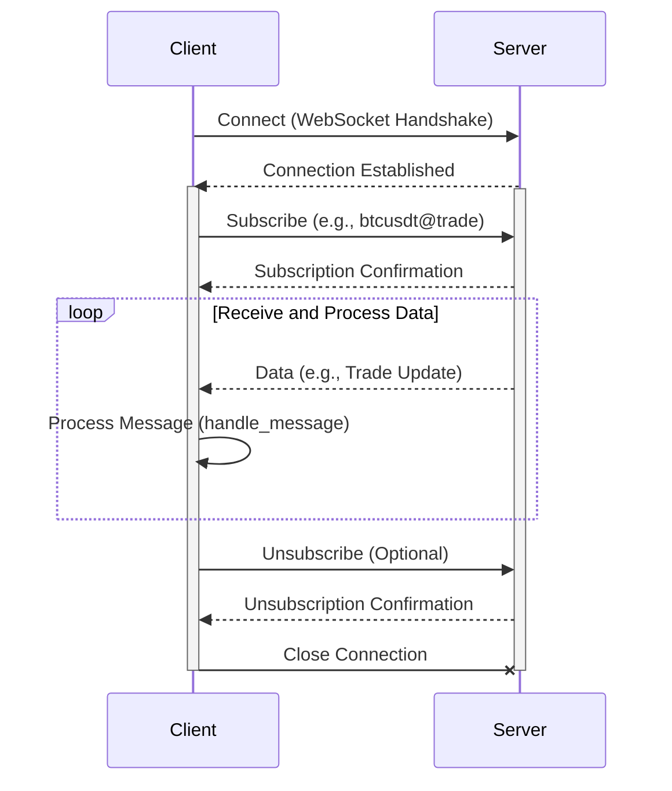
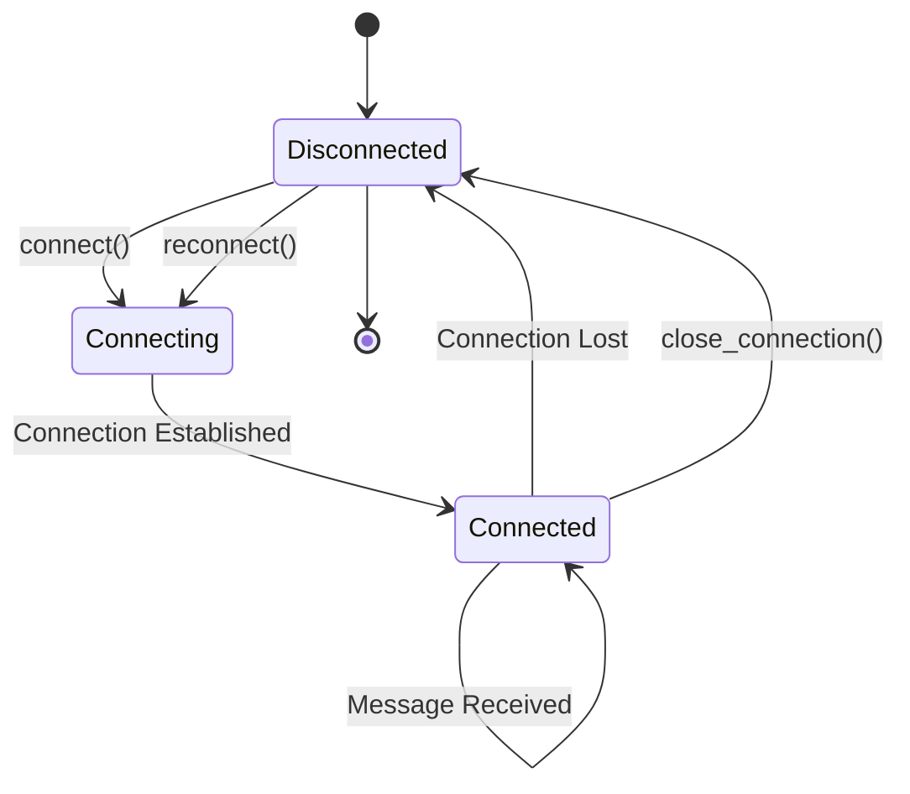

Okay, let's dive into Module 2: Trading Infrastructure, focusing on Section 2.1: Data Management.

**Module 2: Trading Infrastructure**

**2.1 Data Management**

**Prompt 1: Identify and compare various sources of cryptocurrency market data, including exchange APIs (REST and WebSocket), data aggregators (e.g., CoinMarketCap, CryptoCompare), and specialized data providers. Create a table comparing these sources based on data types, frequency, cost, and reliability. Include links to the most relevant API documentation for each source.**

**Response:**

**Sources of Cryptocurrency Market Data**

Cryptocurrency market data can be obtained from various sources, each with its own strengths and weaknesses. Here's a comparison of common sources:

| Source                 | Data Types                                                              | Frequency      | Cost                             | Reliability                                  | API Documentation                                                                                               |
| :--------------------- | :---------------------------------------------------------------------- | :------------- | :------------------------------- | :------------------------------------------- | :------------------------------------------------------------------------------------------------------------- |
| **Exchange REST APIs** | OHLCV, order book, trades, account data, funding rates, etc.             | Varies (typically 1s to 1m or even daily for OHLCV) | Usually free (with rate limits)   | High (if the exchange is reputable)          | Varies by exchange (see links below)                                                                         |
| **Exchange WebSockets** | Real-time trades, order book updates, account updates                  | Real-time      | Usually free (with rate limits)   | High (if the exchange is reputable)          | Varies by exchange (see links below)                                                                         |
| **Data Aggregators**   | OHLCV, market cap, volume, social media data, basic on-chain metrics | Varies (seconds to daily) | Free tier with limits, paid plans | Can vary, depends on aggregator's sources | CoinMarketCap: [https://coinmarketcap.com/api/documentation/v1/](https://coinmarketcap.com/api/documentation/v1/), CoinGecko: [https://www.coingecko.com/en/api/documentation](https://www.coingecko.com/en/api/documentation), CryptoCompare: [https://min-api.cryptocompare.com/](https://min-api.cryptocompare.com/) |
| **Specialized Data Providers** | Alternative data (e.g. sentiment, on-chain), order flow, tick data, advanced analytics | Varies (real-time to daily) | Typically paid                     | Generally high, specialized expertise     | Kaiko: [https://www.kaiko.com/pages/cryptocurrency-data-api](https://www.kaiko.com/pages/cryptocurrency-data-api), Messari: [https://messari.io/api/docs](https://messari.io/api/docs), Glassnode: [https://docs.glassnode.com/api/](https://docs.glassnode.com/api/)                       |

**Exchange API Documentation Links:**

*   **Binance:** [https://binance-docs.github.io/apidocs/spot/en/](https://binance-docs.github.io/apidocs/spot/en/)
*   **Coinbase Pro:** [https://docs.pro.coinbase.com/](https://docs.pro.coinbase.com/)
*   **Coinbase Advanced Trade:** [https://docs.cloud.coinbase.com/advanced-trade-api/docs/welcome](https://docs.cloud.coinbase.com/advanced-trade-api/docs/welcome)
*   **Kraken:** [https://docs.kraken.com/rest/](https://docs.kraken.com/rest/)
*   **Bitfinex:** [https://docs.bitfinex.com/docs](https://docs.bitfinex.com/docs)
*   **FTX:** [https://docs.ftx.com/](https://docs.ftx.com/)
*   **Bybit:** [https://bybit-exchange.github.io/docs/v5/intro](https://bybit-exchange.github.io/docs/v5/intro)
*   **OKX:** [https://www.okx.com/docs-v5/en/](https://www.okx.com/docs-v5/en/)

**Explanation:**

*   **Exchange APIs (REST and WebSocket):**
    *   **Pros:**  Direct access to the most granular and up-to-date data, often free for reasonable usage. Offer both historical (REST) and real-time (WebSocket) data.
    *   **Cons:** Requires managing connections to multiple exchanges if you need data from different sources, rate limits can be a constraint for high-frequency trading.
*   **Data Aggregators:**
    *   **Pros:** Convenient access to data from multiple exchanges through a single API, often provide basic analytics and market overview data.
    *   **Cons:** Data might not be as granular or real-time as direct exchange APIs, free tiers often have limited data and request rates. Paid plans can become expensive. Potential single point of failure.
*   **Specialized Data Providers:**
    *   **Pros:** Offer unique datasets (e.g., alternative data like sentiment or on-chain metrics, tick data, order flow data) and advanced analytics, often cater to institutional clients or sophisticated traders.
    *   **Cons:**  Usually expensive, data formats and APIs can vary between providers.

**Choosing the Right Source:**

The best data source depends on your specific needs:

*   **High-Frequency Trading:** Direct exchange APIs (especially WebSockets) are preferred for the lowest latency and most granular data.
*   **Algorithmic Trading (Lower Frequency):** Exchange REST APIs might be sufficient, or a combination of REST and WebSockets.
*   **Market Research and Analysis:** Data aggregators can be a good starting point for general market overviews and basic analysis.
*   **Advanced Strategies:** Specialized data providers are necessary if you need alternative data, order flow, or other unique datasets.

**Conclusion:**

Selecting the appropriate data source is a crucial step in building a trading infrastructure. Carefully consider the data types, frequency, cost, and reliability of each option to make an informed decision based on your specific trading strategy and requirements.

---

**Prompt 2: Explain the process of collecting and processing real-time market data using WebSockets. Provide a Python code example that connects to a cryptocurrency exchange's WebSocket feed, subscribes to specific data streams (e.g., trades, order book updates), and processes the incoming messages. Include a sequence diagram illustrating the interaction between the client and the WebSocket server.**

**Response:**

**Collecting and Processing Real-Time Market Data Using WebSockets**

**What are WebSockets?**

WebSocket is a communication protocol that provides full-duplex (two-way) communication channels over a single TCP connection. Unlike HTTP, which is request-response based, WebSockets allow for persistent, real-time data streaming between a client (e.g., your trading bot) and a server (e.g., a cryptocurrency exchange).

**Advantages of WebSockets for Real-Time Data:**

*   **Low Latency:** Data is pushed from the server to the client as soon as it's available, minimizing delays.
*   **Efficiency:**  Reduces the overhead of constantly establishing new connections, as is the case with HTTP polling.
*   **Real-Time Updates:** Ideal for applications that require real-time updates, such as live trading bots.

**Process of Collecting and Processing Real-Time Data:**

1. **Establish a Connection:** The client initiates a WebSocket connection to the server's WebSocket endpoint.
2. **Subscribe to Streams:** The client sends subscription messages to the server, specifying the data streams it wants to receive (e.g., trades, order book updates, specific trading pairs).
3. **Receive and Process Data:** The server continuously pushes data to the client as it becomes available. The client receives the data, parses it (often JSON format), and processes it according to the trading logic.
4. **Maintain the Connection:** The connection remains open until either the client or the server closes it. The client may need to handle reconnection logic in case of network interruptions.
5. **Unsubscribe (Optional):** The client can send unsubscribe messages to stop receiving data from specific streams.

**Python Code Example (Binance WebSocket):**

```python
import asyncio
import websockets
import json

async def handle_message(message):
    """
    Processes incoming WebSocket messages.
    """
    data = json.loads(message)
    # Add your logic to process different message types here.
    # Example: Check if the message is a trade update or an orderbook update.

    if "e" in data:
        if data["e"] == "trade":
            print(f"Trade: Symbol - {data['s']}, Price - {data['p']}, Quantity - {data['q']}")
        elif data["e"] == "depthUpdate":
            print(f"Order Book Update: Symbol - {data['s']}, Bids - {data['b']}, Asks - {data['a']}")

async def subscribe_to_streams(websocket, streams):
    """
    Subscribes to specified streams.
    """
    for stream in streams:
        subscribe_message = {
            "method": "SUBSCRIBE",
            "params": [stream],
            "id": 1
        }
        await websocket.send(json.dumps(subscribe_message))

async def binance_websocket_client():
    """
    Connects to the Binance WebSocket, subscribes to streams, and processes messages.
    """
    uri = "wss://stream.binance.com:9443/ws"

    try:
        async with websockets.connect(uri) as websocket:
            # Subscribe to Bitcoin and Ethereum trade streams
            streams = ["btcusdt@trade", "ethusdt@trade", "btcusdt@depth", "ethusdt@depth"]
            await subscribe_to_streams(websocket, streams)

            while True:
                message = await websocket.recv()
                await handle_message(message)
    except ConnectionRefusedError:
        print("Connection refused. Check your internet connection or the server status.")
    except websockets.exceptions.ConnectionClosed:
        print("Connection closed.")
    except Exception as e:
        print(f"An error occurred: {e}")

if __name__ == "__main__":
    asyncio.run(binance_websocket_client())
```

**Explanation:**

1. **Import Libraries:** `websockets` for WebSocket communication, `json` for parsing JSON messages.
2. **`handle_message()`:** This function will be called when a new message arrives on the stream. Parses the JSON message and processes it.
3. **`subscribe_to_streams()`:** Sends subscription messages to the server.
4. **`binance_websocket_client()`:**
    *   Defines the Binance WebSocket endpoint URL (`uri`).
    *   Uses `websockets.connect()` to establish a connection.
    *   Subscribes to `btcusdt@trade`, `ethusdt@trade`, `btcusdt@depth`, and `ethusdt@depth` streams.
    *   Enters an infinite loop (`while True`) to continuously receive and process messages.
    *   Uses `await websocket.recv()` to receive messages from the server.
    *   Passes received messages to `handle_message()` for processing.
5. **`asyncio.run()`:** Starts the event loop and runs the `binance_websocket_client` coroutine.

**Sequence Diagram:**



**Explanation of the Sequence Diagram:**

1. The client initiates a WebSocket connection to the server.
2. The server establishes the connection.
3. The client sends a subscription message to the server, requesting a specific data stream (e.g., `btcusdt@trade`).
4. The server confirms the subscription.
5. The server continuously sends data to the client as it becomes available.
6. The client processes the received messages.
7. (Optional) The client can unsubscribe from streams.
8. The client or server closes the connection.

**Important Considerations:**

*   **Error Handling:** Implement robust error handling to deal with network issues, connection problems, and invalid messages.
*   **Reconnection Logic:**  Add logic to automatically reconnect to the server if the connection is lost.
*   **Rate Limiting:** Be mindful of the exchange's rate limits for WebSocket connections and subscriptions.
*   **Authentication:** Some exchange APIs require authentication for accessing private data streams (e.g., account information, order placement).

**Conclusion:**

WebSockets provide a powerful mechanism for receiving real-time market data from cryptocurrency exchanges. By using libraries like `websockets` in Python, you can build trading bots that react quickly to market changes and efficiently process large volumes of data. Understanding the WebSocket protocol and implementing proper error handling and reconnection logic are essential for creating reliable and robust trading systems.

---

**Prompt 3: Discuss strategies for managing historical cryptocurrency market data. Compare different storage options, such as CSV files, SQL databases (e.g., PostgreSQL), and NoSQL databases (e.g., MongoDB). Explain how to choose the appropriate storage solution based on data volume, query patterns, and performance requirements. Include a decision tree diagram to guide this choice.**

**Response:**

**Strategies for Managing Historical Cryptocurrency Market Data**

Efficiently managing historical market data is crucial for backtesting, strategy development, and market analysis. The choice of storage solution depends on factors like data volume, query patterns, performance needs, and scalability requirements.

**Storage Options:**

*   **CSV Files:**
    *   **Description:** Comma-separated values (CSV) files are simple, human-readable text files that store data in a tabular format.
    *   **Pros:** Easy to use, widely supported, no special software required.
    *   **Cons:**  Can become slow and inefficient for large datasets, limited querying capabilities, not ideal for frequent updates or concurrent access.
    *   **Use Cases:** Small datasets, simple storage needs, data exchange between different tools.

*   **SQL Databases (e.g., PostgreSQL, MySQL):**
    *   **Description:** Relational database management systems (RDBMS) that store data in structured tables with defined schemas. They use SQL (Structured Query Language) for data manipulation and retrieval.
    *   **Pros:**  Powerful querying capabilities, efficient for complex queries involving joins and aggregations, support for transactions and data integrity, mature and widely used technology.
    *   **Cons:**  Schema can be rigid, scaling to very large datasets can be complex and expensive, might require specialized database administration skills.
    *   **Use Cases:**  Medium to large datasets, complex analytical queries, applications requiring data integrity and transactional support.

*   **NoSQL Databases (e.g., MongoDB, InfluxDB):**
    *   **Description:** Non-relational databases that offer flexible schemas and are designed for scalability and performance. Different types exist, including document databases (MongoDB), key-value stores, and time-series databases (InfluxDB).
    *   **Pros:**  Flexible schema (especially useful for evolving data structures), high scalability and performance for large datasets, often designed for distributed environments.
    *   **Cons:**  Querying capabilities might be less powerful than SQL, data consistency models can vary, might require specialized knowledge to manage and optimize.
    *   **Use Cases:** Very large datasets, high-volume data ingestion, applications requiring high scalability and flexibility. Time-series databases like InfluxDB are particularly well-suited for storing and querying time-series data like market data.

**Choosing the Appropriate Storage Solution:**

**Factors to Consider:**

*   **Data Volume:** How much data do you need to store (gigabytes, terabytes, petabytes)?
*   **Query Patterns:** What types of queries will you be running? Simple lookups, complex aggregations, analytical queries, full-text search?
*   **Performance Requirements:** How fast do you need to be able to access and query the data? What are your latency requirements?
*   **Scalability:** How much do you expect your data volume and query load to grow in the future?
*   **Data Structure:** Is your data highly structured with a fixed schema, or does it require more flexibility?
*   **Update Frequency:** How often will you be updating the data?
*   **Cost:** What are the costs associated with storage, compute, and licensing for each solution?
*   **Expertise:** What is your team's level of expertise with different database technologies?

**Decision Tree Diagram:**

```mermaid
graph TD
    A[Start] --> B{Data Volume < 10GB?};
    B -- Yes --> C[Use CSV Files];
    B -- No --> D{Complex Queries?};
    D -- Yes --> E{Frequent Updates?};
    D -- No --> I{Need for Speed and Scalability?};
    E -- Yes --> J{Schema Flexibility Required?};
    E -- No --> F[Use PostgreSQL/MySQL];
    J -- Yes --> K[Use MongoDB (or other NoSQL)];
    J -- No --> F;
    I -- Yes --> K;
    I -- No --> F;
```

**Explanation of the Decision Tree:**

1. **Start:** Begin the decision-making process.
2. **Data Volume < 10GB?:** If your data volume is small (less than 10GB), CSV files might be sufficient.
3. **Complex Queries?:** If you need to perform complex analytical queries involving joins, aggregations, etc., a SQL database is generally a better choice.
4. **Frequent Updates?:** If you need to frequently update the data, a database (SQL or NoSQL) that supports efficient updates is preferred over CSV files.
5. **Schema Flexibility Required?:** If your data structure is likely to evolve or if you need a flexible schema, a NoSQL database like MongoDB might be more suitable.
6. **Need for Speed and Scalability?:** For very large datasets or applications with high-performance and scalability requirements, consider NoSQL databases, particularly time-series databases like InfluxDB.
7. **Use PostgreSQL/MySQL:** If you need a robust, mature database with strong querying capabilities and your schema is relatively fixed, choose a SQL database like PostgreSQL or MySQL.
8. **Use MongoDB (or other NoSQL):**  If you need schema flexibility, high scalability, or are dealing with very large datasets, consider a NoSQL database like MongoDB.

**Conclusion:**

Choosing the right storage solution for historical cryptocurrency market data is crucial for the performance and scalability of your trading system. Carefully evaluate your data volume, query patterns, performance requirements, and other factors using the decision tree as a guide. Consider starting with a simpler solution (e.g., CSV or a managed SQL database) and migrating to a more complex one (e.g., a self-hosted SQL cluster or a NoSQL database) as your needs evolve.

---

**Prompt 4: Provide a detailed tutorial on using PostgreSQL or MongoDB to store and query time-series data for algorithmic trading. Include example database schemas, optimized queries for common trading analyses, and Python code examples for interacting with the database using libraries like `psycopg2` or `pymongo`.**

**Response:**

Let's focus on **PostgreSQL** for this tutorial, as it's a powerful and popular choice for storing and analyzing time-series data in trading applications.

**Tutorial: Using PostgreSQL for Time-Series Data in Algorithmic Trading**

**Why PostgreSQL for Time-Series Data?**

*   **Robust and Reliable:** PostgreSQL is known for its stability, data integrity, and extensive feature set.
*   **Powerful Querying:**  PostgreSQL supports complex SQL queries, window functions, and various data types, making it well-suited for analyzing time-series data.
*   **Time-Series Extensions:** Extensions like TimescaleDB enhance PostgreSQL's capabilities for handling time-series data, providing features like automatic partitioning and optimized query performance.
*   **JSON Support:** PostgreSQL can efficiently store and query JSON data, which is common in cryptocurrency exchange APIs.
*   **Open Source:** PostgreSQL is open-source, eliminating licensing costs.

**1. Database Schema:**

Let's design a simple schema for storing OHLCV (Open, High, Low, Close, Volume) data for multiple cryptocurrencies:

```sql
-- Create a table to store daily OHLCV data
CREATE TABLE ohlcv_data (
    symbol TEXT NOT NULL,
    timestamp TIMESTAMPTZ NOT NULL,
    open NUMERIC NOT NULL,
    high NUMERIC NOT NULL,
    low NUMERIC NOT NULL,
    close NUMERIC NOT NULL,
    volume NUMERIC NOT NULL,
    PRIMARY KEY (symbol, timestamp)
);

-- Create a table to store trades
CREATE TABLE trades (
    trade_id TEXT NOT NULL PRIMARY KEY,
    symbol TEXT NOT NULL,
    timestamp TIMESTAMPTZ NOT NULL,
    price NUMERIC NOT NULL,
    quantity NUMERIC NOT NULL,
    side TEXT NOT NULL
);
```

**Explanation:**

*   **`ohlcv_data` table:** Stores daily OHLCV data.
    *   `symbol`: The cryptocurrency symbol (e.g., "BTCUSD").
    *   `timestamp`: The timestamp of the data point (using `TIMESTAMPTZ` for timezone awareness).
    *   `open`, `high`, `low`, `close`: The OHLC prices.
    *   `volume`: The trading volume for the period.
    *   `PRIMARY KEY (symbol, timestamp)`: Creates a composite primary key on `symbol` and `timestamp` for efficient data retrieval.

*   **`trades` table:** Stores individual trade data.
    *   `trade_id`: A unique identifier for each trade.
    *   `symbol`: The cryptocurrency symbol.
    *   `timestamp`: The timestamp of the trade.
    *   `price`: The price at which the trade was executed.
    *   `quantity`: The quantity traded.
    *   `side`: Whether the trade was a "buy" or "sell".

**2. Optimized Queries for Common Trading Analyses:**

*   **Calculate a 20-day Simple Moving Average (SMA) for Bitcoin:**

```sql
SELECT
    timestamp,
    close,
    AVG(close) OVER (ORDER BY timestamp ROWS BETWEEN 19 PRECEDING AND CURRENT ROW) AS sma_20
FROM
    ohlcv_data
WHERE
    symbol = 'BTCUSD'
ORDER BY
    timestamp;
```

*   **Find the highest and lowest closing prices for Ethereum in a specific date range:**

```sql
SELECT
    MAX(close) AS highest_close,
    MIN(close) AS lowest_close
FROM
    ohlcv_data
WHERE
    symbol = 'ETHUSD'
    AND timestamp BETWEEN '2023-10-26' AND '2023-10-28';
```

*   **Calculate the daily volume-weighted average price (VWAP) for a specific symbol:**

```sql
SELECT
    timestamp::DATE AS date, -- Truncate timestamp to date part, for daily level aggregation
    SUM(close * volume) / SUM(volume) AS vwap
FROM
    ohlcv_data
WHERE
    symbol = 'BTCUSD'
    AND timestamp >= '2023-10-27' -- Example start date
GROUP BY
    date
ORDER BY
    date;
```

*   **Get the last 50 trades for a given symbol:**

```sql
SELECT *
FROM trades
WHERE symbol = 'BTCUSD'
ORDER BY timestamp DESC
LIMIT 50;
```

**3. Python Code Examples using `psycopg2`:**

First, install `psycopg2`:

```bash
pip install psycopg2-binary
```

**Example Code:**

```python
import psycopg2
import pandas as pd

# Database connection details
DB_HOST = "your_db_host"
DB_NAME = "your_db_name"
DB_USER = "your_db_user"
DB_PASSWORD = "your_db_password"

def connect_to_db():
    """Connects to the PostgreSQL database."""
    try:
        conn = psycopg2.connect(
            host=DB_HOST,
            database=DB_NAME,
            user=DB_USER,
            password=DB_PASSWORD
        )
        return conn
    except psycopg2.Error as e:
        print(f"Error connecting to database: {e}")
        return None

def insert_ohlcv_data(conn, data):
    """Inserts OHLCV data into the database."""
    cursor = conn.cursor()
    try:
        for row in data:
            cursor.execute(
                """
                INSERT INTO ohlcv_data (symbol, timestamp, open, high, low, close, volume)
                VALUES (%s, %s, %s, %s, %s, %s, %s)
                ON CONFLICT (symbol, timestamp) DO NOTHING;
                """,
                row  # Pass the values directly
            )
        conn.commit()
        print("Data inserted successfully.")
    except psycopg2.Error as e:
        print(f"Error inserting data: {e}")
        conn.rollback()
    finally:
        cursor.close()

def get_sma(conn, symbol, window):
    """Calculates the SMA for a given symbol and window."""
    cursor = conn.cursor()
    try:
        cursor.execute(
            f"""
            SELECT
                timestamp,
                close,
                AVG(close) OVER (ORDER BY timestamp ROWS BETWEEN {window - 1} PRECEDING AND CURRENT ROW) AS sma_{window}
            FROM
                ohlcv_data
            WHERE
                symbol = %s
            ORDER BY
                timestamp;
            """,
            (symbol,)
        )
        results = cursor.fetchall()
        df = pd.DataFrame(results, columns=["timestamp", "close", f"sma_{window}"])
        return df
    except psycopg2.Error as e:
        print(f"Error calculating SMA: {e}")
        return None
    finally:
        cursor.close()

# Example usage
conn = connect_to_db()

if conn:
    # Example data (replace with your actual data fetching logic)
    sample_data = [
        ("BTCUSD", "2023-10-27 00:00:00+00", 34000, 34500, 33800, 34300, 1500),
        ("BTCUSD", "2023-10-28 00:00:00+00", 34300, 34700, 34200, 34600, 1200),
        ("ETHUSD", "2023-10-27 00:00:00+00", 1800, 1850, 1780, 1830, 2500),
        ("ETHUSD", "2023-10-28 00:00:00+00", 1830, 1860, 1820, 1850, 2200)
    ]

    insert_ohlcv_data(conn, sample_data)

    sma_df = get_sma(conn, "BTCUSD", 2)
    print(sma_df)

    conn.close()
```

**Explanation:**

*   **`connect_to_db()`:** Establishes a connection to the PostgreSQL database.
*   **`insert_ohlcv_data()`:** Inserts OHLCV data into the `ohlcv_data` table.
*   **`get_sma()`:**  Retrieves data from the database and calculates the SMA using a window function.
*   **Example Usage:** Shows how to connect to the database, insert sample data, and calculate the SMA.

**4. Using TimescaleDB (Optional):**

TimescaleDB is a PostgreSQL extension that optimizes the database for time-series data. To use TimescaleDB:

1. **Install TimescaleDB:** Follow the installation instructions for your operating system on the TimescaleDB website ([https://docs.timescale.com/](https://docs.timescale.com/)).
2. **Enable the Extension:** In your PostgreSQL database, run: `CREATE EXTENSION IF NOT EXISTS timescaledb CASCADE;`
3. **Convert to Hypertable:** Convert the `ohlcv_data` table to a hypertable (TimescaleDB's core concept):

```sql
SELECT create_hypertable('ohlcv_data', 'timestamp');
```

**Benefits of TimescaleDB:**

*   **Automatic Partitioning:** TimescaleDB automatically partitions your data by time, improving query performance.
*   **Time-Series Optimized Queries:** Provides specialized functions and optimizations for time-series analysis.
*   **Compression:** Supports data compression to reduce storage space.

**Conclusion:**

PostgreSQL is a powerful and versatile database for storing and analyzing cryptocurrency market data. By using appropriate schemas, optimized queries, and potentially leveraging extensions like TimescaleDB, you can build a robust and efficient data management system for your algorithmic trading applications. The `psycopg2` library provides a straightforward way to interact with PostgreSQL from your Python code.

---

**Prompt 5: Demonstrate how to implement a WebSocket client in Python to receive real-time market data from a cryptocurrency exchange. Explain how to handle different message types, manage the connection, and process the data efficiently. Include a state diagram illustrating the different states of a WebSocket connection.**

**Response:**

**Implementing a WebSocket Client in Python for Real-Time Market Data**

We'll build upon the previous example (Prompt 2) to create a more robust WebSocket client with enhanced message handling, connection management, and a state diagram.

**Enhanced Python Code (Binance WebSocket):**

```python
import asyncio
import websockets
import json
import time

class BinanceWebSocketClient:
    def __init__(self, streams):
        self.uri = "wss://stream.binance.com:9443/ws"
        self.streams = streams
        self.websocket = None
        self.running = False

    async def connect(self):
        """Establishes a WebSocket connection and starts listening for messages."""
        try:
            self.websocket = await websockets.connect(self.uri)
            await self.subscribe_to_streams()
            self.running = True
            await self.listen_for_messages()
        except ConnectionRefusedError:
            print("Connection refused. Check your internet connection or the server status.")
            await self.reconnect()
        except websockets.exceptions.ConnectionClosed:
            print("Connection closed.")
            await self.reconnect()
        except Exception as e:
            print(f"An error occurred: {e}")
            await self.reconnect()

    async def subscribe_to_streams(self):
        """Subscribes to specified streams."""
        subscribe_message = {
            "method": "SUBSCRIBE",
            "params": self.streams,
            "id": 1
        }
        await self.websocket.send(json.dumps(subscribe_message))

    async def listen_for_messages(self):
        """Listens for incoming messages and passes them to the message handler."""
        while self.running:
            try:
                message = await self.websocket.recv()
                await self.handle_message(message)
            except websockets.exceptions.ConnectionClosed:
                print("Connection closed unexpectedly.")
                await self.reconnect()
                break
            except Exception as e:
                print(f"An error occurred while listening for messages: {e}")
                await self.reconnect()
                break

    async def handle_message(self, message):
        """Processes incoming WebSocket messages."""
        data = json.loads(message)
        if "e" in data:
            if data["e"] == "trade":
                print(f"Trade: Symbol - {data['s']}, Price - {data['p']}, Quantity - {data['q']}")
            elif data["e"] == "depthUpdate":
                print(f"Order Book Update: Symbol - {data['s']}, Bids - {data['b']}, Asks - {data['a']}")

    async def reconnect(self):
        """Attempts to reconnect to the WebSocket server."""
        if self.running:
            print("Attempting to reconnect in 5 seconds...")
            await asyncio.sleep(5)
            asyncio.create_task(self.connect())

    async def close_connection(self):
        """Closes the WebSocket connection."""
        self.running = False
        if self.websocket:
            await self.websocket.close()

async def main():
    """Creates and starts the Binance WebSocket client."""
    streams = ["btcusdt@trade", "ethusdt@trade", "btcusdt@depth", "ethusdt@depth"]
    client = BinanceWebSocketClient(streams)
    await client.connect()

if __name__ == "__main__":
    asyncio.run(main())
```

**Improvements and Explanations:**

1. **Class-Based Structure:** The code is now organized into a class `BinanceWebSocketClient`, making it more modular and reusable.
2. **`connect()`:** Handles establishing the WebSocket connection and subscribing to streams.
3. **`subscribe_to_streams()`:** Sends a subscription message to the server for specified streams.
4. **`listen_for_messages()`:**  Continuously listens for incoming messages and calls `handle_message()`.
5. **`handle_message()`:** Processes different message types (e.g., trades, order book updates). You would add your specific trading logic here.
6. **`reconnect()`:** Implements reconnection logic to attempt reconnection every 5 seconds if the connection is lost.
7. **`close_connection()`:** Allows for gracefully closing the connection.
8. **Error Handling:** Includes `try...except` blocks to handle connection errors and unexpected exceptions.
9. **State Management:** The `running` attribute helps manage the state of the client.

**State Diagram:**



**Explanation of the State Diagram:**

*   **`[*] (Initial State)`:** The client starts in a disconnected state.
*   **`Disconnected`:** The client is not connected to the WebSocket server.
*   **`Connecting`:** The client is attempting to establish a connection.
*   **`Connected`:** The client has an active WebSocket connection.
*   **Transitions:**
    *   `connect()`: Moves the client from `Disconnected` to `Connecting`.
    *   `Connection Established`: Moves the client from `Connecting` to `Connected`.
    *   `Message Received`: Keeps the client in the `Connected` state when a message is received.
    *   `Connection Lost`: Moves the client from `Connected` to `Disconnected` due to a network error or server issue.
    *   `reconnect()`: Moves the client from `Disconnected` to `Connecting` to attempt reconnection.
    *   `close_connection()`: Moves the client from `Connected` to `Disconnected` when the connection is intentionally closed.

*   **Message Types:** The `handle_message()` function should be able to distinguish between different message types (e.g., trades, order book updates, account updates) and process them accordingly. Refer to the exchange's API documentation for details on the message formats.
*   **Order Book Management:** For order book updates, you'll likely need to maintain a local order book representation and update it efficiently based on the received messages. This can be complex, especially for high-frequency trading.
*   **Heartbeats/Pings:** Some WebSocket APIs require sending periodic heartbeat or ping messages to keep the connection alive. Implement this if necessary.
*   **Asynchronous Operations:** Remember that operations like sending messages and receiving data are asynchronous. Use `await` appropriately to avoid blocking the event loop.

**Conclusion:**

This enhanced example demonstrates a more robust WebSocket client with better connection management, error handling, and message processing capabilities. The state diagram illustrates the different states of the WebSocket connection and the transitions between them. By understanding these concepts and adapting the code to your specific needs, you can build reliable trading bots that leverage real-time market data from cryptocurrency exchanges.

---

**Prompt 6: Explain techniques for handling time-series data in Python, including using the `pandas` library for data manipulation and analysis. Provide examples of common time-series operations, such as resampling, rolling window calculations, and handling missing data. Include links to relevant `pandas` documentation and tutorials.**

**Response:**

**Handling Time-Series Data in Python with Pandas**

Pandas is a powerful Python library that provides high-performance data structures and data analysis tools, making it ideal for working with time-series data like financial market data.

**Key `pandas` Features for Time-Series:**

*   **`DatetimeIndex`:**  Pandas has a specialized index type called `DatetimeIndex` that is designed for working with time-series data. It provides efficient indexing, slicing, and other time-series-specific operations.
*   **`Series` and `DataFrame`:** These are the core data structures in pandas. `Series` represents a one-dimensional time series, while `DataFrame` represents a two-dimensional table with time as one of the dimensions.
*   **Time-Series Functionality:** Pandas offers a wide range of functions for time-series manipulation, including:
    *   **Resampling:** Changing the frequency of the data (e.g., from minutes to hours, or from daily to monthly).
    *   **Rolling Window Calculations:**  Computing statistics (e.g., moving averages, standard deviations) over a rolling window of time.
    *   **Date/Time Arithmetic:**  Performing calculations with dates and times (e.g., adding or subtracting time periods).
    *   **Time Zone Handling:**  Working with different time zones.
    *   **Shifting/Lagging:**  Moving data forward or backward in time.
    *   **Handling Missing Data:** Filling or interpolating missing values.

**Common Time-Series Operations:**

**1. Creating a `DatetimeIndex`:**

```python
import pandas as pd

# Sample data with timestamps
dates = ["2023-10-27 09:00:00", "2023-10-27 09:15:00", "2023-10-27 09:30:00", "2023-10-27 09:45:00"]
prices = [34000, 34100, 34050, 34200]

# Create a Pandas Series with a DatetimeIndex
ts = pd.Series(prices, index=pd.to_datetime(dates))
print(ts)
```

**2. Resampling:**

*   **Downsampling:**  Converting data to a lower frequency (e.g., from minutes to hours).

```python
# Resample to 30-minute frequency, taking the mean of each interval
ts_resampled = ts.resample("30min").mean()
print(ts_resampled)
```

*   **Upsampling:** Converting data to a higher frequency (e.g., from daily to hourly). This often requires filling in missing values.

```python
# Example: upsampling from daily to hourly, forward-filling missing values
# ts_daily.resample("H").ffill()
```

**3. Rolling Window Calculations:**

*   **Moving Average:**

```python
# Calculate a 3-period simple moving average
sma = ts.rolling(window=3).mean()
print(sma)
```

*   **Rolling Standard Deviation:**

```python
# Calculate a 3-period rolling standard deviation
rolling_std = ts.rolling(window=3).std()
print(rolling_std)
```

**4. Handling Missing Data:**

*   **Forward Fill:**  Propagate the last valid observation forward.

```python
# Example of forward fill - assuming you have some NaN values in your series
# ts_with_nan.ffill()
```

*   **Backward Fill:**  Use the next valid observation to fill backward.

```python
# ts_with_nan.bfill()
```

*   **Interpolation:**  Estimate missing values based on surrounding values.

```python
# Example of linear interpolation
# ts_with_nan.interpolate(method="linear")
```

*   **Dropping Missing Values:**

```python
# ts_with_nan.dropna()
```

**5. Time Zone Handling:**

```python
# Convert to a specific timezone. Let's assume you loaded data and want to convert it to UTC
# ts.tz_localize("UTC")

# Convert from one timezone to another
# ts.tz_convert("America/New_York")
```

**6. Shifting/Lagging:**

```python
# Shift data forward by 1 period
ts_shifted = ts.shift(1)
print(ts_shifted)
```

**`pandas` Documentation and Tutorials:**

*   **Pandas User Guide (Time Series):** [https://pandas.pydata.org/docs/user\_guide/timeseries.html](https://pandas.pydata.org/docs/user_guide/timeseries.html)
*   **10 Minutes to pandas:** [https://pandas.pydata.org/docs/user\_guide/10min.html](https://pandas.pydata.org/docs/user_guide/10min.html)
*   **Pandas Tutorial by DataCamp:** [https://www.datacamp.com/community/tutorials/pandas-tutorial-dataframe-python](https://www.datacamp.com/community/tutorials/pandas-tutorial-dataframe-python) (Interactive tutorial)
*   **Real Python Pandas Tutorials:** [https://realpython.com/learning-paths/pandas-data-science/](https://realpython.com/learning-paths/pandas-data-science/)

**Conclusion:**

Pandas is an indispensable tool for working with time-series data in Python. Its `DatetimeIndex`, `Series`, and `DataFrame` structures, along with its extensive time-series functionality, make it easy to manipulate, analyze, and visualize financial market data. By mastering these techniques, you can build more sophisticated and effective trading algorithms.

---

**Prompt 7: Discuss methods for normalizing cryptocurrency market data from different exchanges. Explain how to handle discrepancies in timestamps, data formats, and asset symbols. Provide a Python code example demonstrating how to normalize data from two different exchanges into a common format. Include a visual representation of the normalization process using a flowchart.**

**Response:**

**Normalizing Cryptocurrency Market Data from Different Exchanges**

**Why Normalize?**

Cryptocurrency exchanges often use different:

*   **Timestamps:** Different formats, time zones, or precisions.
*   **Data Formats:** Different structures for representing order books, trades, and other data.
*   **Asset Symbols:** Different symbols for the same asset (e.g., BTC/USD, XBT/USD, BTC-USD).

Normalization is the process of transforming data from multiple sources into a consistent and standardized format, making it easier to combine, compare, and analyze.

**Methods for Handling Discrepancies:**

**1. Timestamps:**

*   **Standardize to UTC:** Convert all timestamps to Coordinated Universal Time (UTC) to avoid time zone issues.
*   **Use a Common Format:**  Choose a standard timestamp format, such as ISO 8601 (YYYY-MM-DDTHH:MM:SSZ).
*   **Handle Different Precisions:** If exchanges provide timestamps with varying precision (e.g., seconds, milliseconds, microseconds), round or truncate them to a common precision.

**2. Data Formats:**

*   **Define a Common Schema:**  Create a target schema or data structure that you will use to represent data from all exchanges.
*   **Map Fields:**  Map the fields from each exchange's data format to the corresponding fields in your common schema.
*   **Parse and Transform:**  Write code to parse the raw data from each exchange and transform it into your common format.

**3. Asset Symbols:**

*   **Create a Symbol Mapping:** Build a dictionary or database table that maps exchange-specific symbols to a standard set of symbols.
*   **Use the Mapping:**  When you receive data from an exchange, use the mapping to translate the exchange-specific symbol to your standard symbol.

**Python Code Example:**

Let's assume you're getting OHLCV data from two exchanges (Binance and "Fake এক্সচেഞ്ച്") with different formats and need to normalize it.

**Data from Binance:**

```json
[
    [
        1666828800000,  // Timestamp (milliseconds since epoch)
        "34000.00",     // Open
        "34500.00",     // High
        "33800.00",     // Low
        "34300.00",     // Close
        "1500.00"      // Volume
    ],
    [
        1666915200000,
        "36000.00",
        "36500.00",
        "35800.00",
        "36300.00",
        "1700.00"
    ]
]
```

**Data from Fake Exchange:**

```json
[
    {
        "t": "2022-10-27T00:00:00Z", 
        "o": "34000",
        "h": "34500",
        "l": "33800",
        "c": "34300",
        "v": "1500",
        "symbol": "BTC-USD"
    },
    {
        "t": "2022-10-28T00:00:00Z",
        "o": "36000",
        "h": "36500",
        "l": "35800",
        "c": "36300",
        "v": "1700",
        "symbol": "BTC-USD"
    }
]
```

**Symbol Mapping:**

```python
symbol_mapping = {
    "Binance": {
        "BTCUSD": "BTC/USD",
        "ETHUSD": "ETH/USD"
    },
    "Fake_Exchange": {
        "BTC-USD": "BTC/USD",
        "ETH-USD": "ETH/USD"
    }
}
```

**Normalization Code:**

```python
import pandas as pd
import json

def normalize_timestamp(ts, source):
    """Normalizes timestamps to a common format (ISO 8601) and timezone (UTC)."""
    if source == "Binance":
        return pd.to_datetime(ts, unit="ms", utc=True).isoformat()
    elif source == "Fake_Exchange":
        return pd.to_datetime(ts, utc=True).isoformat()  # Assuming ISO format
    else:
        raise ValueError("Unknown source")

def normalize_data(data, source, symbol_mapping):
    """Normalizes OHLCV data from different exchanges to a common format."""
    normalized_data = []

    for item in data:
        if source == "Binance":
            normalized_item = {
                "timestamp": normalize_timestamp(item[0], source),
                "symbol": symbol_mapping[source]["BTCUSD"], # for the sake of example we are using static value, but you can use mapping logic
                "open": float(item[1]),
                "high": float(item[2]),
                "low": float(item[3]),
                "close": float(item[4]),
                "volume": float(item[5])
            }
        elif source == "Fake_Exchange":
            normalized_item = {
                "timestamp": normalize_timestamp(item["t"], source),
                "symbol": symbol_mapping[source][item["symbol"]],
                "open": float(item["o"]),
                "high": float(item["h"]),
                "low": float(item["l"]),
                "close": float(item["c"]),
                "volume": float(item["v"])
            }
        else:
            raise ValueError("Unknown source")

        normalized_data.append(normalized_item)

    return pd.DataFrame(normalized_data)

# Example Usage:
binance_data = json.loads('[ [ 1666828800000, "34000.00", "34500.00", "33800.00", "34300.00", "1500.00" ], [ 1666915200000, "36000.00", "36500.00", "35800.00", "36300.00", "1700.00" ] ]')  # Replace with actual Binance data fetching
fake_exchange_data = json.loads('[ { "t": "2022-10-27T00:00:00Z", "o": "34000", "h": "34500", "l": "33800", "c": "34300", "v": "1500", "symbol": "BTC-USD" }, { "t": "2022-10-28T00:00:00Z", "o": "36000", "h": "36500", "l": "35800", "c": "36300", "v": "1700", "symbol": "BTC-USD" } ]')  # Replace with actual Fake Exchange data fetching

normalized_binance_data = normalize_data(binance_data, "Binance", symbol_mapping)
normalized_fake_exchange_data = normalize_data(fake_exchange_data, "Fake_Exchange", symbol_mapping)

print("Normalized Binance Data:\n", normalized_binance_data)
print("\nNormalized Fake Exchange Data:\n", normalized_fake_exchange_data)
```

**Flowchart of the Normalization Process:**

```mermaid
graph TD
    A[Start] --> B{Receive Data from Exchange};
    B --> C{Identify Source (e.g., Binance, Fake Exchange)};
    C --> D{Normalize Timestamp};
    D --> E{Normalize Symbol};
    E --> F{Normalize Data Format (Map Fields to Common Schema)};
    F --> G{Store Normalized Data};
    G --> H[End];
```

**Explanation:**

1. **Receive Data from Exchange:**  Fetch raw data from an exchange API.
2. **Identify Source:** Determine the source of the data (e.g., Binance, Fake Exchange).
3. **Normalize Timestamp:** Convert the timestamp to a standard format (ISO 8601) and UTC timezone.
4. **Normalize Symbol:** Use the symbol mapping to convert the exchange-specific symbol to a standard symbol.
5. **Normalize Data Format:** Map the fields from the exchange's data format to your common schema.
6. **Store Normalized Data:** Store the normalized data in a database or other storage system.

**Conclusion:**

Normalizing cryptocurrency market data from different exchanges is essential for building robust trading systems. By standardizing timestamps, data formats, and asset symbols, you can combine data from multiple sources, perform meaningful analysis, and develop more effective trading strategies. The provided Python example and flowchart demonstrate a basic normalization process, which you can adapt and expand based on your specific needs and the exchanges you're working with.

---

**Prompt 8: Explain the importance of data quality assurance in algorithmic trading. Describe common data issues (e.g., missing data, outliers, incorrect timestamps) and techniques for detecting and correcting them. Provide a checklist for data quality checks and suggest tools for data validation.**

**Response:**

**Data Quality Assurance in Algorithmic Trading**

**Importance of Data Quality:**

In algorithmic trading, the quality of your data is paramount. Your trading strategies, backtests, and analyses are only as good as the data they're based on. Poor data quality can lead to:

*   **Incorrect Trading Signals:**  Flawed data can generate false signals, leading to poor trading decisions and potential losses.
*   **Inaccurate Backtesting Results:**  Backtesting on bad data will produce misleading performance metrics, giving you a false sense of confidence in your strategy.
*   **Unreliable Analyses:**  Market analyses based on inaccurate data will be flawed, leading to incorrect conclusions about market trends and opportunities.
*   **Regulatory Issues:**  In some jurisdictions, using inaccurate data for trading decisions could have legal or regulatory consequences.

**Common Data Issues:**

*   **Missing Data:** Gaps in the data where values are missing for certain timestamps or periods.
*   **Outliers:**  Extreme values that deviate significantly from the normal range of data, potentially caused by errors or unusual market events.
*   **Incorrect Timestamps:** Timestamps that are inaccurate, inconsistent, or in the wrong time zone.
*   **Data Errors:** Incorrect prices, volumes, or other values due to errors in data collection or processing.
*   **Inconsistent Data:** Data from different sources that is inconsistent or contradictory.
*   **Stale Data:** Data that is not up-to-date, which can be a problem for real-time trading.
*   **Survivorship Bias:**  A situation where a dataset only includes assets that have "survived" a certain period, potentially leading to an overestimation of past performance.

**Techniques for Detecting and Correcting Data Issues:**

**1. Data Validation:**

*   **Range Checks:** Ensure that values fall within acceptable ranges (e.g., prices should be positive, volume should not be negative).
*   **Type Checks:** Verify that data types are correct (e.g., numerical data should be stored as numbers, not strings).
*   **Consistency Checks:** Compare data from different sources to identify inconsistencies.
*   **Cross-Field Validation:** Check for logical relationships between different fields (e.g., the high price should always be greater than or equal to the low price).
*   **Statistical Checks:**  Use statistical methods to identify outliers (e.g., z-scores, standard deviations).

**2. Data Cleaning:**

*   **Handling Missing Data:**
    *   **Deletion:** Remove data points with missing values (use with caution, as it can reduce the size of your dataset).
    *   **Imputation:** Fill in missing values using techniques like forward fill, backward fill, interpolation, or using the mean/median.
*   **Outlier Handling:**
    *   **Removal:**  Remove outliers if they are clearly errors.
    *   **Capping/Flooring:**  Replace outliers with a predefined maximum or minimum value.
    *   **Transformation:** Apply transformations (e.g., log transformation) to reduce the impact of outliers.
*   **Timestamp Correction:**
    *   Identify and correct inaccurate timestamps.
    *   Standardize timestamps to a common format and time zone (e.g., UTC).
*   **Data Correction:**
    *   If you identify incorrect values, try to correct them based on reliable sources or by using interpolation.
    *   If corrections are not possible, flag or remove the affected data points.

**Data Quality Checklist:**

*   **Completeness:**
    *   Are there any missing values?
    *   Are there any gaps in the time series?
*   **Accuracy:**
    *   Are the values within acceptable ranges?
    *   Are there any outliers?
    *   Are the timestamps correct and consistent?
*   **Consistency:**
    *   Is the data consistent across different sources?
    *   Are there any contradictions between different fields?
*   **Timeliness:**
    *   Is the data up-to-date?
    *   Is the data being collected and processed in a timely manner?
*   **Validity:**
    *   Does the data conform to the expected format and data types?
    *   Are the asset symbols correct and consistent?
*   **Uniqueness:**
    *   Are there any duplicate records?

**Tools for Data Validation:**

*   **Pandas:** Pandas provides many functions for data cleaning and validation, including:
    *   `isnull()`, `notnull()`, `dropna()`, `fillna()` for handling missing data.
    *   `describe()` for generating descriptive statistics.
    *   Filtering and boolean indexing for identifying outliers and inconsistencies.
*   **Great Expectations:** A Python library specifically designed for data validation and quality checks. It allows you to define expectations about your data and automatically validate them. ([https://greatexpectations.io/](https://greatexpectations.io/))
*   **TensorFlow Data Validation (TFDV):** A library for exploring and validating machine learning data, including time-series data. ([https://www.tensorflow.org/tfx/data\_validation/get\_started](https://www.tensorflow.org/tfx/data_validation/get_started))
*   **Custom Scripts:** You can write your own Python scripts to perform specific data quality checks tailored to your needs.

**Example (using Pandas for basic data validation):**

```python
import pandas as pd

# Sample data (replace with your actual data)
data = pd.DataFrame({
    "timestamp": pd.to_datetime(["2023-10-27 00:00:00", "2023-10-27 00:01:00", "2023-10-27 00:02:00", "2023-10-27 00:04:00"]),
    "price": [100, 101, None, 103],
    "volume": [1000, -1, 1200, 1100]  # -1 volume is an error
})

# 1. Check for missing values
print(data.isnull().sum())

# 2. Check for outliers (e.g., price > 0)
print(data[data["price"] < 0])

# 3. Check for invalid values (e.g., volume should be >= 0)
print(data[data["volume"] < 0])

# 4. Handle missing values (e.g., forward fill)
data["price"].fillna(method="ffill", inplace=True)

# 5. Handle invalid values (e.g., replace negative volume with 0)
data.loc[data["volume"] < 0, "volume"] = 0

print(data)
```

**Conclusion:**

Data quality assurance is a critical aspect of algorithmic trading. By implementing robust data validation and cleaning procedures, you can minimize the risk of errors, improve the reliability of your trading strategies, and make more informed trading decisions. Using tools like Pandas, Great Expectations, and custom scripts can help you automate and streamline the data quality assurance process.

---

**Prompt 9: Discuss strategies for optimizing data storage and retrieval in a trading system. Cover topics like database indexing, data compression, and caching. Provide benchmark comparisons of different storage and retrieval methods to illustrate the performance impact of these optimizations.**

**Response:**

**Optimizing Data Storage and Retrieval in a Trading System**

Optimizing data storage and retrieval is crucial for building high-performance trading systems. Slow data access can lead to missed opportunities, inaccurate analyses, and ultimately, reduced profitability.

**Strategies for Optimization:**

**1. Database Indexing:**

*   **Concept:** Indexes are data structures that improve the speed of data retrieval operations on a database table. They work similarly to an index in a book, allowing the database to quickly locate specific rows without scanning the entire table.
*   **Types of Indexes:**
    *   **B-tree index:** The most common type, suitable for a wide range of data types and queries.
    *   **Hash index:**  Faster for equality lookups but not suitable for range queries.
    *   **GiST and SP-GiST indexes:** Used for indexing complex data types like geometric data or network addresses.
    *   **GIN index:**  Used for indexing array data or full-text search.
*   **How to Create Indexes in PostgreSQL:**

```sql
-- Create an index on the 'symbol' column of the 'ohlcv_data' table
CREATE INDEX idx_ohlcv_data_symbol ON ohlcv_data (symbol);

-- Create a composite index on the 'symbol' and 'timestamp' columns
CREATE INDEX idx_ohlcv_data_symbol_timestamp ON ohlcv_data (symbol, timestamp);
```

*   **Benefits:** Significantly speeds up queries that filter or sort data based on indexed columns.
*   **Trade-offs:** Indexes add overhead to write operations (INSERT, UPDATE, DELETE) and consume additional storage space. Choose indexed columns carefully based on your query patterns.

**2. Data Compression:**

*   **Concept:**  Reduces the size of data stored on disk, saving storage space and potentially improving I/O performance.
*   **Techniques:**
    *   **Columnar Storage:** Databases like TimescaleDB use columnar storage, which inherently compresses data more effectively than row-based storage.
    *   **Compression Algorithms:**  PostgreSQL and other databases support various compression algorithms (e.g., `pglz`, `zstd`) that can be applied to tables or individual columns.
*   **Benefits:** Reduces storage costs, can improve query performance by reducing the amount of data that needs to be read from disk.
*   **Trade-offs:** Compression and decompression add CPU overhead. Choose compression algorithms carefully based on your performance requirements and data characteristics.

**3. Caching:**

*   **Concept:**  Storing frequently accessed data in a fast-access cache (e.g., in-memory) to reduce the need to retrieve it from slower storage (e.g., disk).
*   **Types of Caches:**
    *   **Database Cache:**  Databases often have internal caches to store frequently accessed data and query results.
    *   **Application-Level Cache:** Implement caching within your trading bot using libraries like `cachetools` or `redis` to store frequently used data structures or calculation results.
    *   **Content Delivery Network (CDN):** For geographically distributed trading systems, CDNs can cache data closer to users, reducing latency.
*   **Benefits:**  Dramatically improves performance for frequently accessed data.
*   **Trade-offs:** Adds complexity to the system, cached data can become stale if not properly invalidated or updated. Requires careful consideration of cache size and eviction policies.

**4. Data Partitioning:**

*   **Concept:** Dividing a large table into smaller, more manageable pieces (partitions) based on a specific criterion (e.g., time range, symbol).
*   **Benefits:**
    *   **Improved Query Performance:** Queries that filter on the partitioning key can be significantly faster, as the database only needs to scan the relevant partitions.
    *   **Easier Data Management:**  Operations like archiving or deleting old data can be performed more efficiently on individual partitions.
*   **Implementation in PostgreSQL:** PostgreSQL supports declarative partitioning, where you can define partitions when creating a table. TimescaleDB's automatic partitioning is a specialized form of partitioning for time-series data.

**5. Choosing the Right Data Types:**

*   **Concept:** Using the most appropriate and efficient data types for your columns can reduce storage space and improve query performance.
*   **Examples:**
    *   Use `TIMESTAMPTZ` for timestamps instead of `TIMESTAMP` to store timezone information.
    *   Use `NUMERIC` or `DOUBLE PRECISION` for prices and other financial data, depending on the required precision.
    *   Use `TEXT` or `VARCHAR` for symbols, but consider using a fixed-width type (e.g., `CHAR`) if all symbols have the same length.
    *   Use integer types for IDs and other numerical data where appropriate.

**6. Database Tuning:**

*   **Concept:** Configuring database parameters to optimize performance for your specific workload.
*   **Examples (PostgreSQL):**
    *   `shared_buffers`:  Amount of memory used for caching data.
    *   `work_mem`: Amount of memory used for sorting and other operations within a query.
    *   `effective_cache_size`:  Estimate of the amount of memory available for disk caching by the operating system and database.
    *   `random_page_cost`:  Cost estimate for fetching a random page from disk (can be adjusted based on storage type, e.g., SSDs have lower random access costs than HDDs).

**7. Connection Pooling:**
* **Concept**: Instead of creating a new database connection for each request, which is a time-consuming operation, you can use a connection pool to maintain a set of open connections that can be reused by multiple requests.
* **Benefits**: Reduces connection overhead and improves performance, especially in applications with high concurrency.
* **Implementation**: Most database drivers, including `psycopg2`, provide built-in support for connection pooling.

**Benchmark Comparisons (Illustrative):**

It's difficult to provide specific benchmark numbers without knowing the exact hardware, database configuration, and workload. However, here are some general comparisons to illustrate the potential impact of optimizations:

| Optimization       | Impact on Query Time | Impact on Storage |
| :----------------- | :------------------- | :---------------- |
| Indexing           | Up to 10x-100x faster (or even more for highly selective queries) | Slight increase     |
| Data Compression   | Up to 2x-5x faster (due to reduced I/O) | Significant reduction (up to 5x or more) |
| Caching            | Up to 100x-1000x faster (for cached data) | Depends on cache size |
| Partitioning       | Up to 10x-100x faster (for queries targeting specific partitions) | No significant impact |
| Choosing the right data types | 5-20% faster queries | Reduced storage |
| Database Tuning    | Varies greatly depending on parameters and workload | No significant impact |

**Example: Benchmarking with and without an index in PostgreSQL:**

```sql
-- Create a table with some sample data
CREATE TABLE test_data (
    id SERIAL PRIMARY KEY,
    value INTEGER,
    created_at TIMESTAMPTZ
);

-- Insert 1 million rows of sample data
INSERT INTO test_data (value, created_at)
SELECT
    random() * 10000,
    '2023-01-01'::TIMESTAMPTZ + (i || ' seconds')::INTERVAL
FROM
    generate_series(1, 1000000) AS i;

-- Query without an index
EXPLAIN ANALYZE SELECT * FROM test_data WHERE value > 5000;

-- Create an index on the 'value' column
CREATE INDEX idx_test_data_value ON test_data (value);

-- Query with an index
EXPLAIN ANALYZE SELECT * FROM test_data WHERE value > 5000;

-- compare execution time of these two queries
```

You'll likely observe a significant difference in query execution time between the query without an index and the query with an index.

**Conclusion:**

Optimizing data storage and retrieval is essential for building high-performance trading systems. By carefully considering indexing, data compression, caching, partitioning, data types, connection pooling, and database tuning, you can significantly improve the speed and efficiency of your data operations. Benchmarking different approaches with your specific workload and data is crucial for determining the most effective optimizations.

---

**Prompt 10: Explain how to implement data backup and recovery procedures for a trading system. Describe different backup strategies (e.g., full, incremental, differential) and provide examples of how to automate backups using tools like `cron` or cloud-based backup services. Include a diagram illustrating a typical backup and recovery workflow.**

**Response:**

**Data Backup and Recovery Procedures for a Trading System**

**Importance of Backup and Recovery:**

Data loss in a trading system can be catastrophic, leading to financial losses, regulatory issues, and reputational damage. Implementing robust backup and recovery procedures is essential to protect your data and ensure business continuity in case of:

*   **Hardware Failures:** Disk crashes, server failures, etc.
*   **Software Errors:** Bugs in your code or database software.
*   **Human Error:** Accidental deletion or modification of data.
*   **Security Breaches:**  Data corruption or deletion by malicious actors.
*   **Natural Disasters:**  Events like floods, earthquakes, or fires that can damage your infrastructure.

**Backup Strategies:**

*   **Full Backup:**
    *   **Description:** A complete copy of all data at a specific point in time.
    *   **Pros:**  Simplest recovery (just restore the full backup).
    *   **Cons:**  Can be time-consuming and resource-intensive for large datasets, requires significant storage space.

*   **Incremental Backup:**
    *   **Description:** Backs up only the changes made since the last backup (either full or incremental).
    *   **Pros:** Faster and requires less storage space than full backups.
    *   **Cons:**  Recovery requires restoring the last full backup and all subsequent incremental backups, making it more complex and potentially time-consuming.

*   **Differential Backup:**
    *   **Description:** Backs up all changes made since the last *full* backup.
    *   **Pros:** Faster recovery than incremental backups (only need the last full and the last differential backup).
    *   **Cons:** Slower and requires more storage space than incremental backups.

**Choosing a Backup Strategy:**

The best strategy depends on factors like:

*   **Recovery Time Objective (RTO):** How quickly you need to be able to recover from a data loss.
*   **Recovery Point Objective (RPO):** How much data you can afford to lose.
*   **Data Volume:** The size of your dataset.
*   **Change Rate:** How frequently your data changes.
*   **Storage Capacity:**  The amount of storage space you have available for backups.

**Common Backup Strategies:**

*   **Daily Full Backups:** Simple but resource-intensive.
*   **Weekly Full Backups + Daily Incremental Backups:** A good balance for many applications.
*   **Weekly Full Backups + Daily Differential Backups:** Faster recovery than the previous option but requires more storage space.
*   **Continuous Data Protection (CDP):**  More advanced solutions that capture every change to the data, providing very low RPO.

**Automating Backups:**

**1. Using `cron` (Linux/macOS):**

*   **`cron`** is a time-based job scheduler in Unix-like operating systems.
*   You can use `cron` to schedule scripts that perform backups at regular intervals.

**Example: Daily backup of a PostgreSQL database using `pg_dump`:**

```bash
#!/bin/bash
PG_USER="your_db_user"
PG_PASSWORD="your_db_password"
PG_DATABASE="your_db_name"
BACKUP_DIR="/path/to/backup/directory"
DATE=$(date +"%Y%m%d_%H%M%S")
BACKUP_FILE="$BACKUP_DIR/$PG_DATABASE_$DATE.sql"

pg_dump -U $PG_USER -d $PG_DATABASE -f $BACKUP_FILE -F c # Use custom format for compression
```

1. **Make the script executable:** `chmod +x backup.sh`
2. **Edit the crontab:** `crontab -e`
3. **Add a line to schedule the backup (e.g., daily at 3:00 AM):**

```
0 3 * * * /path/to/backup.sh
```

**2. Using Cloud-Based Backup Services:**

*   Most cloud providers (AWS, GCP, Azure) offer managed backup services for databases and other data storage solutions.
*   These services typically provide features like:
    *   Automated backups based on schedules or triggers.
    *   Point-in-time recovery.
    *   Encryption and security features.
    *   Offsite replication for disaster recovery.

**Example: AWS Backup for RDS (Relational Database Service):**

*   You can configure automated backups for your RDS instances in the AWS Management Console or using the AWS CLI.
*   AWS Backup allows you to create backup plans with schedules, retention policies, and lifecycle rules.

**3. Using Database-Specific Tools:**

*   **PostgreSQL:** `pg_dump`, `pg_dumpall` (for cluster-level backups), `pg_basebackup` (for physical backups)
*   **MongoDB:** `mongodump`, `mongoexport`
*   **TimescaleDB:** `timescaledb-backup`

**Example: Using `pg_dump` for a full backup:**

```bash
pg_dump -U your_db_user -d your_db_name -f /path/to/backup/directory/backup_file.sql
```

**Example: Using `mongodump` for a full backup:**

```bash
mongodump --host your_db_host --port your_db_port --username your_db_user --password your_db_password --db your_db_name --out /path/to/backup/directory
```

**Data Recovery:**

*   **Develop a Recovery Plan:** Document the steps required to restore your data from backups.
*   **Test Your Recovery Plan Regularly:**  Periodically test your recovery procedures to ensure they work as expected and that you can meet your RTO and RPO.
*   **Restore from Backup:** The specific steps for restoring data depend on the backup method and database you're using. Generally, it involves:
    1. Stopping the database (if necessary).
    2. Restoring the backup files to the appropriate location.
    3. Starting the database.

**Example: Restoring a PostgreSQL database from a `pg_dump` backup:**

```bash
psql -U your_db_user -d your_db_name -f /path/to/backup/directory/backup_file.sql
```

**Diagram of a Typical Backup and Recovery Workflow:**

```mermaid
graph TD
    subgraph "Backup"
        A[Production Database] --> B{Backup Trigger (e.g., cron job, scheduled event)};
        B --> C[Backup Script/Tool (e.g., pg_dump, mongodump, cloud backup service)];
        C --> D{Select Backup Strategy (Full, Incremental, Differential)};
        D --> E[Compress Backup (Optional)];
        E --> F[Encrypt Backup (Optional)];
        F --> G[Store Backup (Local Storage, Cloud Storage, Offsite)];
    end
    subgraph "Recovery"
        H[Data Loss Event] --> I{Initiate Recovery Process};
        I --> J[Retrieve Backup from Storage];
        J --> K{Select Restore Point};
        K --> L[Decrypt Backup (if encrypted)];
        L --> M[Decompress Backup (if compressed)];
        M --> N[Restore Data to Database];
        N --> O[Verify Data Integrity];
        O --> P[Resume Operations];
    end
```

**Explanation:**

**Backup Process:**

1. The production database is the source of the data.
2. A backup trigger (e.g., a scheduled cron job or a cloud-based backup service) initiates the backup process.
3. A backup script or tool (e.g., `pg_dump`, `mongodump`, or a cloud provider's backup tool) is executed.
4. The backup strategy (full, incremental, or differential) is selected.
5. Optionally, the backup is compressed to save space.
6. Optionally, the backup is encrypted for security.
7. The backup is stored in a secure location (local storage, cloud storage, or offsite).

**Recovery Process:**

1. A data loss event occurs.
2. The recovery process is initiated.
3. The appropriate backup is retrieved from storage.
4. A restore point is selected (e.g., the most recent full backup or a specific point in time).
5. If the backup is encrypted, it is decrypted.
6. If the backup is compressed, it is decompressed.
7. The data is restored to the database.
8. Data integrity is verified.
9. Normal operations are resumed.

**Conclusion:**

Implementing a robust data backup and recovery plan is essential for any trading system. By carefully choosing a backup strategy, automating backups using appropriate tools, and regularly testing your recovery procedures, you can protect your valuable data and ensure business continuity in the face of various threats. Remember to consider your RTO, RPO, data volume, and other factors when designing your backup and recovery plan.
