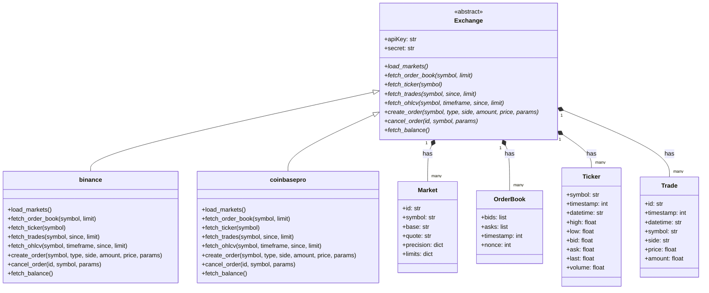

Okay, let's delve into Module 2.2: Exchange Integration.

**Module 2: Trading Infrastructure**

**2.2 Exchange Integration**

**Prompt 1: Provide a comprehensive guide to using the CCXT library for integrating with multiple cryptocurrency exchanges. Explain its core concepts, architecture, and common usage patterns. Include a class diagram illustrating the key classes in CCXT (e.g., `Exchange`, `Market`, `OrderBook`). Also, provide links to the official CCXT documentation and community forums.**

**Response:**

**CCXT: A Unified API for Cryptocurrency Exchange Integration**

CCXT (CryptoCurrency eXchange Trading) is a powerful JavaScript/Python/PHP library that provides a unified interface for interacting with over 100 cryptocurrency exchanges. It simplifies the process of fetching market data, placing orders, managing accounts, and performing other trading-related operations across different exchanges.

**Core Concepts:**

*   **Unified API:** CCXT provides a consistent API across all supported exchanges, allowing you to write code that works with multiple exchanges without significant modifications.
*   **Exchange Abstraction:**  CCXT abstracts away the specific details of each exchange's API, handling differences in authentication, data formats, and API endpoints.
*   **Market Data:**  CCXT provides methods for fetching real-time and historical market data, including:
    *   Tickers (price and volume information)
    *   OHLCV (Open, High, Low, Close, Volume) candlesticks
    *   Order books
    *   Trades
*   **Trading:** CCXT allows you to place and manage orders, including:
    *   Market orders
    *   Limit orders
    *   Stop-loss orders
    *   Take-profit orders
    *   Other advanced order types (depending on exchange support)
*   **Account Management:** You can access account information, such as balances and transaction history.

**Architecture:**

CCXT's architecture is built around a hierarchy of classes:

*   **`Exchange` (Base Class):**  An abstract base class that defines the common interface for all exchanges. It provides methods for:
    *   Authentication
    *   Fetching market data
    *   Placing and managing orders
    *   Handling errors
*   **Exchange-Specific Classes (e.g., `binance`, `coinbasepro`, `kraken`):**  Concrete classes that inherit from the `Exchange` class and implement the specific logic for interacting with each exchange's API.
*   **`Market`:** Represents a trading pair on an exchange (e.g., BTC/USD). It contains information about the symbol, base and quote currencies, precision, limits, and other market-specific details.
*   **`OrderBook`:** Represents the order book for a specific market. It contains lists of bids and asks, along with their corresponding prices and quantities.
*   **`Ticker`:** Represents the ticker information for a market, including the last price, bid, ask, volume, etc.
*   **`Trade`:** Represents a single trade that has occurred on the market.

**Class Diagram (Simplified):**



**Common Usage Patterns:**

1. **Instantiation:** Create an instance of the desired exchange class, providing API keys and other configuration options.
2. **Loading Markets:** Load the available markets from the exchange using `load_markets()`. This populates the `markets` attribute of the exchange object.
3. **Fetching Market Data:** Use methods like `fetch_ticker()`, `fetch_order_book()`, `fetch_trades()`, and `fetch_ohlcv()` to retrieve market data.
4. **Authentication:** For private endpoints (e.g., placing orders, accessing account data), provide your API keys and secrets during instantiation or set them using the `apiKey` and `secret` attributes.
5. **Placing Orders:** Use `create_order()` to place market, limit, or other order types.
6. **Managing Orders:** Use `cancel_order()`, `fetch_order()`, `fetch_open_orders()`, and `fetch_closed_orders()` to manage your orders.
7. **Handling Errors:**  CCXT raises exceptions for various errors (e.g., network errors, API errors, authentication errors). Implement proper error handling to gracefully handle these exceptions.

**Example (Fetching BTC/USDT Ticker from Binance):**

```python
import ccxt

# Instantiate the Binance exchange object
exchange = ccxt.binance()

# Load markets
exchange.load_markets()

# Fetch the ticker for BTC/USDT
ticker = exchange.fetch_ticker("BTC/USDT")

# Print the ticker data
print(ticker)
```

**Links:**

*   **Official CCXT Documentation:** [https://docs.ccxt.com/](https://docs.ccxt.com/)
*   **CCXT Manual:** [https://docs.ccxt.com/#/](https://docs.ccxt.com/#/)
*   **CCXT GitHub Repository:** [https://github.com/ccxt/ccxt](https://github.com/ccxt/ccxt)
*   **CCXT Community Forums:** Not an official forum, but you can find discussions on the CCXT GitHub issues: [https://github.com/ccxt/ccxt/issues](https://github.com/ccxt/ccxt/issues) and in various trading communities.

**Conclusion:**

CCXT is a powerful and versatile library for cryptocurrency exchange integration. Its unified API, exchange abstraction, and extensive functionality make it a valuable tool for building trading bots and other trading-related applications. By understanding its core concepts, architecture, and common usage patterns, you can leverage CCXT to interact with a wide range of exchanges and streamline your development process.

---

**Prompt 2: Demonstrate how to use the CCXT library to connect to the Binance API, fetch market data, and execute trades. Provide Python code examples for authenticating with the API, retrieving order book data, placing different order types (market, limit), and checking order status. Include links to the official Binance API documentation.**

**Response:**

**Using CCXT to Interact with the Binance API**

Here's a demonstration of using the CCXT library to connect to the Binance API, fetch market data, and execute trades.

**1. Installation:**

```bash
pip install ccxt
```

**2. Authentication:**

```python
import ccxt

# Replace with your actual API keys
api_key = "YOUR_BINANCE_API_KEY"
api_secret = "YOUR_BINANCE_API_SECRET"

# Instantiate the Binance exchange object with API credentials
exchange = ccxt.binance({
    "apiKey": api_key,
    "secret": api_secret,
    "enableRateLimit": True  # Enable rate limiting to avoid getting blocked
})

# You can also set the API keys later:
# exchange.apiKey = api_key
# exchange.secret = api_secret
```

**3. Fetching Market Data:**

*   **Fetching the Order Book:**

```python
# Load markets
exchange.load_markets()

# Fetch the order book for BTC/USDT with a depth of 10
order_book = exchange.fetch_order_book("BTC/USDT", limit=10)

print("Bids:", order_book["bids"])
print("Asks:", order_book["asks"])
```

*   **Fetching OHLCV Data:**

```python
# Fetch daily OHLCV data for ETH/USDT for the last 30 days
ohlcv = exchange.fetch_ohlcv("ETH/USDT", timeframe="1d", limit=30)

# Convert to Pandas DataFrame for easier analysis
import pandas as pd
df = pd.DataFrame(ohlcv, columns=["timestamp", "open", "high", "low", "close", "volume"])
df["timestamp"] = pd.to_datetime(df["timestamp"], unit="ms")  # Convert timestamps to datetime objects
print(df)
```

*   **Fetching the Ticker:**

```python
ticker = exchange.fetch_ticker("BTC/USDT")
print(ticker)
```

**4. Executing Trades:**

*   **Placing a Market Order:**

```python
# Place a market buy order for 0.01 BTC
symbol = "BTC/USDT"
amount = 0.01
side = "buy"
order_type = "market"

try:
    order = exchange.create_order(symbol, order_type, side, amount)
    print("Market order placed:", order)
except Exception as e:
    print("Error placing order:", e)
```

*   **Placing a Limit Order:**

```python
# Place a limit sell order for 0.02 ETH at a price of 2500 USDT
symbol = "ETH/USDT"
amount = 0.02
side = "sell"
order_type = "limit"
price = 2500.00

try:
    order = exchange.create_order(symbol, order_type, side, amount, price)
    print("Limit order placed:", order)
except Exception as e:
    print("Error placing order:", e)
```

**5. Checking Order Status:**

```python
# Get order details using the order ID
order_id = order["id"]  # Assuming you have the order ID from the create_order response
try:
    order_status = exchange.fetch_order(order_id, symbol)
    print("Order status:", order_status)
except Exception as e:
    print("Error fetching order status:", e)

# Fetch all open orders for a symbol:
try:
    open_orders = exchange.fetch_open_orders(symbol)
    print("Open orders:", open_orders)
except Exception as e:
    print("Error fetching open orders: ", e)
```

**6. Fetching Balance:**

```python
# Fetch your account balance
try:
    balance = exchange.fetch_balance()
    print("Balance:", balance)
except Exception as e:
    print("Error fetching balance:", e)
```

**Important Considerations:**

*   **Error Handling:** Always include `try...except` blocks to handle potential errors, such as network issues, API errors, and insufficient funds.
*   **Rate Limiting:**  Enable rate limiting (`"enableRateLimit": True`) to avoid exceeding the exchange's API request limits.
*   **Testnet:** Use the Binance testnet ([https://testnet.binance.vision/](https://testnet.binance.vision/)) for testing your code before deploying it with real funds. You'll need separate testnet API keys.

**Binance API Documentation:**

*   **Official Binance API Documentation:** [https://binance-docs.github.io/apidocs/spot/en/](https://binance-docs.github.io/apidocs/spot/en/)

**Conclusion:**

The CCXT library simplifies interacting with the Binance API, allowing you to fetch market data, execute trades, and manage your account using a consistent interface. The provided code examples demonstrate common operations, but always refer to the official Binance and CCXT documentation for the most up-to-date information and advanced features. Remember to handle errors, respect rate limits, and thoroughly test your code before deploying it to a live trading environment.

---

**Prompt 3: Demonstrate how to use the CCXT library or directly interact with the Coinbase Advanced Trade API using Python. Provide code examples for fetching account information, retrieving historical data, placing orders, and managing positions. Include links to the official Coinbase Advanced Trade API documentation.**

**Response:**

**Interacting with the Coinbase Advanced Trade API**

You can interact with Coinbase Advanced Trade either through CCXT or directly using the Coinbase Advanced Trade API. I'll show examples for both methods.

**Method 1: Using CCXT**

```python
import ccxt
import pandas as pd

# Replace with your actual API keys
api_key = "YOUR_COINBASE_ADVANCED_TRADE_API_KEY"
api_secret = "YOUR_COINBASE_ADVANCED_TRADE_API_SECRET"

# Instantiate the Coinbase exchange object
# For Coinbase Advanced Trade use 'coinbasepro' in CCXT
exchange = ccxt.coinbasepro({
    "apiKey": api_key,
    "secret": api_secret,
    "enableRateLimit": True
})

# Load markets
exchange.load_markets()

# Fetch account balance
try:
    balance = exchange.fetch_balance()
    print("Balance:", balance)
except Exception as e:
    print("Error fetching balance:", e)

# Fetch historical OHLCV data for BTC-USD (daily candles for the last 30 days)
try:
    ohlcv = exchange.fetch_ohlcv("BTC/USD", timeframe="1d", limit=30)
    df = pd.DataFrame(ohlcv, columns=["timestamp", "open", "high", "low", "close", "volume"])
    df["timestamp"] = pd.to_datetime(df["timestamp"], unit="ms")
    print(df)
except Exception as e:
    print("Error fetching OHLCV data:", e)

# Place a limit buy order for 0.01 BTC at 25000 USD
symbol = "BTC/USD"
amount = 0.01
side = "buy"
order_type = "limit"
price = 25000.00

try:
    order = exchange.create_order(symbol, order_type, side, amount, price)
    print("Limit order placed:", order)
except Exception as e:
    print("Error placing order:", e)

# Check order status (replace with actual order ID)
# order_id = "YOUR_ORDER_ID"
# try:
#     order_status = exchange.fetch_order(order_id, symbol)
#     print("Order status:", order_status)
# except Exception as e:
#     print("Error fetching order status:", e)
```

**Method 2: Using Coinbase Advanced Trade API Directly**

First you need to install unofficial Coinbase Advanced Trade Python library:

```
pip install cbpro-python
```

```python
import cbpro

# Replace with your actual API keys
api_key = "YOUR_COINBASE_ADVANCED_TRADE_API_KEY"
api_secret = "YOUR_COINBASE_ADVANCED_TRADE_API_SECRET"
passphrase = "YOUR_COINBASE_ADVANCED_TRADE_API_PASSPHRASE"

# Authenticated client (for placing orders, managing account, etc.)
auth_client = cbpro.AuthenticatedClient(api_key, api_secret, passphrase)

# Public client (for fetching market data)
public_client = cbpro.PublicClient()

# Get accounts
try:
    accounts = auth_client.get_accounts()
    print("Accounts:", accounts)
except Exception as e:
    print("Error fetching accounts:", e)

# Get historical rates for BTC-USD (last 300 candles, granularity of 1 day)
try:
    historic_rates = public_client.get_product_historic_rates("BTC-USD", granularity=86400)
    df = pd.DataFrame(historic_rates, columns=["timestamp", "low", "high", "open", "close", "volume"])
    df["timestamp"] = pd.to_datetime(df["timestamp"], unit="s")
    print(df)
except Exception as e:
    print("Error fetching historical rates:", e)

# Place a limit buy order for 0.01 BTC at 25000 USD
try:
    order = auth_client.buy(
        price="25000.00",  # USD
        size="0.01",  # BTC
        order_type="limit",
        product_id="BTC-USD",
    )
    print("Limit order placed:", order)
except Exception as e:
    print("Error placing order:", e)
```

**Coinbase Advanced Trade API Documentation:**

*   **Official Coinbase Advanced Trade API Documentation:** [https://docs.cloud.coinbase.com/advanced-trade-api/docs/welcome](https://docs.cloud.coinbase.com/advanced-trade-api/docs/welcome)

**Important Considerations:**

*   **Error Handling:** Always include `try...except` blocks to handle potential errors.
*   **Rate Limiting:** Be mindful of API rate limits. CCXT's `enableRateLimit` helps with this, but you should also be aware of the limits when using the API directly.
*   **Test Environment:** Coinbase offers a sandbox environment for testing ([https://public.sandbox.exchange.coinbase.com/](https://public.sandbox.exchange.coinbase.com/)). Use this for development and testing before deploying to production.

**Conclusion:**

You can interact with the Coinbase Advanced Trade API either through the CCXT library, which provides a unified interface, or directly using Coinbase's own Python library or by making HTTP requests to the API endpoints. Choose the method that best suits your needs and always refer to the official Coinbase Advanced Trade API documentation for the most up-to-date information on endpoints, parameters, and data formats. Remember to handle errors, respect rate limits, and test your code thoroughly.

---

**Prompt 4: Explain how to use the CCXT library or directly interact with the FTX API using Python. Provide code examples for similar operations as with Binance and Coinbase, and highlight any unique features of the FTX API. Include links to the official FTX API documentation.**

**Response:**

**Interacting with the FTX API**

Similar to Coinbase, you can interact with the FTX API either through the CCXT library or directly using HTTP requests. I'll provide examples for both methods.

**Method 1: Using CCXT**

```python
import ccxt
import pandas as pd

# Replace with your actual API keys
api_key = "YOUR_FTX_API_KEY"
api_secret = "YOUR_FTX_API_SECRET"

# Instantiate the FTX exchange object
exchange = ccxt.ftx({
    "apiKey": api_key,
    "secret": api_secret,
    "enableRateLimit": True
})

# Load markets
exchange.load_markets()

# Fetch account balance
try:
    balance = exchange.fetch_balance()
    print("Balance:", balance)
except Exception as e:
    print("Error fetching balance:", e)

# Fetch historical OHLCV data for BTC/USD (daily candles for the last 30 days)
try:
    ohlcv = exchange.fetch_ohlcv("BTC/USD", timeframe="1d", limit=30)
    df = pd.DataFrame(ohlcv, columns=["timestamp", "open", "high", "low", "close", "volume"])
    df["timestamp"] = pd.to_datetime(df["timestamp"], unit="ms")
    print(df)
except Exception as e:
    print("Error fetching OHLCV data:", e)

# Place a limit buy order for 0.01 BTC at 25000 USD
symbol = "BTC/USD"
amount = 0.01
side = "buy"
order_type = "limit"
price = 25000.00

try:
    order = exchange.create_order(symbol, order_type, side, amount, price)
    print("Limit order placed:", order)
except Exception as e:
    print("Error placing order:", e)

# Check order status (replace with actual order ID)
# order_id = "YOUR_ORDER_ID"
# try:
#     order_status = exchange.fetch_order(order_id, symbol)
#     print("Order status:", order_status)
# except Exception as e:
#     print("Error fetching order status:", e)

# FTX Unique Feature: Subaccounts
# You can specify a subaccount for API calls using the 'ftx-subaccount' header
# exchange.headers = {
#     "FTX-SUBACCOUNT": "your_subaccount_name"
# }
```

**Method 2: Interacting with the FTX API Directly**

FTX doesn't have its own official Python library, but you can use `requests` to make HTTP requests to the API endpoints.

```python
import requests
import time
import hmac
import hashlib
import json

# Replace with your actual API keys
api_key = "YOUR_FTX_API_KEY"
api_secret = "YOUR_FTX_API_SECRET"
subaccount_name = "YOUR_SUBACCOUNT_NAME"  # Optional

# Base URL for FTX API
base_url = "https://ftx.com/api"

def create_ftx_signature(api_secret, timestamp, method, path, body=None):
    """
    Generates an FTX API signature.
    """
    body_str = json.dumps(body) if body else ""
    signature_payload = f"{timestamp}{method.upper()}{path}{body_str}".encode()
    signature = hmac.new(api_secret.encode(), signature_payload, hashlib.sha256).hexdigest()
    return signature

# Get balances
def get_balances():
    """
    Fetches the account balances.
    """
    timestamp = int(time.time() * 1000)
    method = "GET"
    path = "/account"

    signature = create_ftx_signature(api_secret, timestamp, method, path)

    headers = {
        "FTX-KEY": api_key,
        "FTX-SIGN": signature,
        "FTX-TS": str(timestamp),
        "FTX-SUBACCOUNT": subaccount_name  # Optional
    }

    try:
        response = requests.get(base_url + path, headers=headers)
        response.raise_for_status()
        data = response.json()
        print("Balances:", data)
        return data
    except Exception as e:
        print("Error fetching balances:", e)
        return None

# Place a limit order
def place_limit_order(symbol, side, price, amount):
    """
    Places a limit order.
    """
    timestamp = int(time.time() * 1000)
    method = "POST"
    path = "/orders"
    body = {
        "market": symbol,
        "side": side,
        "price": price,
        "type": "limit",
        "size": amount,
    }

    signature = create_ftx_signature(api_secret, timestamp, method, path, body)

    headers = {
        "FTX-KEY": api_key,
        "FTX-SIGN": signature,
        "FTX-TS": str(timestamp),
        "FTX-SUBACCOUNT": subaccount_name  # Optional
    }
    
    try:
        response = requests.post(base_url + path, headers=headers, json=body)
        response.raise_for_status()
        data = response.json()
        print("Order placed:", data)
        return data
    except Exception as e:
        print("Error placing order:", e)
        return None

# Example usage
get_balances()
place_limit_order("BTC/USD", "buy", 25000, 0.01)
```

**Unique Features of the FTX API:**

*   **Subaccounts:** FTX allows you to create subaccounts under your main account, which can be useful for managing different trading strategies or allocating funds to different bots. You can specify the subaccount for API calls using the `ftx-subaccount` header or through the `subaccount` parameter in CCXT.
*   **Futures Trading:** FTX is primarily known for its derivatives (futures) trading. The API provides extensive support for futures, including various order types, leverage, and position management.
*   **Convert Functionality:** FTX has a convert functionality that allows you to convert one asset to another using an RFQ (request for quote) system.

**FTX API Documentation:**

*   **Official FTX API Documentation:** [https://docs.ftx.com/](https://docs.ftx.com/)

**Important Considerations:**

*   **Authentication:**  When using the API directly, you need to handle authentication by creating signatures for your requests, as shown in the example code.
*   **Error Handling:** Implement robust error handling to catch API errors, network issues, and other exceptions.
*   **Rate Limiting:**  Be aware of FTX's API rate limits and implement appropriate mechanisms to avoid exceeding them.
*   **Security:** Securely store your API keys and secrets.

**Conclusion:**

You can interact with the FTX API either through CCXT for a more unified experience or directly using HTTP requests for greater control. The choice depends on your preferences and the specific requirements of your trading bot. Always refer to the official FTX API documentation for the most accurate and up-to-date information, and remember to handle errors, respect rate limits, and prioritize security.

---

**Prompt 5: Demonstrate how to use the CCXT library or directly interact with the Kraken API using Python. Provide code examples for key operations and highlight any specific considerations for the Kraken API. Include links to the official Kraken API documentation.**

**Response:**

**Interacting with the Kraken API**

You can interact with the Kraken API either through the CCXT library or directly using HTTP requests.

**Method 1: Using CCXT**

```python
import ccxt
import pandas as pd

# Replace with your actual API keys
api_key = "YOUR_KRAKEN_API_KEY"
api_secret = "YOUR_KRAKEN_API_SECRET"

# Instantiate the Kraken exchange object
exchange = ccxt.kraken({
    "apiKey": api_key,
    "secret": api_secret,
    "enableRateLimit": True
})

# Load markets
exchange.load_markets()

# Fetch account balance
try:
    balance = exchange.fetch_balance()
    print("Balance:", balance)
except Exception as e:
    print("Error fetching balance:", e)

# Fetch historical OHLCV data for BTC/USD (daily candles for the last 30 days)
# Kraken uses a different symbol format. Check the 'id' in exchange.markets
try:
    ohlcv = exchange.fetch_ohlcv("BTC/USD", timeframe="1d", limit=30)
    df = pd.DataFrame(ohlcv, columns=["timestamp", "open", "high", "low", "close", "volume"])
    df["timestamp"] = pd.to_datetime(df["timestamp"], unit="ms")
    print(df)
except Exception as e:
    print("Error fetching OHLCV data:", e)

# Place a limit buy order for 0.01 BTC at 25000 USD
symbol = "BTC/USD"
amount = 0.01
side = "buy"
order_type = "limit"
price = 25000.00

try:
    order = exchange.create_order(symbol, order_type, side, amount, price)
    print("Limit order placed:", order)
except Exception as e:
    print("Error placing order:", e)
```

**Method 2: Interacting with the Kraken API Directly**

Kraken doesn't have its own official Python library, but you can use `requests` to make HTTP requests to the API endpoints.

```python
import requests
import urllib.parse
import hashlib
import hmac
import base64
import time

# Replace with your actual API keys
api_key = "YOUR_KRAKEN_API_KEY"
api_secret = "YOUR_KRAKEN_API_SECRET"

# Base URL for Kraken API
base_url = "https://api.kraken.com"

def get_kraken_signature(urlpath, data, secret):
    """
    Generates a Kraken API signature.
    """
    postdata = urllib.parse.urlencode(data)
    encoded = (str(data['nonce']) + postdata).encode()
    message = urlpath.encode() + hashlib.sha256(encoded).digest()
    mac = hmac.new(base64.b64decode(secret), message, hashlib.sha512)
    sigdigest = base64.b64encode(mac.digest())
    return sigdigest.decode()

def kraken_request(uri_path, data, api_key, api_secret):
    """
    Makes a request to the Kraken API.
    """
    headers = {}
    headers['API-Key'] = api_key
    headers['API-Sign'] = get_kraken_signature(uri_path, data, api_secret)
    req = requests.post((base_url + uri_path), headers=headers, data=data)
    return req

# Get server time
def get_server_time():
    """
    Fetches the server time from Kraken.
    """
    try:
        response = requests.get(base_url + "/0/public/Time")
        response.raise_for_status()
        data = response.json()
        print("Server Time:", data)
        return data
    except Exception as e:
        print("Error fetching server time:", e)
        return None
    
# Get account balance
def get_account_balance():
    """
    Fetches the account balance from Kraken.
    """
    try:
        response = kraken_request("/0/private/Balance", {
            "nonce": str(int(1000 * time.time()))
        }, api_key, api_secret)
        response.raise_for_status()
        data = response.json()
        print("Account Balance:", data)
        return data
    except Exception as e:
        print("Error fetching account balance:", e)
        return None

# Place a limit order
def place_limit_order(pair, type, volume, price):
    """
    Places a limit order on Kraken.
    """
    try:
        response = kraken_request("/0/private/AddOrder", {
            "nonce": str(int(1000 * time.time())),
            "ordertype": "limit",
            "type": type,
            "volume": volume,
            "pair": pair,
            "price": price
        }, api_key, api_secret)
        response.raise_for_status()
        data = response.json()
        print("Limit order placed:", data)
        return data
    except Exception as e:
        print("Error placing limit order:", e)
        return None

# Example usage
get_server_time()
get_account_balance()
place_limit_order("XBTUSD", "buy", "0.01", "25000")
```

**Specific Considerations for the Kraken API:**

*   **Symbol Format:** Kraken uses a different symbol format than many other exchanges. For example, Bitcoin is represented as `XBT` instead of `BTC`. You need to use the correct symbol format when interacting with the API. In CCXT you can see the available `id` for each symbol in `exchange.markets` after calling `exchange.load_markets()`.
*   **Authentication:** Kraken's API authentication involves creating a signature using your API secret and the request data. The example code demonstrates how to generate the signature.
*   **Nonce:**  The Kraken API requires a nonce (a number that is always greater than the previous nonce) for private endpoint requests. The example code uses the current timestamp in milliseconds as the nonce.
*   **Rate Limiting:** Kraken has strict rate limits. Be mindful of these limits and implement appropriate mechanisms to avoid exceeding them.
*   **Error Handling:** The Kraken API returns errors in a specific format. Make sure to handle errors gracefully in your code.

**Kraken API Documentation:**

*   **Official Kraken API Documentation:** [https://docs.kraken.com/rest/](https://docs.kraken.com/rest/)

**Conclusion:**

You can interact with the Kraken API using either CCXT or by making direct HTTP requests. CCXT provides a more convenient and unified interface, while direct interaction gives you more control. When working with the Kraken API, pay close attention to the symbol format, authentication, nonce requirements, and rate limits. Always refer to the official Kraken API documentation for the most up-to-date information.

---

**Prompt 6: Explain how to integrate with decentralized exchanges (DEXs) like Uniswap and PancakeSwap using Python. Discuss the differences between interacting with DEXs compared to centralized exchanges. Provide code examples for fetching token prices, making swaps, and providing liquidity using libraries like `web3.py` or `eth_account`. Include links to the official documentation for Uniswap and PancakeSwap SDKs.**

**Response:**

| **Security**      | Less risk of exchange hacks, but users are responsible for the security of their private keys | Higher risk of exchange hacks, but users don't need to manage private keys directly |
| **Regulation**    | Less regulated (currently)                                       | More regulated                                                   |
| **KYC/AML**       | Typically no KYC/AML requirements                               | Usually require KYC/AML compliance                               |
| **Fees**          | Gas fees for on-chain transactions, plus trading fees (typically lower than CEXs) | Trading fees, deposit/withdrawal fees                              |
| **Accessibility** | Permissionless (anyone can access)                               | May have geographic restrictions                                   |

**Interacting with DEXs:**

DEXs are smart contracts running on a blockchain (e.g., Ethereum for Uniswap, BNB Chain for PancakeSwap). To interact with them, you need to:

1. **Connect to the Blockchain:** Use a library like `web3.py` (for Ethereum-based DEXs) to connect to a blockchain node (e.g., your own node, Infura, Alchemy).
2. **Interact with Smart Contracts:**
    *   Load the smart contract's ABI (Application Binary Interface), which defines the contract's functions and data structures.
    *   Create contract objects that allow you to call functions and access data.
3. **Sign Transactions:** Use an account (private key) to sign transactions before sending them to the blockchain. You can manage accounts using `web3.py` or libraries like `eth_account`.
4. **Pay Gas Fees:**  Transactions on the blockchain require gas fees, paid in the native cryptocurrency of the blockchain (e.g., ETH for Ethereum).

**Code Examples (Uniswap V2 on Ethereum with `web3.py`):**

**Prerequisites:**

*   Install `web3.py`: `pip install web3`
*   Have an Ethereum node or an endpoint from a service like Infura or Alchemy.
*   Have an Ethereum account with some ETH to pay for gas fees.

**1. Fetching Token Prices:**

```python
from web3 import Web3

# Replace with your node provider URL (e.g., Infura, Alchemy)
INFURA_URL = "YOUR_INFURA_URL"

# Connect to the Ethereum network
w3 = Web3(Web3.HTTPProvider(INFURA_URL))

# Uniswap V2 Router contract address and ABI
UNISWAP_ROUTER_ADDRESS = "0x7a250d5630B4cF539739dF2C5dAcb4c659F2488D"  # Replace if using a different network or router
UNISWAP_ROUTER_ABI = [
    # ... (Get the ABI from a source like Etherscan or the Uniswap documentation)
    # Reduced for brevity
    {"inputs": [{"internalType": "uint256", "name": "amountIn", "type": "uint256"}, {"internalType": "address[]", "name": "path", "type": "address[]"}], "name": "getAmountsOut", "outputs": [{"internalType": "uint256[]", "name": "amounts", "type": "uint256[]"}], "stateMutability": "view", "type": "function"},
]

# Create a contract object
uniswap_router = w3.eth.contract(address=UNISWAP_ROUTER_ADDRESS, abi=UNISWAP_ROUTER_ABI)

# Token addresses (replace with actual addresses)
WETH_ADDRESS = "0xC02aaA39b223FE8D0A0e5C4F27eAD9083C756Cc2"  # Wrapped Ether
DAI_ADDRESS = "0x6B175474E89094C44Da98b954EedeAC495271d0F"   # DAI stablecoin

# Get the amount of DAI you would receive for 1 WETH
amount_in = w3.to_wei(1, "ether")  # Convert 1 ETH to Wei (smallest unit of Ether)
path = [WETH_ADDRESS, DAI_ADDRESS]
amounts_out = uniswap_router.functions.getAmountsOut(amount_in, path).call()
dai_amount = amounts_out[1] / 10**18 # Convert from Wei to DAI (assuming DAI has 18 decimals)

print(f"1 WETH = {dai_amount:.2f} DAI")
```

**2. Making a Swap:**

```python
from web3 import Web3

# ... (Infura URL, contract address, ABI, as in the previous example)

# Your account details (replace with your actual details)
PRIVATE_KEY = "YOUR_PRIVATE_KEY"
ACCOUNT_ADDRESS = "YOUR_ACCOUNT_ADDRESS"

# Create a contract object
uniswap_router = w3.eth.contract(address=UNISWAP_ROUTER_ADDRESS, abi=UNISWAP_ROUTER_ABI)

# Token addresses
WETH_ADDRESS = "0xC02aaA39b223FE8D0A0e5C4F27eAD9083C756Cc2"
DAI_ADDRESS = "0x6B175474E89094C44Da98b954EedeAC495271d0F"

# Amount to swap (in Wei)
amount_in = w3.to_wei(0.1, "ether")

# Get the current nonce for the account
nonce = w3.eth.get_transaction_count(ACCOUNT_ADDRESS)

# Build the transaction
transaction = uniswap_router.functions.swapExactTokensForTokens(
    amount_in,  # amountIn
    0,  # amountOutMin (set to 0 for simplicity, but you should calculate a minimum acceptable amount)
    [WETH_ADDRESS, DAI_ADDRESS],  # path
    ACCOUNT_ADDRESS,  # to
    (int(time.time()) + 1000)  # deadline (e.g., 1000 seconds from now)
).build_transaction({
    "chainId": 1,  # Replace with the correct chain ID (e.g., 1 for Ethereum mainnet, 5 for goerli testnet)
    "gas": 2000000,  # Adjust gas limit as needed
    "gasPrice": w3.to_wei("50", "gwei"),  # Adjust gas price as needed
    "nonce": nonce,
})

# Sign the transaction
signed_txn = w3.eth.account.sign_transaction(transaction, private_key=PRIVATE_KEY)

# Send the transaction
txn_hash = w3.eth.send_raw_transaction(signed_txn.rawTransaction)

# Wait for the transaction to be mined
receipt = w3.eth.wait_for_transaction_receipt(txn_hash)

print(f"Transaction hash: {txn_hash.hex()}")
print(f"Transaction receipt: {receipt}")
```

**3. Providing Liquidity:**

Providing liquidity involves adding tokens to a liquidity pool on the DEX. This is a more advanced operation and requires understanding concepts like impermanent loss. The following is a simplified example:

```python
from web3 import Web3
# ... (Infura URL, contract address, ABI, account details as before)

# Create a contract object for Uniswap V2 Router
uniswap_router = w3.eth.contract(address=UNISWAP_ROUTER_ADDRESS, abi=UNISWAP_ROUTER_ABI)

# Token addresses
WETH_ADDRESS = "0xC02aaA39b223FE8D0A0e5C4F27eAD9083C756Cc2"
DAI_ADDRESS = "0x6B175474E89094C44Da98b954EedeAC495271d0F"

# Approve before add liquidity
# Get ERC-20 token contract instances
weth_token = w3.eth.contract(address=WETH_ADDRESS, abi=ERC20_ABI)  # Assume you have the ERC20 ABI
dai_token = w3.eth.contract(address=DAI_ADDRESS, abi=ERC20_ABI)

# Approve the Uniswap router to spend your WETH and DAI
amount_weth_to_approve = w3.to_wei(1, 'ether')
amount_dai_to_approve = w3.to_wei(1000, 'ether')

approve_weth_tx = weth_token.functions.approve(UNISWAP_ROUTER_ADDRESS, amount_weth_to_approve).build_transaction({
    'from': ACCOUNT_ADDRESS,
    'gas': 100000,
    'gasPrice': w3.to_wei('50', 'gwei'),
    'nonce': w3.eth.get_transaction_count(ACCOUNT_ADDRESS),
})

signed_approve_weth_tx = w3.eth.account.sign_transaction(approve_weth_tx, PRIVATE_KEY)
tx_hash = w3.eth.send_raw_transaction(signed_approve_weth_tx.rawTransaction)
w3.eth.wait_for_transaction_receipt(tx_hash)

approve_dai_tx = dai_token.functions.approve(UNISWAP_ROUTER_ADDRESS, amount_dai_to_approve).build_transaction({
    'from': ACCOUNT_ADDRESS,
    'gas': 100000,
    'gasPrice': w3.to_wei('50', 'gwei'),
    'nonce': w3.eth.get_transaction_count(ACCOUNT_ADDRESS),
})

signed_approve_dai_tx = w3.eth.account.sign_transaction(approve_dai_tx, PRIVATE_KEY)
tx_hash = w3.eth.send_raw_transaction(signed_approve_dai_tx.rawTransaction)
w3.eth.wait_for_transaction_receipt(tx_hash)

# Amounts to add to the liquidity pool (in Wei)
amount_weth_desired = w3.to_wei(0.5, "ether")  # Replace with the desired amount of WETH
amount_dai_desired = w3.to_wei(1800, "ether")  # Replace with the desired amount of DAI (should be proportionate to WETH based on current price)

# Get the current nonce for the account
nonce = w3.eth.get_transaction_count(ACCOUNT_ADDRESS)

# Build the transaction
transaction = uniswap_router.functions.addLiquidity(
    WETH_ADDRESS,  # tokenA
    DAI_ADDRESS,  # tokenB
    amount_weth_desired,  # amountADesired
    amount_dai_desired,  # amountBDesired
    0,  # amountAMin (set to 0 for simplicity, but you should calculate a minimum acceptable amount)
    0,  # amountBMin (set to 0 for simplicity, but you should calculate a minimum acceptable amount)
    ACCOUNT_ADDRESS,  # to
    (int(time.time()) + 1000)  # deadline
).build_transaction({
    "chainId": 1,
    "gas": 3000000,  # Adjust gas limit as needed
    "gasPrice": w3.to_wei("50", "gwei"),
    "nonce": nonce,
})

# Sign and send the transaction
signed_txn = w3.eth.account.sign_transaction(transaction, private_key=PRIVATE_KEY)
txn_hash = w3.eth.send_raw_transaction(signed_txn.rawTransaction)

# Wait for the transaction to be mined
receipt = w3.eth.wait_for_transaction_receipt(txn_hash)

print(f"Transaction hash: {txn_hash.hex()}")
print(f"Transaction receipt: {receipt}")
```

**Explanation:**

*   The code interacts with the Uniswap V2 Router smart contract to add liquidity to a WETH-DAI pool.
*   It approves the router to spend your WETH and DAI tokens.
*   It specifies the desired amounts of WETH and DAI to add.
*   It builds, signs, and sends the `addLiquidity` transaction.

**Important Notes:**

*   **Replace Placeholders:**  Replace all placeholder values (Infura URL, private key, account address, token addresses, etc.) with your actual values.
*   **ABI:** You'll need the full ABI of the Uniswap V2 Router contract and ERC20 contract. You can typically find these on Etherscan by searching for the contract address or in the official Uniswap documentation.
*   **Gas Fees:**  Adjust the `gas` and `gasPrice` values based on network conditions. Using a service like [https://ethgasstation.info/](https://ethgasstation.info/) can help you estimate appropriate gas prices.
*   **Slippage:** When making swaps or adding liquidity, be aware of slippage. Set appropriate minimum amounts (`amountOutMin`, `amountAMin`, `amountBMin`) to protect yourself from unfavorable price movements during the transaction.
*   **Security:**  **Never hardcode your private key directly into your code.** Store it securely, such as in environment variables or a dedicated secrets management system.
*   **Testnet:**  Test your code thoroughly on a testnet (e.g., Goerli, Rinkeby) before deploying it to the mainnet.

**Official Documentation:**

*   **Uniswap V2 SDK:** [https://docs.uniswap.org/sdk/v2/overview](https://docs.uniswap.org/sdk/v2/overview)
*   **Uniswap V3 SDK:** [https://docs.uniswap.org/sdk/v3/overview](https://docs.uniswap.org/sdk/v3/overview)
*   **PancakeSwap SDK:** [https://docs.pancakeswap.finance/developers](https://docs.pancakeswap.finance/developers) (PancakeSwap is a fork of Uniswap, so the concepts are similar)
*   **`web3.py` Documentation:** [https://web3py.readthedocs.io/en/stable/](https://web3py.readthedocs.io/en/stable/)
*   **`eth_account` Documentation:** [https://eth-account.readthedocs.io/en/stable/](https://eth-account.readthedocs.io/en/stable/)

**Conclusion:**

Interacting with DEXs like Uniswap and PancakeSwap requires a different approach than interacting with CEXs. You need to connect to the blockchain, interact with smart contracts, sign transactions, and pay gas fees. Libraries like `web3.py` and `eth_account` provide the necessary tools for these operations. Always be mindful of security, especially when handling private keys, and test your code thoroughly on a testnet before deploying it to the mainnet. Remember to consult the official documentation of the specific DEX and the SDK you're using for the most accurate and up-to-date information.
