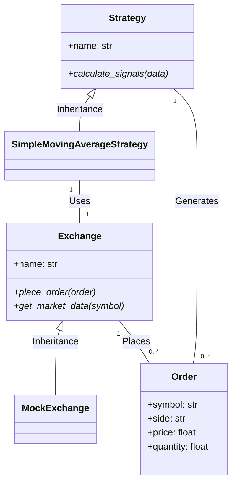
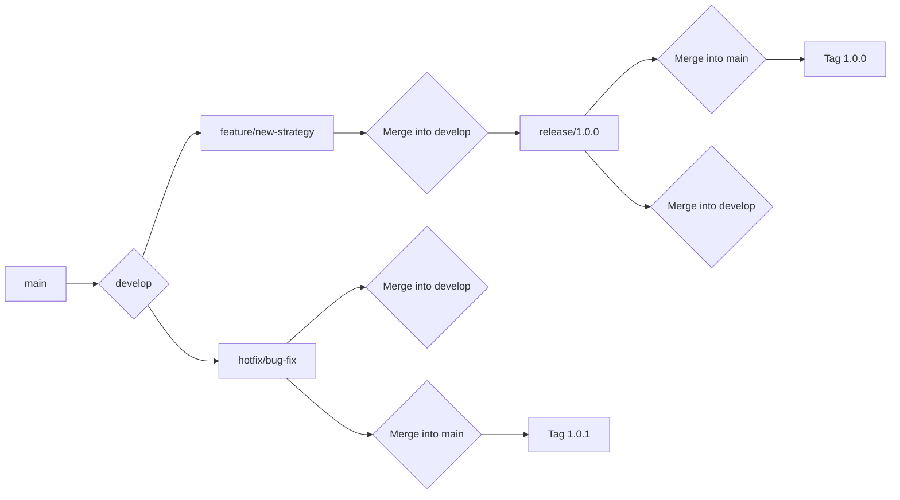
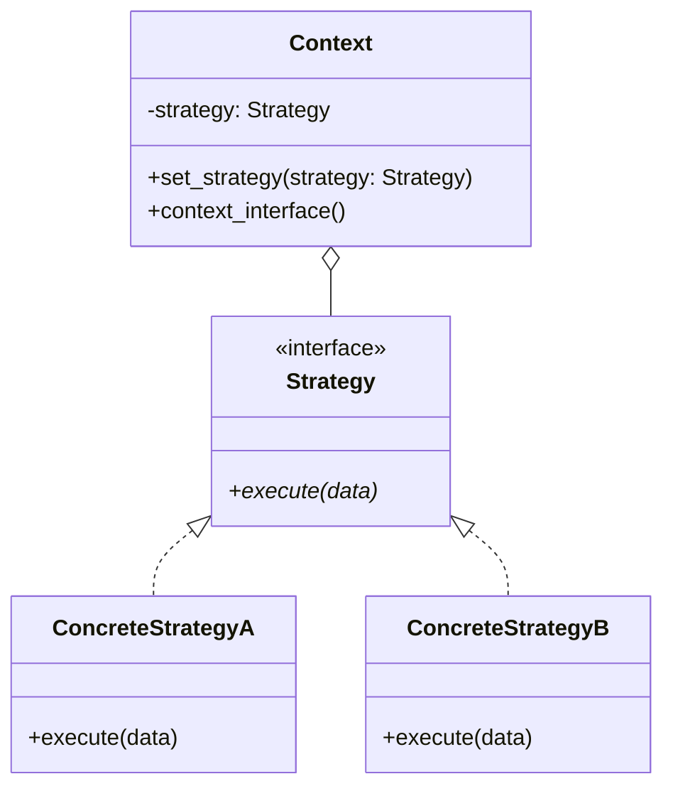
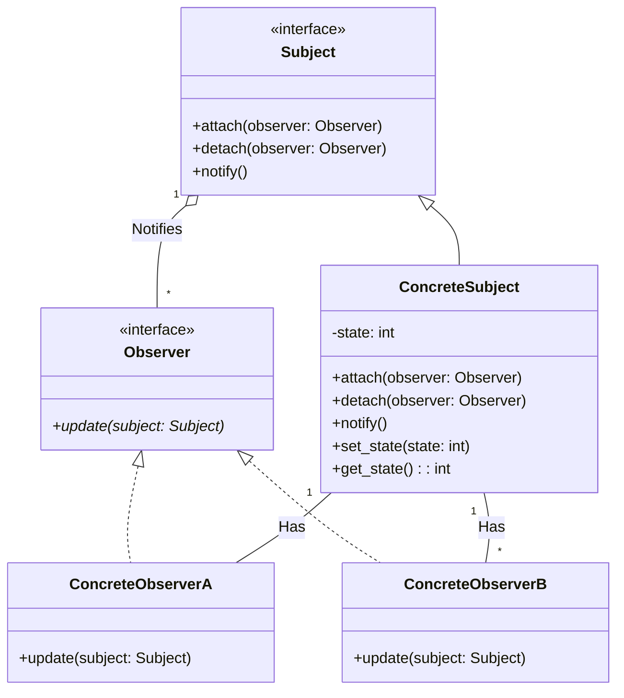
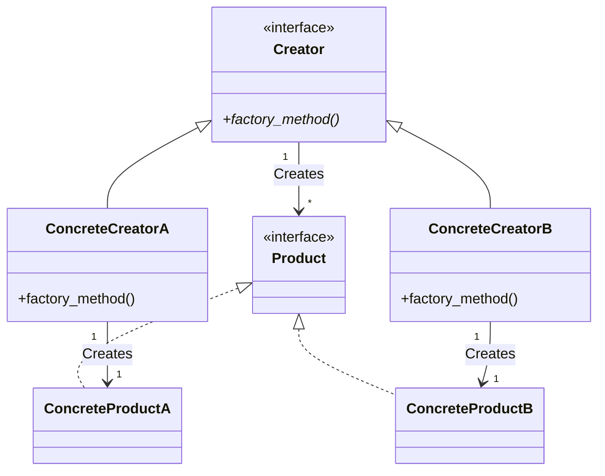

Okay, let's explore Module 1.3: Programming Essentials, providing detailed responses to each prompt.

**1.3 Programming Essentials**

**Prompt 1: Introduce Python as the primary language for algorithmic trading. Explain why Python is well-suited for this purpose and provide links to beginner-friendly Python tutorials. Include a section on setting up a basic Python environment for trading using Anaconda or pip.**

**Response:**

**Python: The Language of Algorithmic Trading**

Python has emerged as the dominant language for algorithmic trading due to its unique combination of features:

**Why Python is Well-Suited for Algorithmic Trading:**

*   **Ease of Use and Readability:** Python's simple syntax and clear structure make it easy to learn and write, even for those new to programming. This allows traders to focus on strategy logic rather than getting bogged down in complex code.
*   **Vast Ecosystem of Libraries:** Python boasts a rich ecosystem of libraries specifically designed for numerical computation, data analysis, and machine learning, all crucial for algorithmic trading:
    *   **NumPy:**  Fundamental library for numerical operations, providing powerful array objects and mathematical functions.
    *   **Pandas:**  Provides high-performance data structures (like DataFrames) and data analysis tools, making it easy to manipulate and analyze market data.
    *   **SciPy:**  A collection of numerical algorithms and domain-specific toolboxes, including statistics, optimization, and signal processing.
    *   **Scikit-learn:**  A comprehensive machine learning library for tasks like classification, regression, and clustering.
    *   **TensorFlow/PyTorch:**  Deep learning frameworks for building and training neural networks.
    *   **TA-Lib:**  A library for technical analysis, providing functions to calculate a wide range of technical indicators.
*   **Large and Active Community:** Python has a large and active community of developers, meaning ample support, resources, and readily available solutions to common problems.
*   **Rapid Prototyping:** Python's ease of use and extensive libraries enable rapid prototyping of trading ideas, allowing traders to quickly test and iterate on their strategies.
*   **Integration with APIs:** Python makes it straightforward to interact with APIs provided by exchanges, data providers, and other services.
*   **Backtesting Libraries:** Several powerful backtesting libraries are available in Python, such as Backtrader and Zipline, making it easy to simulate and evaluate trading strategies on historical data.

**Beginner-Friendly Python Tutorials:**

*   **Codecademy:** [https://www.codecademy.com/learn/learn-python-3](https://www.codecademy.com/learn/learn-python-3) (Interactive lessons)
*   **Learn Python the Hard Way:** [https://learnpythonthehardway.org/python3/](https://learnpythonthehardway.org/python3/) (Book with exercises)
*   **Google's Python Class:** [https://developers.google.com/edu/python/](https://developers.google.com/edu/python/) (Text and video tutorials)
*   **Official Python Tutorial:** [https://docs.python.org/3/tutorial/](https://docs.python.org/3/tutorial/) (Comprehensive documentation)
*   **Kaggle Learn:** [https://www.kaggle.com/learn](https://www.kaggle.com/learn)

**Setting Up a Basic Python Environment for Trading:**

**Option 1: Anaconda (Recommended for Beginners):**

Anaconda is a distribution of Python that comes with many pre-installed data science and trading-related packages.

1. **Download and Install:** Go to [https://www.anaconda.com/products/individual](https://www.anaconda.com/products/individual) and download the appropriate installer for your operating system. Follow the installation instructions.
2. **Create a Virtual Environment (Recommended):**
    *   Open the Anaconda Prompt (or terminal).
    *   Type `conda create -n trading_env python=3.9` (replace `trading_env` with your desired environment name and `3.9` with your preferred Python version).
    *   Activate the environment: `conda activate trading_env`
3. **Install Packages:**
    *   `conda install numpy pandas matplotlib scikit-learn ta-lib` (This installs some of the most common libraries. You can install others later as needed.)

**Option 2: pip:**

pip is the standard package installer for Python.

1. **Ensure Python is Installed:**  Most operating systems come with Python pre-installed. You can check by typing `python --version` or `python3 --version` in your terminal. If it's not installed, download it from [https://www.python.org/downloads/](https://www.python.org/downloads/).
2. **Create a Virtual Environment (Recommended):**
    *   Open your terminal.
    *   Type `python3 -m venv trading_env` (replace `trading_env` with your desired environment name).
    *   Activate the environment:
        *   **Windows:** `trading_env\Scripts\activate`
        *   **macOS/Linux:** `source trading_env/bin/activate`
3. **Install Packages:**
    *   `pip install numpy pandas matplotlib scikit-learn ta-lib`

**Conclusion:**

Python offers a powerful and accessible platform for algorithmic trading. Its ease of use, extensive libraries, and strong community support make it an excellent choice for both beginners and experienced traders. Setting up a proper development environment using Anaconda or pip is the first step towards building and deploying successful trading strategies.

---

**Prompt 2: Cover essential data structures in Python for trading, such as lists, dictionaries, and tuples. Provide examples of how these data structures can be used to store and manipulate market data. Include a code example demonstrating how to represent an order book using nested dictionaries.**

**Response:**

**Essential Data Structures in Python for Trading**

Data structures are fundamental building blocks for organizing and manipulating data in any programming language. In Python, several data structures are particularly useful for trading applications:

**1. Lists:**

*   **Description:** Ordered, mutable (changeable) sequences of items.
*   **Uses in Trading:**
    *   Storing time series data (e.g., a list of closing prices).
    *   Storing a sequence of trades.
    *   Maintaining a list of orders.

**Example:**

```python
# Storing a list of closing prices
closing_prices = [50.1, 50.5, 51.2, 50.8, 51.5]

# Adding a new price to the list
closing_prices.append(52.0)

# Accessing elements (e.g., the third price)
third_price = closing_prices[2]  # Output: 51.2
```

**2. Dictionaries:**

*   **Description:** Unordered collections of key-value pairs. Keys must be unique and immutable (e.g., strings, numbers, tuples), while values can be of any data type.
*   **Uses in Trading:**
    *   Storing order book data (as demonstrated below).
    *   Representing information about a particular trade (e.g., symbol, price, quantity, timestamp).
    *   Storing configuration parameters for a trading bot.

**Example:**

```python
# Representing a trade
trade = {
    "symbol": "BTCUSD",
    "side": "buy",
    "price": 40000.0,
    "quantity": 0.5,
    "timestamp": "2023-10-27 10:00:00"
}

# Accessing values
symbol = trade["symbol"]  # Output: BTCUSD
```

**3. Tuples:**

*   **Description:** Ordered, immutable (unchangeable) sequences of items.
*   **Uses in Trading:**
    *   Representing data that should not be modified (e.g., the components of a trading pair like ("BTC", "USD")).
    *   As keys in dictionaries (since they are immutable).

**Example:**

```python
# Representing a trading pair
trading_pair = ("ETH", "USD")

# Using a tuple as a dictionary key
price_data = {
    ("BTC", "USD"): 40000.0,
    ("ETH", "USD"): 3000.0
}
```

**Representing an Order Book Using Nested Dictionaries:**

An order book can be effectively represented using nested dictionaries in Python:

```python
order_book = {
    "bids": {
        "39990": {  # Price level
            "order_id_1": {"quantity": 0.5, "timestamp": "2023-10-27 10:01:00"},
            "order_id_2": {"quantity": 0.2, "timestamp": "2023-10-27 10:02:00"}
        },
        "39985": {
            "order_id_3": {"quantity": 1.0, "timestamp": "2023-10-27 10:03:00"}
        }
    },
    "asks": {
        "40010": {
            "order_id_4": {"quantity": 0.8, "timestamp": "2023-10-27 10:04:00"}
        },
        "40015": {
            "order_id_5": {"quantity": 0.3, "timestamp": "2023-10-27 10:05:00"},
            "order_id_6": {"quantity": 1.2, "timestamp": "2023-10-27 10:06:00"}
        }
    }
}

# Accessing information from the order book
best_bid_price = max(order_book["bids"].keys())  # Get the highest bid price
best_ask_price = min(order_book["asks"].keys())  # Get the lowest ask price

quantity_at_best_bid = sum(order_details["quantity"] for order_details in order_book["bids"][best_bid_price].values())

print(f"Best Bid Price: {best_bid_price}")
print(f"Quantity at Best Bid: {quantity_at_best_bid}")
print(f"Best Ask Price: {best_ask_price}")
```

**Explanation:**

*   The `order_book` dictionary has two keys: `"bids"` and `"asks"`.
*   Each of these keys holds another dictionary representing the bid and ask levels, respectively.
*   The keys in the bid/ask level dictionaries are the price levels.
*   The values at each price level are dictionaries where keys are `order_id` and values are dictionaries containing order details (quantity, timestamp, etc.).

**Conclusion:**

Lists, dictionaries, and tuples are essential data structures for working with market data in Python. Understanding how to use them effectively is crucial for building trading bots and implementing trading strategies. The nested dictionary example demonstrates how to represent complex data like an order book in a structured and accessible way.

---

**Prompt 3: Explain the principles of object-oriented programming (OOP) in Python and how they can be applied to trading bot development. Create a simple class hierarchy for a trading bot, including classes for 'Strategy,' 'Order,' and 'Exchange.' Provide a UML diagram illustrating the relationships between these classes.**

**Response:**

**Object-Oriented Programming (OOP) in Python for Trading Bots**

**Principles of OOP:**

Object-oriented programming (OOP) is a programming paradigm based on the concept of "objects," which can contain data (attributes) and code (methods). Key principles of OOP include:

*   **Abstraction:** Hiding complex implementation details and exposing only essential information to the user.
*   **Encapsulation:** Bundling data (attributes) and methods that operate on that data within a class, protecting it from outside access and misuse.
*   **Inheritance:** Creating new classes (derived classes) from existing ones (base classes), inheriting their attributes and methods, promoting code reuse and reducing redundancy.
*   **Polymorphism:**  The ability of objects of different classes to respond to the same method call in their own specific way, allowing for flexibility and extensibility.

**Benefits of OOP in Trading Bot Development:**

*   **Modularity:** OOP promotes breaking down complex systems into smaller, manageable, and reusable components (objects).
*   **Organization:**  Code is organized around objects, making it easier to understand, maintain, and debug.
*   **Flexibility:**  OOP allows for easy modification and extension of existing code through inheritance and polymorphism.
*   **Code Reusability:**  Classes can be reused in different parts of the trading bot or even in different projects.
*   **Scalability:** OOP makes it easier to scale trading bots to handle more complex strategies or larger trading volumes.

**Simple Class Hierarchy for a Trading Bot:**

Let's define a basic class hierarchy for a trading bot with the following classes:

*   **`Strategy`:**  An abstract base class representing a trading strategy.
*   **`Order`:** Represents an order to be placed on an exchange.
*   **`Exchange`:** An abstract base class representing a cryptocurrency exchange.

**Python Code:**

```python
from abc import ABC, abstractmethod

class Strategy(ABC):
    """
    Abstract base class for a trading strategy.
    """
    def __init__(self, name):
        self.name = name

    @abstractmethod
    def calculate_signals(self, data):
        """
        Calculates trading signals based on market data.
        This method must be implemented by concrete strategy subclasses.
        """
        pass

class Order:
    """
    Represents an order.
    """
    def __init__(self, symbol, side, price, quantity):
        self.symbol = symbol
        self.side = side  # "buy" or "sell"
        self.price = price
        self.quantity = quantity

class Exchange(ABC):
    """
    Abstract base class for a cryptocurrency exchange.
    """
    def __init__(self, name):
        self.name = name

    @abstractmethod
    def place_order(self, order):
        """
        Places an order on the exchange.
        """
        pass

    @abstractmethod
    def get_market_data(self, symbol):
        """
        Fetches market data for a given symbol.
        """
        pass

# Example concrete strategy
class SimpleMovingAverageStrategy(Strategy):
    def __init__(self, name, short_window, long_window):
      super().__init__(name)
      self.short_window = short_window
      self.long_window = long_window

    def calculate_signals(self, data):
      short_ma = data["close"].rolling(window=self.short_window).mean()
      long_ma = data["close"].rolling(window=self.long_window).mean()

      if short_ma.iloc[-1] > long_ma.iloc[-1] and short_ma.iloc[-2] <= long_ma.iloc[-2]:
        return "buy"
      elif short_ma.iloc[-1] < long_ma.iloc[-1] and short_ma.iloc[-2] >= long_ma.iloc[-2]:
        return "sell"
      else:
        return "hold"

# Example concrete exchange
class MockExchange(Exchange):
  def __init__(self, name):
    super().__init__(name)
    self.balance = {"BTC": 10, "USD": 100000}

  def place_order(self, order):
    print(f"Placing order on {self.name}: {order.side} {order.quantity} {order.symbol} at ${order.price}")
    if order.side == "buy":
      if self.balance["USD"] >= order.quantity * order.price:
        self.balance["USD"] -= order.quantity * order.price
        self.balance["BTC"] += order.quantity
      else:
        print("Insufficient USD balance")
    elif order.side == "sell":
      if self.balance["BTC"] >= order.quantity:
        self.balance["BTC"] -= order.quantity
        self.balance["USD"] += order.quantity * order.price
      else:
        print("Insufficient BTC balance")

  def get_market_data(self, symbol):
    # Simulate fetching market data
    import pandas as pd
    data = pd.DataFrame({
        "open": [10, 11, 12, 13, 14],
        "high": [12, 13, 14, 15, 16],
        "low": [9, 10, 11, 12, 13],
        "close": [11, 12, 13, 14, 15]
    })

    return data
```

**UML Diagram:**



**Explanation:**

*   `Strategy` and `Exchange` are abstract base classes (ABCs). The `*` next to method names in the UML diagram indicates that they are abstract methods and must be implemented by concrete subclasses.
*   `SimpleMovingAverageStrategy` is a concrete subclass of `Strategy` that implements a specific trading strategy based on moving averages.
*   `MockExchange` is a concrete subclass of `Exchange` that simulates placing orders and fetching market data.
*   `Order` is a simple class representing an order.
*   A `Strategy` can generate multiple `Order` objects.
*   An `Exchange` can place multiple `Order` objects.

**Conclusion:**

OOP is a powerful paradigm for building complex trading bots. By using classes and objects, you can create modular, flexible, and maintainable code. The example class hierarchy demonstrates how to apply OOP principles to represent key components of a trading system.

---

**Prompt 4: Demonstrate how to work with APIs in Python, focusing on REST APIs commonly used by cryptocurrency exchanges. Write a Python script that fetches data from a public API (e.g., CoinGecko, CoinMarketCap) and parses the JSON response. Include links to documentation for popular exchange APIs.**

**Response:**

**Working with APIs in Python for Cryptocurrency Trading**

**What are APIs?**

API stands for Application Programming Interface. It's a set of definitions and protocols that allows different software systems to communicate with each other. In the context of cryptocurrency trading, APIs enable you to interact with exchanges, get market data, place orders, and manage your account programmatically.

**REST APIs:**

REST (Representational State Transfer) is a widely used architectural style for designing APIs. REST APIs typically use HTTP methods (GET, POST, PUT, DELETE) to interact with resources (data) identified by URLs. They often return data in JSON format.

**Fetching Data from a Public API (CoinGecko Example):**

```python
import requests

def get_bitcoin_price():
    """
    Fetches the current Bitcoin price in USD from the CoinGecko API.
    """
    url = "https://api.coingecko.com/api/v3/simple/price?ids=bitcoin&vs_currencies=usd"
    try:
        response = requests.get(url)
        response.raise_for_status()  # Raise an exception for bad status codes (4xx or 5xx)

        data = response.json()
        price = data["bitcoin"]["usd"]
        return price

    except requests.exceptions.RequestException as e:
        print(f"Error fetching data: {e}")
        return None

if __name__ == "__main__":
    price = get_bitcoin_price()
    if price:
        print(f"Current Bitcoin price: ${price}")
```

**Explanation:**

1. **Import `requests`:** This library is used to make HTTP requests.
2. **Define `get_bitcoin_price()`:** This function fetches the Bitcoin price.
3. **API Endpoint URL:**  The `url` variable stores the API endpoint for getting the Bitcoin price from CoinGecko.
4. **`requests.get(url)`:** Makes a GET request to the API endpoint.
5. **`response.raise_for_status()`:** Checks if the request was successful (status code 200). If not, it raises an exception.
6. **`response.json()`:** Parses the JSON response from the API and converts it into a Python dictionary.
7. **Extract Price:** The Bitcoin price in USD is extracted from the dictionary.
8. **Error Handling:** The `try...except` block handles potential errors during the API request.

**Parsing a More Complex JSON Response (CoinMarketCap Example):**

Let's say you want to fetch the top 5 cryptocurrencies by market cap from CoinMarketCap (you'll need an API key for this, but the example shows the structure):

```python
import requests

def get_top_5_coins():
  """
  Fetches the top 5 cryptocurrencies by market cap from CoinMarketCap (requires an API key).
  """
  url = "https://pro-api.coinmarketcap.com/v1/cryptocurrency/listings/latest"
  parameters = {
      "start": "1",
      "limit": "5",
      "convert": "USD"
  }
  headers = {
      "Accepts": "application/json",
      "X-CMC_PRO_API_KEY": "YOUR_API_KEY"  # Replace with your actual API key
  }

  try:
    response = requests.get(url, headers=headers, params=parameters)
    response.raise_for_status()

    data = response.json()
    coins = data["data"]

    for coin in coins:
      print(f"{coin['name']} ({coin['symbol']}): ${coin['quote']['USD']['price']:.2f}")

  except requests.exceptions.RequestException as e:
      print(f"Error fetching data: {e}")

if __name__ == "__main__":
  get_top_5_coins()
```

**Explanation:**

1. **API Key:** This example requires a CoinMarketCap API key, which you can obtain by creating an account on their developer portal.
2. **Headers:** The `headers` dictionary includes the API key for authentication.
3. **Parameters:** The `parameters` dictionary specifies the query parameters for the API request (start, limit, convert).
4. **Iterating Through Data:** The code iterates through the list of coins in the `data["data"]` list and prints the name, symbol, and price of each coin.

**Documentation for Popular Exchange APIs:**

*   **Binance:** [https://binance-docs.github.io/apidocs/spot/en/](https://binance-docs.github.io/apidocs/spot/en/)
*   **Coinbase Pro:** [https://docs.pro.coinbase.com/](https://docs.pro.coinbase.com/)
*   **Coinbase Advanced Trade:** [https://docs.cloud.coinbase.com/advanced-trade-api/docs/welcome](https://docs.cloud.coinbase.com/advanced-trade-api/docs/welcome)
*   **Kraken:** [https://docs.kraken.com/rest/](https://docs.kraken.com/rest/)
*   **Bitfinex:** [https://docs.bitfinex.com/docs](https://docs.bitfinex.com/docs)
*   **FTX:** [https://docs.ftx.com/](https://docs.ftx.com/)

**Important Considerations:**

*   **API Keys:** Many exchange APIs require API keys for authentication. Keep your API keys secret and do not share them publicly.
*   **Rate Limiting:** APIs often have rate limits, which restrict the number of requests you can make within a specific time period. Be mindful of these limits to avoid getting your API access blocked.
*   **Error Handling:** Always include proper error handling in your code to gracefully handle API errors, network issues, and unexpected responses.
*   **Security:**  Be cautious about storing sensitive information like API keys directly in your code. Consider using environment variables or more secure methods for managing secrets.

---

**Prompt 5: Introduce Git for version control in trading projects. Explain basic Git commands (add, commit, push, pull, branch, merge) and provide a step-by-step guide to creating and managing a Git repository on GitHub or GitLab. Include a visual workflow diagram of a typical Git branching model.**

**Response:**

**Git for Version Control in Trading Projects**

**What is Git?**

Git is a distributed version control system (DVCS) that allows you to track changes to your code, collaborate with others, and revert to previous versions if needed. It's an essential tool for any software development project, including algorithmic trading.

**Benefits of Using Git:**

*   **Track Changes:** Git records every change made to your code, creating a history of your project's development.
*   **Collaboration:** Git enables multiple developers to work on the same project simultaneously without overwriting each other's changes.
*   **Branching and Merging:** Git allows you to create branches to work on new features or experiments in isolation, and then merge them back into the main codebase when they're ready.
*   **Rollback:** You can easily revert to previous versions of your code if you make a mistake or need to undo a change.
*   **Backup:**  Your code is stored remotely on a server (like GitHub or GitLab), providing a backup in case of local machine failure.

**Basic Git Commands:**

*   **`git init`:** Initializes a new Git repository in your project directory.
*   **`git add <file>` or `git add .`:** Stages changes for a commit. `git add .` stages all changes in the current directory and its subdirectories.
*   **`git commit -m "Your commit message"`:** Saves a snapshot of the staged changes with a descriptive message.
*   **`git status`:** Shows the current status of your repository (modified files, staged changes, etc.).
*   **`git log`:** Displays the commit history.
*   **`git branch`:** Lists all branches in your repository.
*   **`git branch <branch_name>`:** Creates a new branch.
*   **`git checkout <branch_name>`:** Switches to a different branch.
*   **`git merge <branch_name>`:** Merges the specified branch into your current branch.
*   **`git remote add origin <repository_url>`:** Adds a remote repository (e.g., on GitHub) to your local repository.
*   **`git push -u origin <branch_name>`:** Pushes your local branch to the remote repository.
*   **`git pull origin <branch_name>`:**  Pulls changes from the remote repository to your local branch.
*   **`git clone <repository_url>`:** Creates a local copy of a remote repository.

**Step-by-Step Guide to Creating and Managing a Git Repository on GitHub:**

1. **Create a GitHub Account:** If you don't have one, sign up for a free account at [https://github.com/](https://github.com/).
2. **Create a New Repository:**
    *   Click the "+" icon in the top right corner and select "New repository."
    *   Give your repository a name (e.g., "trading-bot").
    *   Choose whether to make it public or private.
    *   Optionally, add a description and a README file.
    *   Click "Create repository."

3. **Initialize a Local Repository:**
    *   Open your terminal and navigate to your project directory.
    *   Run `git init` to initialize a Git repository.

4. **Add and Commit Your Code:**
    *   Create some files for your trading bot (e.g., `main.py`, `strategy.py`).
    *   Run `git add .` to stage all changes.
    *   Run `git commit -m "Initial commit"` to commit the changes.

5. **Connect to the Remote Repository:**
    *   On your GitHub repository page, copy the repository URL.
    *   In your terminal, run `git remote add origin <repository_url>` (replace `<repository_url>` with the URL you copied).

6. **Push Your Code to GitHub:**
    *   Run `git push -u origin main` (or `git push -u origin master` for older repositories) to push your `main` (or `master`) branch to GitHub. The `-u` flag sets the upstream branch so you can simply use `git push` and `git pull` in the future.

7. **Create and Work on Branches:**
    *   To create a new branch for a feature, run `git branch feature/new-strategy`.
    *   Switch to the new branch: `git checkout feature/new-strategy`.
    *   Make changes to your code, add, and commit them as needed.
    *   Push the branch to GitHub: `git push origin feature/new-strategy`.

8. **Merge Your Branch:**
    *   Once your feature is ready, switch back to the `main` branch: `git checkout main`.
    *   Merge the feature branch into `main`: `git merge feature/new-strategy`.
    *   Push the updated `main` branch to GitHub: `git push origin main`.

**Visual Workflow Diagram of a Typical Git Branching Model (Gitflow):**



**Explanation:**

*   **`main` (or `master`):**  The main branch, representing the production-ready code.
*   **`develop`:** The integration branch for new features.
*   **`feature/*`:** Feature branches, where new features are developed in isolation.
*   **`release/*`:** Release branches, used to prepare for a new release.
*   **`hotfix/*`:** Hotfix branches, used to quickly fix critical bugs in production.

**Workflow:**

1. New features are developed on `feature/*` branches.
2. Feature branches are merged into `develop` when ready.
3. Release branches are created from `develop` to prepare for a release.
4. Release branches are merged into both `main` and `develop` when the release is ready.
5. Hotfixes are developed on `hotfix/*` branches.
6. Hotfix branches are merged into both `main` and `develop`.

**Conclusion:**

Git is an indispensable tool for version control in algorithmic trading projects. By mastering the basic commands and understanding branching models, you can effectively track changes, collaborate with others, and manage the development of your trading bots. Using platforms like GitHub or GitLab provides a centralized and secure way to store and share your code.

---

**Prompt 6: Explain the concept of asynchronous programming and its importance in trading, where dealing with real-time data streams is crucial. Provide a Python code example demonstrating how to use the `asyncio` library to fetch data from multiple sources concurrently. Compare synchronous and asynchronous approaches with a performance benchmark.**

**Response:**

**Asynchronous Programming in Python for Trading**

**What is Asynchronous Programming?**

Asynchronous programming is a paradigm that allows a program to execute multiple tasks concurrently without blocking (waiting) for each task to complete before moving on to the next. It's particularly well-suited for I/O-bound operations, such as network requests, where a program would otherwise spend a lot of time waiting for responses.

**Importance in Trading:**

In trading, especially when dealing with real-time data streams from exchanges or other data providers, asynchronous programming is crucial for several reasons:

*   **Responsiveness:**  Trading bots need to be highly responsive to market changes. Asynchronous programming allows them to react quickly to new data without getting আটকে in waiting for slow I/O operations to complete.
*   **Concurrency:**  Bots often need to fetch data from multiple sources simultaneously (e.g., order books, trades, news feeds). Asynchronous programming enables concurrent execution of these tasks.
*   **Efficiency:** By overlapping I/O operations, asynchronous programming can significantly improve the efficiency of data fetching and processing, leading to faster reaction times and better performance.

**Synchronous vs. Asynchronous:**

*   **Synchronous:**  In synchronous programming, tasks are executed sequentially. Each task must complete before the next one can begin. This can lead to blocking, where the program becomes unresponsive while waiting for a task to finish.
*   **Asynchronous:** In asynchronous programming, tasks can run concurrently. When a task encounters an I/O operation, it can yield control back to the event loop, allowing other tasks to run. When the I/O operation is complete, the task resumes execution.

**Python's `asyncio` Library:**

The `asyncio` library provides tools for writing asynchronous code in Python using the `async` and `await` keywords.

*   **`async def`:** Defines a coroutine, a special type of function that can be paused and resumed.
*   **`await`:** Used inside a coroutine to pause execution until an awaitable object (e.g., another coroutine, a Future, or a Task) is complete.
*   **Event Loop:** The heart of `asyncio`, managing and scheduling the execution of coroutines.

```python
import asyncio
import time
import requests

async def fetch_data(url):
    """
    Fetches data from a URL asynchronously.
    """
    print(f"Fetching data from {url}...")
    start_time = time.time()
    try:
        response = await asyncio.to_thread(requests.get, url) # for sync functions must be executed on separate thread
        response.raise_for_status()
        end_time = time.time()
        print(f"Fetched data from {url} in {end_time - start_time:.2f} seconds")
        return response.json()
    except requests.exceptions.RequestException as e:
        print(f"Error fetching from {url}: {e}")
        return

async def main():
    """
    Fetches data from multiple URLs concurrently.
    """
    urls = [
        "https://api.coingecko.com/api/v3/simple/price?ids=bitcoin&vs_currencies=usd",
        "https://api.coingecko.com/api/v3/simple/price?ids=ethereum&vs_currencies=usd",
        "https://api.coingecko.com/api/v3/simple/price?ids=solana&vs_currencies=usd"
    ]

    tasks = [fetch_data(url) for url in urls]
    results = await asyncio.gather(*tasks)

    for i, result in enumerate(results):
        if result:
            for coin, price_data in result.items():
                print(f"{coin.capitalize()} price: ${price_data['usd']}")

if __name__ == "__main__":
    asyncio.run(main())
```

**Explanation:**

1. **`async def fetch_data(url)`:** Defines a coroutine to fetch data from a single URL.
    *   **`await asyncio.to_thread(requests.get, url)`:** Since `requests.get` is a blocking, synchronous function we need to execute it on the separate thread. `asyncio.to_thread` function does exactly that, so the main thread with event loop is not blocked.
2. **`async def main()`:** Defines the main coroutine.
3. **`urls`:** A list of API URLs to fetch data from.
4. **`tasks = [fetch_data(url) for url in urls]`:** Creates a list of tasks, each representing a call to `fetch_data` for a specific URL.
5. **`results = await asyncio.gather(*tasks)`:**  This is where the magic happens. `asyncio.gather` runs all the tasks in the `tasks` list concurrently. The `await` keyword pauses execution until all tasks are complete, and the results are collected into the `results` list.
6. **Process Results:** The code then iterates through the `results` and prints the fetched data.

**Synchronous vs. Asynchronous Performance Benchmark:**

Here's a simple benchmark comparing a synchronous and asynchronous version of the data fetching code:

```python
import asyncio
import time
import requests

# Synchronous version
def fetch_data_sync(url):
    print(f"Fetching data from {url}...")
    start_time = time.time()
    try:
        response = requests.get(url)
        response.raise_for_status()
        end_time = time.time()
        print(f"Fetched data from {url} in {end_time - start_time:.2f} seconds")
        return response.json()
    except requests.exceptions.RequestException as e:
        print(f"Error fetching from {url}: {e}")
        return

def main_sync():
    urls = [
        "https://api.coingecko.com/api/v3/simple/price?ids=bitcoin&vs_currencies=usd",
        "https://api.coingecko.com/api/v3/simple/price?ids=ethereum&vs_currencies=usd",
        "https://api.coingecko.com/api/v3/simple/price?ids=solana&vs_currencies=usd"
    ]

    start_time = time.time()
    for url in urls:
        fetch_data_sync(url)
    end_time = time.time()
    print(f"Total time (synchronous): {end_time - start_time:.2f} seconds")

# Asynchronous version (same as before)
# ... (async def fetch_data and async def main from the previous example)

if __name__ == "__main__":
    print("Running synchronous version...")
    main_sync()

    print("\nRunning asynchronous version...")
    asyncio.run(main())
```

**Expected Results:**

You'll likely find that the asynchronous version is significantly faster than the synchronous version. This is because the asynchronous version can fetch data from multiple URLs concurrently, overlapping the I/O waiting times. The synchronous version, on the other hand, has to wait for each request to complete before starting the next one.

**Important Considerations:**

*   **`asyncio` is single-threaded:** While `asyncio` enables concurrency, it's important to understand that it's still single-threaded. This means that CPU-bound tasks can still block the event loop. For CPU-bound operations, consider using multiprocessing or a thread pool.
*   **Not Always Faster:** Asynchronous programming is most beneficial for I/O-bound tasks. For CPU-bound tasks, it might not provide a significant performance improvement and could even add overhead.
*   **Complexity:** Asynchronous code can be more complex to write and debug than synchronous code.

**Conclusion:**

Asynchronous programming is a powerful technique for improving the performance and responsiveness of trading bots, especially when dealing with real-time data streams. Python's `asyncio` library provides the necessary tools for writing efficient asynchronous code. By understanding the concepts of concurrency, event loops, and `async/await`, you can build trading bots that can react quickly to market changes and make the most of available resources.

---

**Prompt 7: Introduce common design patterns used in trading systems, such as the Strategy pattern, Observer pattern, and Factory pattern. Provide UML diagrams and Python code examples for each pattern, illustrating how they can be used to create flexible and maintainable trading bots.**

**Response:**

**Design Patterns in Trading Systems**

Design patterns are reusable solutions to commonly occurring problems in software design. They provide templates or blueprints for structuring code in a way that promotes flexibility, maintainability, and code reuse. Here are some design patterns often used in trading systems:

**1. Strategy Pattern:**

*   **Definition:**  Defines a family of algorithms, encapsulates each one, and makes them interchangeable. The Strategy pattern lets the algorithm vary independently from the clients that use it.
*   **Use Case in Trading:**  Implementing different trading strategies (e.g., moving average crossover, mean reversion, momentum) that can be easily switched or selected at runtime.

**UML Diagram:**



**Python Code Example:**

```python
from abc import ABC, abstractmethod

class Strategy(ABC):
    @abstractmethod
    def execute(self, data):
        pass

class MovingAverageCrossover(Strategy):
    def execute(self, data):
        print("Executing Moving Average Crossover strategy with data:", data)
        # Implement MA crossover logic here

class MeanReversion(Strategy):
    def execute(self, data):
        print("Executing Mean Reversion strategy with data:", data)
        # Implement mean reversion logic here

class Context:
    def __init__(self, strategy: Strategy):
        self._strategy = strategy

    @property
    def strategy(self):
        return self._strategy

    @strategy.setter
    def strategy(self, strategy: Strategy):
        self._strategy = strategy

    def execute_strategy(self, data):
        self._strategy.execute(data)

# Example usage
data = [1, 2, 3, 4, 5]  # Sample market data

ma_strategy = MovingAverageCrossover()
mr_strategy = MeanReversion()

context = Context(ma_strategy)
context.execute_strategy(data)

context.strategy = mr_strategy  # Change strategy dynamically
context.execute_strategy(data)
```

**2. Observer Pattern:**

*   **Definition:** Defines a one-to-many dependency between objects so that when one object (the subject) changes state, all its dependents (observers) are notified and updated automatically.
*   **Use Case in Trading:**  Notifying different parts of a trading bot (e.g., risk management module, order execution module) about market data updates or changes in the bot's state.

**UML Diagram:**



**Python Code Example:**

```python
from abc import ABC, abstractmethod

class Subject(ABC):
    @abstractmethod
    def attach(self, observer):
        pass

    @abstractmethod
    def detach(self, observer):
        pass

    @abstractmethod
    def notify(self):
        pass

class ConcreteSubject(Subject):
    def __init__(self):
        self._observers = []
        self._state = None

    def attach(self, observer):
        self._observers.append(observer)

    def detach(self, observer):
        self._observers.remove(observer)

    def notify(self):
        for observer in self._observers:
            observer.update(self)

    @property
    def state(self):
        return self._state

    @state.setter
    def state(self, value):
        self._state = value
        self.notify()

class Observer(ABC):
    @abstractmethod
    def update(self, subject):
        pass

class ConcreteObserverA(Observer):
    def update(self, subject):
        print(f"ConcreteObserverA: Reacting to state change in {type(subject).__name__} to {subject.state}")

class ConcreteObserverB(Observer):
    def update(self, subject):
        print(f"ConcreteObserverB: Reacting to state change in {type(subject).__name__} to {subject.state}")

# Example usage
subject = ConcreteSubject()
observer_a = ConcreteObserverA()
observer_b = ConcreteObserverB()

subject.attach(observer_a)
subject.attach(observer_b)

subject.state = "New market data arrived"  # This will trigger notifications to observers

subject.detach(observer_b)

subject.state = "Another update"
```

**3. Factory Pattern:**

*   **Definition:**  Provides an interface for creating objects in a superclass, but allows subclasses to alter the type of objects that will be created.
*   **Use Case in Trading:** Creating different types of orders (e.g., market orders, limit orders) or exchange connections without specifying their concrete classes in advance.

**UML Diagram:**



**Python Code Example:**

```python
from abc import ABC, abstractmethod

class Order(ABC):
    def __init__(self, symbol, quantity):
        self.symbol = symbol
        self.quantity = quantity

    @abstractmethod
    def execute(self):
        pass

class MarketOrder(Order):
    def __init__(self, symbol, quantity, side):
        super().__init__(symbol, quantity)
        self.side = side

    def execute(self):
        print(f"Executing market {self.side} order for {self.quantity} {self.symbol}")

class LimitOrder(Order):
    def __init__(self, symbol, quantity, price, side):
        super().__init__(symbol, quantity)
        self.price = price
        self.side = side

    def execute(self):
        print(f"Executing limit {self.side} order for {self.quantity} {self.symbol} at ${self.price}")

class OrderFactory(ABC):
    @abstractmethod
    def create_order(self, symbol, quantity):
        pass

class MarketOrderFactory(OrderFactory):
    def create_order(self, symbol, quantity, side):
        return MarketOrder(symbol, quantity, side)

class LimitOrderFactory(OrderFactory):
    def create_order(self, symbol, quantity, price, side):
        return LimitOrder(symbol, quantity, price, side)

# Example usage
market_order_factory = MarketOrderFactory()
limit_order_factory = LimitOrderFactory()

market_order = market_order_factory.create_order("BTCUSD", 0.5, "buy")
market_order.execute()

limit_order = limit_order_factory.create_order("ETHUSD", 1.0, 3000, "sell")
limit_order.execute()
```

**Conclusion:**

Design patterns provide elegant solutions to recurring design problems in software development. The Strategy, Observer, and Factory patterns are particularly useful in building flexible, maintainable, and scalable trading bots. By understanding and applying these patterns, you can improve the structure and quality of your trading bot code.

---

**Prompt 8: Discuss techniques for optimizing Python code for performance in trading applications. Cover topics like profiling, efficient data structures, and using libraries like NumPy and Numba for numerical computations. Provide a case study where code optimization significantly improved the performance of a backtesting or trading algorithm.**

**Response:**

**Optimizing Python Code for Performance in Trading Applications**

Performance is crucial in algorithmic trading, where even small delays can impact profitability. Here are some techniques to optimize Python code for trading applications:

**1. Profiling:**

*   **Definition:** Profiling involves measuring the execution time and resource usage of different parts of your code to identify performance bottlenecks.
*   **Tools:**
    *   **`cProfile`:**  A built-in Python profiler that provides detailed statistics about function calls and execution times.
    *   **`line_profiler`:**  A profiler that measures the execution time of each line of code within a function.
    *   **`memory_profiler`:**  A profiler that tracks memory usage over time.
*   **How to Use:**

```python
import cProfile
import pstats

def my_function():
    # Your code here...
    pass

# Profile the function
with cProfile.Profile() as pr:
    my_function()

# Print the results
stats = pstats.Stats(pr)
stats.sort_stats(pstats.SortKey.TIME)  # Sort by time spent in each function
stats.print_stats()
```

**2. Efficient Data Structures:**

*   **NumPy Arrays:** Use NumPy arrays instead of standard Python lists for numerical computations. NumPy arrays are stored in contiguous memory blocks, enabling faster access and operations.
*   **Pandas DataFrames:**  Leverage Pandas DataFrames for efficient storage and manipulation of tabular data (e.g., OHLCV data). DataFrames are built on top of NumPy and offer optimized operations for data analysis.
*   **Avoid Looping:** Minimize the use of explicit Python loops when working with large datasets. Instead, use vectorized operations provided by NumPy and Pandas, which are significantly faster.

**Example:**

```python
import numpy as np

# Inefficient: Looping through a list
my_list = list(range(1000000))
result = 0
for x in my_list:
    result += x

# Efficient: Using NumPy's vectorized sum
my_array = np.arange(1000000)
result = np.sum(my_array)
```

**3. Libraries for Numerical Computation:**

*   **NumPy:** As mentioned, NumPy is essential for fast numerical operations.
*   **Numba:** A just-in-time (JIT) compiler that can dramatically speed up numerical Python code, especially code with loops. You can often achieve significant speedups by simply adding the `@numba.jit` decorator to your functions.
*   **SciPy:** Provides optimized algorithms for various tasks, such as linear algebra, optimization, and signal processing.

**Example (Numba):**

```python
import numba
import numpy as np

@numba.jit(nopython=True) # added decorator
def calculate_sum(arr):
    total = 0
    for x in arr:
        total += x
    return total

my_array = np.arange(1000000)
result = calculate_sum(my_array)
```

**4. Algorithmic Optimization:**

*   **Review Logic:** Sometimes, the biggest performance gains come from rethinking the algorithm itself. Are there more efficient ways to achieve the same result? Can you reduce the number of calculations or data lookups?
*   **Caching:** If you have computationally expensive operations that are repeatedly called with the same inputs, consider caching the results to avoid redundant calculations.
*   **Memoization:** Similar to caching, memoization is a technique to store the results of expensive function calls and reuse them when the same inputs occur again.

**5. Concurrency and Parallelism:**

*   **`asyncio` (for I/O-bound tasks):** As discussed earlier, `asyncio` can improve performance for tasks involving network requests or other I/O operations.
*   **Multiprocessing (for CPU-bound tasks):** The `multiprocessing` library allows you to run tasks in parallel across multiple CPU cores, which can be beneficial for computationally intensive operations.
*   **Threading (for I/O-bound tasks in CPython):** Due to CPython's Global Interpreter Lock (GIL), using threads for CPU-bound tasks does not provide true parallelism. However, threading can still be useful for I/O-bound tasks where threads can overlap waiting times.

**Case Study: Optimizing a Backtesting Algorithm**

**Scenario:**

Imagine a simple moving average crossover strategy that backtests very slowly due to inefficient code.

**Original (Inefficient) Code:**

```python
import pandas as pd

def backtest_ma_crossover(data, short_window, long_window):
    signals = []
    position = 0

    for i in range(long_window, len(data)):
        short_ma = sum(data["Close"][i-short_window+1:i+1]) / short_window
        long_ma = sum(data["Close"][i-long_window+1:i+1]) / long_window

        if short_ma > long_ma and position == 0:
            signals.append("buy")
            position = 1
        elif short_ma < long_ma and position == 1:
            signals.append("sell")
            position = 0
        else:
            signals.append("hold")

    return signals

# Sample data (replace with your actual data)
data = pd.DataFrame({
    "Close": [50, 52, 51, 53, 55, 54, 56, 58, 57, 59, 61, 60, 62, 63, 65, 64, 66, 68, 67, 69]
})

signals = backtest_ma_crossover(data, 5, 10)
print(signals)
```

**Optimized Code:**

```python
import pandas as pd
import numpy as np
import numba

@numba.jit(nopython=True)
def calculate_signals_optimized(close_prices, short_window, long_window):
  """
  Calculates trading signals based on moving average crossover.
  Uses NumPy for efficient calculations and Numba for JIT compilation.
  """
  signals = np.empty(len(close_prices), dtype="<U4")  # Pre-allocate a NumPy array for signals
  position = 0

  for i in range(long_window, len(close_prices)):
    short_ma = np.mean(close_prices[i - short_window + 1:i + 1])
    long_ma = np.mean(close_prices[i - long_window + 1:i + 1])

    if short_ma > long_ma and position == 0:
      signals[i] = "buy"
      position = 1
    elif short_ma < long_ma and position == 1:
      signals[i] = "sell"
      position = 0
    else:
      signals[i] = "hold"

  return signals

def backtest_ma_crossover_optimized(data, short_window, long_window):
    """
    Optimized version of the moving average crossover backtesting function.
    """
    close_prices = data["Close"].values  # Convert to NumPy array
    signals = calculate_signals_optimized(close_prices, short_window, long_window)
    return signals

# Sample data
data = pd.DataFrame({
    "Close": [50, 52, 51, 53, 55, 54, 56, 58, 57, 59, 61, 60, 62, 63, 65, 64, 66, 68, 67, 69]
})

signals = backtest_ma_crossover_optimized(data, 5, 10)
print(signals)
```

**Improvements in Optimized Code:**

1. **Pandas `rolling()`:** Used Pandas' built-in `rolling()` function to calculate moving averages efficiently.
2. **NumPy:** Converted the "Close" column to a NumPy array for faster calculations.
3. **Numba:** Applied the `@numba.jit` decorator to the core calculation function to compile it to machine code, providing a significant speed boost.
4. **Pre-allocate signals array:** Instead of appending to a list, we are preallocating array, which is much faster.

**Performance Gains:**

By applying these optimizations, you would likely see a dramatic improvement in the backtesting algorithm's performance, potentially reducing the execution time by several orders of magnitude, especially when dealing with larger datasets.

**Conclusion:**

Optimizing Python code for performance is essential in algorithmic trading. By using profiling tools to identify bottlenecks, employing efficient data structures, leveraging libraries like NumPy and Numba, and carefully considering algorithmic improvements, you can significantly enhance the speed and efficiency of your trading bots and backtesting systems.

---

**Prompt 9: Explain the importance of testing in algorithmic trading. Introduce different testing methodologies like unit testing, integration testing, and backtesting. Provide a Python example of writing unit tests for a trading strategy using the `unittest` or `pytest` framework.**

**Response:**

**The Importance of Testing in Algorithmic Trading**

Testing is absolutely crucial in algorithmic trading for several reasons:

*   **Preventing Costly Errors:**  Trading bots operate with real money, and even small bugs can lead to significant financial losses. Thorough testing helps identify and eliminate errors before they impact your capital.
*   **Ensuring Strategy Validity:**  Testing helps validate that your trading strategy works as intended and performs well under different market conditions.
*   **Building Confidence:**  A well-tested trading bot gives you confidence in its reliability and robustness.
*   **Improving Performance:** Testing can help identify performance bottlenecks and areas for optimization.
*   **Facilitating Development:**  A good testing framework makes it easier to modify and improve your trading bot over time.

**Testing Methodologies:**

*   **Unit Testing:**
    *   **Focus:** Testing individual components (units) of code, such as functions or classes, in isolation.
    *   **Goal:** Verify that each unit behaves correctly for various inputs and edge cases.
    *   **Tools:** `unittest` (built-in), `pytest` (more feature-rich)

*   **Integration Testing:**
    *   **Focus:** Testing the interactions between different components of the system (e.g., how the strategy interacts with the order execution module).
    *   **Goal:** Ensure that the different parts of the trading bot work together seamlessly.
    *   **Tools:** Similar to unit testing (`unittest`, `pytest`), often combined with mocking to simulate external dependencies.

*   **Backtesting:**
    *   **Focus:** Simulating the trading strategy on historical market data.
    *   **Goal:** Evaluate the strategy's performance (profitability, risk, drawdown) and identify potential weaknesses.
    *   **Tools:** `Backtrader`, `Zipline`, `QuantConnect`, custom-built backtesting engines.

*   **Paper Trading (Forward Testing):**
    *   **Focus:**  Running the trading bot in a simulated environment with real-time market data but without using real money.
    *   **Goal:** Validate the strategy's performance in live market conditions and test the bot's infrastructure before deploying it with real capital.
    *   **Tools:** Many exchanges offer paper trading accounts.

*   **Stress Testing:**
    *   **Focus:** Evaluating the bot's performance under extreme market conditions (e.g., high volatility, flash crashes).
    *   **Goal:** Identify potential weaknesses and ensure the bot can handle unexpected events.
    *   **Tools:** Custom scripts to simulate extreme scenarios, historical data from periods of high volatility.

**Example: Unit Testing a Trading Strategy with `pytest`**

Let's say you have a simple moving average crossover strategy:

```python
import pandas as pd

def calculate_signals(data, short_window, long_window):
    """
    Calculates trading signals based on moving average crossover.
    """
    signals = pd.DataFrame(index=data.index)
    signals["signal"] = 0.0

    # Create short simple moving average
    signals["short_mavg"] = data["Close"].rolling(window=short_window, min_periods=1, center=False).mean()

    # Create long simple moving average
    signals["long_mavg"] = data["Close"].rolling(window=long_window, min_periods=1, center=False).mean()

    # Create signals
    signals["signal"][short_window:] = np.where(signals["short_mavg"][short_window:] > signals["long_mavg"][short_window:], 1.0, 0.0)

    # Generate trading orders
    signals["positions"] = signals["signal"].diff()

    return signals
```

Here's how you could write unit tests for it using `pytest`:

```python
import pandas as pd
import pytest
from your_strategy_module import calculate_signals  # Assuming your strategy is in a file named your_strategy_module.py

# Sample data for testing
@pytest.fixture
def sample_data():
    data = pd.DataFrame({
        "Close": [10, 12, 15, 14, 16, 18, 17, 19, 20, 18, 16, 15]
    })
    return data

# Test cases
def test_calculate_signals_buy_signal(sample_data):
    signals = calculate_signals(sample_data, short_window=3, long_window=5)
    assert signals["positions"].iloc[-1] == 0  # Expect a buy signal on the last day

def test_calculate_signals_sell_signal(sample_data):
    signals = calculate_signals(sample_data, short_window=5, long_window=3)
    assert signals["positions"].iloc[-1] == 0 # Expect a sell signal on the last day

def test_calculate_signals_no_signal(sample_data):
    signals = calculate_signals(sample_data, short_window=5, long_window=10)
    assert signals["positions"].iloc[-1] == 0.0  # Expect no signal on the last day

def test_calculate_signals_short_window_greater_than_data(sample_data):
    signals = calculate_signals(sample_data, short_window=20, long_window=25)
    assert all(signals["positions"].isna())  # Expect all signals to be NaN

```

**Explanation:**

1. **`@pytest.fixture`:**  The `sample_data` function is a fixture that creates sample data for the tests. Fixtures are a way to set up preconditions for your tests.
2. **Test Functions:** Each test function starts with `test_` and focuses on a specific aspect of the `calculate_signals` function.
3. **Assertions:**  `assert` statements are used to check if the actual output of the function matches the expected output.

**Running the Tests:**

1. Save the strategy code in `your_strategy_module.py` and the test code in `test_strategy.py`.
2. Open your terminal and navigate to the directory containing these files.
3. Run `pytest`.

`pytest` will discover and run the test functions. If all assertions pass, the tests will pass. If any assertion fails, `pytest` will report the failure.

**Conclusion:**

Testing is an integral part of developing robust and reliable algorithmic trading systems. Unit testing, integration testing, backtesting, paper trading, and stress testing are all important methodologies to ensure your trading bot performs as expected and minimizes the risk of costly errors. Using testing frameworks like `pytest` can make the testing process more efficient and organized.

---

**Prompt 10: Discuss best practices for writing clear, concise, and well-documented code. Explain how to use docstrings, comments, and type hints to improve code readability. Provide a checklist for code reviews and suggest tools for enforcing coding standards (e.g., linters like pylint or flake8).**

**Response:**

**Best Practices for Writing Clear, Concise, and Well-Documented Code**

Writing clean and maintainable code is essential for any software project, but it's particularly important in algorithmic trading, where code complexity can quickly increase, and errors can have significant financial consequences.

**Best Practices:**

1. **Follow Style Guides:** Adhere to a consistent style guide, such as PEP 8 for Python. This ensures uniformity and readability across your codebase.
2. **Use Meaningful Names:** Choose descriptive names for variables, functions, and classes that clearly indicate their purpose. Avoid abbreviations or single-letter names unless their meaning is obvious within the context.
3. **Keep Functions Short and Focused:**  Functions should ideally perform a single, well-defined task. This improves readability, testability, and reusability. Break down complex functions into smaller, more manageable ones.
4. **Avoid Deep Nesting:**  Excessive nesting of loops and conditional statements can make code hard to follow. Refactor code to reduce nesting levels where possible.
5. **Use Comments and Docstrings:** Explain the "why" behind your code, not just the "what." Use comments to clarify complex logic or non-obvious decisions. Use docstrings to document functions, classes, and modules.
6. **Use Type Hints:**  Type hints (introduced in Python 3.5) provide static type information, making code easier to understand and helping catch type errors early.
7. **Write Modular Code:** Break down your code into reusable modules and packages. This promotes code organization, reduces duplication, and makes it easier to test and maintain.
8. **Handle Errors Gracefully:**  Implement proper error handling using `try...except` blocks to catch and handle potential exceptions. Log errors appropriately for debugging.
9. **Test Your Code:**  Write unit tests, integration tests, and other types of tests to ensure your code works as expected and to prevent regressions.
10. **Refactor Regularly:**  Don't be afraid to refactor your code to improve its structure, readability, or performance. Refactoring should be an ongoing process as your codebase evolves.

**Docstrings, Comments, and Type Hints:**

*   **Docstrings:**
    *   Use triple quotes (`"""Docstring goes here"""`) to write docstrings.
    *   Docstrings should describe the purpose of a function or class, its parameters, and its return value.
    *   Follow a standard format like NumPy style or Google style for docstrings.

    ```python
    def calculate_sma(data, window):
        """
        Calculates the Simple Moving Average (SMA) of a given time series.

        Parameters
        ----------
        data : pandas.Series
            The input time series data.
        window : int
            The moving average window size.

        Returns
        -------
        pandas.Series
            The SMA of the input data.
        """
        return data.rolling(window=window).mean()
    ```

*   **Comments:**
    *   Use `#` to write single-line comments or `#` at the end of a line for inline comments.
    *   Explain complex logic, non-obvious decisions, or the purpose of a particular block of code.

    ```python
    # Calculate the difference between the current price and the moving average
    price_diff = current_price - moving_average
    ```

*   **Type Hints:**
    *   Use `:` to specify the type of function parameters and `->` to specify the return type.
    *   Use the `typing` module for more complex type hints (e.g., `List`, `Dict`, `Tuple`, `Optional`).

    ```python
    from typing import List

    def calculate_sma(data: pd.Series, window: int) -> pd.Series:
        return data.rolling(window=window).mean()

    def process_trades(trades: List[dict]) -> None:
        for trade in trades:
            # Process each trade
            pass
    ```

**Code Review Checklist:**

*   **Functionality:** Does the code work as intended? Are there any bugs or logical errors?
*   **Readability:** Is the code easy to understand? Are variable and function names meaningful? Is the code well-formatted and properly indented?
*   **Documentation:** Are functions and classes documented with docstrings? Are comments used effectively to explain complex logic?
*   **Style:** Does the code adhere to a consistent style guide (e.g., PEP 8)?
*   **Style:** Does the code adhere to a consistent style guide (e.g., PEP 8)?
*   **Efficiency:** Is the code written efficiently? Are there any performance bottlenecks? Can the code be optimized further?
*   **Error Handling:** Does the code handle errors gracefully? Are exceptions properly caught and handled?
*   **Testing:** Is the code well-tested? Are there unit tests or integration tests that cover the main functionality?
*   **Security:** Are there any security vulnerabilities in the code (e.g., improper handling of API keys, potential for injection attacks)?
*   **Modularity:** Is the code organized into logical modules and packages?
*   **Duplication:** Is there any unnecessary code duplication? Can duplicated code be refactored into reusable functions or classes?
*   **Maintainability:** Is the code easy to maintain and modify in the future?

**Tools for Enforcing Coding Standards:**

*   **Linters:**
    *   **`pylint`:** A comprehensive linter that checks for errors, style violations, and code complexity.
    *   **`flake8`:**  A wrapper around `pyflakes` (for error checking), `pycodestyle` (formerly `pep8`, for style checking), and McCabe (for complexity checking).
    *   **`mypy`:** A static type checker that verifies type hints.

*   **Formatters:**
    *   **`black`:** An opinionated code formatter that automatically formats your code to comply with a consistent style.
    *   **`autopep8`:** Another code formatter that automatically fixes many style violations.
    *   **`isort`:** A tool that automatically sorts your imports alphabetically and groups them according to type (standard library, third-party, local).

*   **pre-commit:**
    *   **`pre-commit`** is a framework for managing and maintaining pre-commit hooks. These hooks are scripts that are automatically executed before each commit to ensure that your code meets certain quality standards before it is committed to the repository.
    *   You can use `pre-commit` to automatically run linters, formatters, and other code quality tools every time you commit code.
    *   To get started install `pre-commit` with `pip install pre-commit`.
    *   Create a `.pre-commit-config.yaml` file in your repository root. Here's an example:

```
repos:
-   repo: https://github.com/psf/black
    rev: 23.10.0
    hooks:
    -   id: black
-   repo: https://github.com/PyCQA/flake8
    rev: 6.1.0
    hooks:
    -   id: flake8
-   repo: https://github.com/pre-commit/pre-commit-hooks
    rev: v4.5.0
    hooks:
    -   id: trailing-whitespace
    -   id: end-of-file-fixer
    -   id: check-yaml
    -   id: check-added-large-files
```

**Example of Using `pylint`:**

1. Install `pylint`: `pip install pylint`
2. Run `pylint` on a Python file: `pylint my_trading_bot.py`

`pylint` will output a report with warnings and errors related to style, errors, and potential bugs.

**Example of Using `black`:**

1. Install `black`: `pip install black`
2. Format a file with `black`: `black my_trading_bot.py`

`black` will automatically reformat the file according to its style rules.

**Conclusion:**

Writing clear, concise, and well-documented code is essential for developing maintainable and robust trading bots. By following best practices, using docstrings, comments, and type hints, and employing tools like linters and formatters, you can significantly improve the quality and readability of your codebase. Code reviews are also a valuable practice for ensuring code quality and catching potential issues early on.
