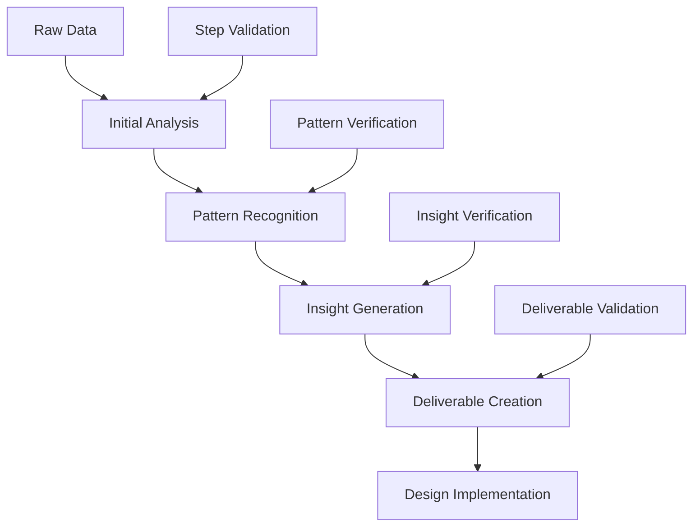

# Advanced Document Processor Guide
## Multi-step Processing and UX Research Integration

## Table of Contents
1. [Multi-step Prompt Architecture](#multi-step-prompt-architecture)
2. [UX Research Workflow](#ux-research-workflow)
3. [Integration Systems](#integration-systems)
4. [Templates and Examples](#templates-and-examples)
5. [Project Setup and Implementation](#project-setup-and-implementation)

## Multi-step Prompt Architecture

### Core Principles
1. **Information Flow**
   - Each step builds on previous outputs
   - Clear data transformation path
   - Validation between steps
   - Error handling and recovery

2. **Prompt Dependencies**


### Prompt Design Patterns

#### 1. Progressive Enhancement Pattern
```markdown
# Step 1: Base Analysis
prompt: "Extract raw information following this schema:
{schema_definition}
Output format: JSON"

# Step 2: Enhancement
prompt: "Using the JSON from Step 1, identify patterns and relationships:
1. Look for correlations between {elements}
2. Group related items by {criteria}
Output format: Enhanced JSON with relationships"

# Step 3: Synthesis
prompt: "Using the enhanced JSON:
1. Generate insights about {topic}
2. Create connections between {elements}
Output format: Markdown with structured insights"
```

#### 2. Recursive Analysis Pattern
```markdown
# Initial Setup
state = {}
documents = get_all_documents()

# Recursive Processing
for document in documents:
    # Level 1 Analysis
    state['current'] = analyze_document(document)
    
    # Level 2 - Pattern Matching
    patterns = match_patterns(state)
    
    # Level 3 - Cross-reference
    insights = cross_reference(patterns, state['history'])
    
    # Update State
    state['history'].append(insights)
```

## UX Research Workflow

### Project Structure
```
ux-research-project/
├── source/
│   ├── interviews/
│   ├── analytics/
│   ├── feedback/
│   └── market-research/
├── processing/
│   ├── cursorrules.md
│   ├── templates/
│   └── scripts/
├── outputs/
│   ├── analysis/
│   ├── insights/
│   └── deliverables/
└── design/
    ├── components/
    ├── prototypes/
    └── specifications/
```

### Research Processing Pipeline

#### 1. Data Collection Phase
```markdown
# cursorrules.md - Data Collection

## Step 1: Interview Processing
prompt: |
  For each interview transcript:
  1. Extract participant information
  2. Identify key quotes and insights
  3. Tag with relevant categories
  4. Create structured summary
  
  Output Template:
  ```json
  {
    "participant": {
      "id": "",
      "demographics": {},
      "background": ""
    },
    "insights": [
      {
        "category": "",
        "quote": "",
        "context": "",
        "tags": []
      }
    ],
    "patterns": {
      "behaviors": [],
      "pain_points": [],
      "needs": []
    }
  }
  ```

## Step 2: Analytics Integration
prompt: |
  Combine interview insights with analytics data:
  1. Match behavioral patterns with usage data
  2. Validate pain points against support tickets
  3. Cross-reference feature requests with usage patterns
  
  Output Template:
  ```json
  {
    "pattern_validation": [
      {
        "pattern": "",
        "analytics_support": "",
        "confidence_score": 0
      }
    ],
    "feature_analysis": [
      {
        "request": "",
        "current_usage": "",
        "impact_score": 0
      }
    ]
  }
  ```
```

#### 2. Insight Generation Phase
```markdown
# Step 3: Pattern Recognition
prompt: |
  Using combined interview and analytics data:
  1. Identify common behavior patterns
  2. Group related pain points
  3. Map feature requests to user needs
  4. Create initial user segments
  
  Output: structured-insights.md

# Step 4: User Segmentation
prompt: |
  For each identified segment:
  1. Define characteristics
  2. Map behaviors and needs
  3. Create initial persona hypothesis
  4. Validate against raw data
  
  Output: user-segments.md
```

### Templates

#### 1. User Persona Template
```markdown
# [Persona Name]

## Overview
- Archetype: [Brief description]
- Representation: [Which user segments]
- Key Characteristics: [Defining traits]

## Background
- Demographics: [Age, location, occupation]
- Technical Proficiency: [Skill level]
- Domain Knowledge: [Industry expertise]

## Behavioral Patterns
### Daily Workflow
- Morning routine:
  - Tasks: [List]
  - Tools: [List]
- Key activities:
  - Primary: [List]
  - Secondary: [List]

### Decision Factors
- Primary motivations:
  1. [Motivation 1]
  2. [Motivation 2]
- Constraints:
  1. [Constraint 1]
  2. [Constraint 2]

## Needs and Goals
### Immediate Needs
1. [Need 1]
   - Context: [Description]
   - Current solution: [Description]
   - Pain points: [List]

### Long-term Goals
1. [Goal 1]
   - Timeline: [Duration]
   - Success metrics: [List]
   - Barriers: [List]

## Scenarios
### Scenario 1: [Name]
- Context: [Description]
- Actions: [Step-by-step]
- Pain Points: [List]
- Desired Outcome: [Description]

## Evidence
### Interview Quotes
1. [Quote 1]
   - Context: [Description]
   - Source: [Interview reference]

### Analytics Support
- Usage patterns: [Data points]
- Feature engagement: [Statistics]
- Problem indicators: [Metrics]
```

#### 2. Journey Map Template
```markdown
# Customer Journey Map

## Journey Overview
- Persona: [Reference]
- Scenario: [Description]
- Timeline: [Duration]

## Stages
### 1. [Stage Name]
#### Actions
- [Action 1]
- [Action 2]

#### Thoughts
- [Thought 1]
- [Thought 2]

#### Emotions
- Score: [1-5]
- Description: [Text]

#### Pain Points
1. [Pain point 1]
   - Impact: [High/Medium/Low]
   - Frequency: [Often/Sometimes/Rare]

#### Opportunities
1. [Opportunity 1]
   - Impact: [Score]
   - Effort: [Score]
   - Priority: [Score]

## Channel Touchpoints
### Digital
- [Touchpoint 1]
- [Touchpoint 2]

### Physical
- [Touchpoint 1]
- [Touchpoint 2]

## Success Metrics
1. [Metric 1]
   - Current: [Value]
   - Target: [Value]
   - Measurement: [Method]
```

## Integration Systems

### 1. Design System Integration
```javascript
// Component Generation Script
async function generateComponent(userInsight, designSystem) {
  const componentSpec = await analyze({
    insight: userInsight,
    patterns: designSystem.patterns,
    constraints: designSystem.constraints
  });
  
  return {
    component: componentSpec.template,
    properties: componentSpec.props,
    variants: componentSpec.variants,
    usage: componentSpec.guidelines
  };
}
```

### 2. Figma Integration
```javascript
// Figma Component Creation
async function createFigmaComponents(insights) {
  const components = [];
  
  for (const insight of insights) {
    const component = await generateComponent(insight);
    const figmaNode = await createFigmaNode(component);
    
    components.push({
      insight: insight.id,
      component: figmaNode.id,
      connections: mapInsightToDesign(insight, figmaNode)
    });
  }
  
  return components;
}
```

### 3. Project Management Integration
```javascript
// Task Generation
async function generateTasks(insights, components) {
  const tasks = [];
  
  for (const insight of insights) {
    tasks.push({
      type: 'research-validation',
      title: `Validate ${insight.pattern}`,
      description: createValidationTask(insight),
      acceptance: createAcceptanceCriteria(insight)
    });
    
    tasks.push({
      type: 'design-implementation',
      title: `Implement ${components[insight.id].name}`,
      description: createImplementationTask(components[insight.id]),
      dependencies: mapDependencies(insight, components)
    });
  }
  
  return tasks;
}
```

## Future Enhancements

### 1. AI-Powered Analysis
- Pattern recognition improvements
- Automated insight generation
- Real-time validation

### 2. Integration Expansions
- A/B testing automation
- Analytics dashboard generation
- Documentation automation

### 3. Workflow Optimizations
- Parallel processing capabilities
- Incremental analysis updates
- Real-time collaboration features

## Conclusion
This enhanced system provides a comprehensive framework for:
1. Processing and analyzing user research
2. Generating validated UX deliverables
3. Creating implementation specifications
4. Automating design system integration

The multi-step prompt architecture ensures consistent, high-quality outputs while maintaining traceability between research insights and design decisions.